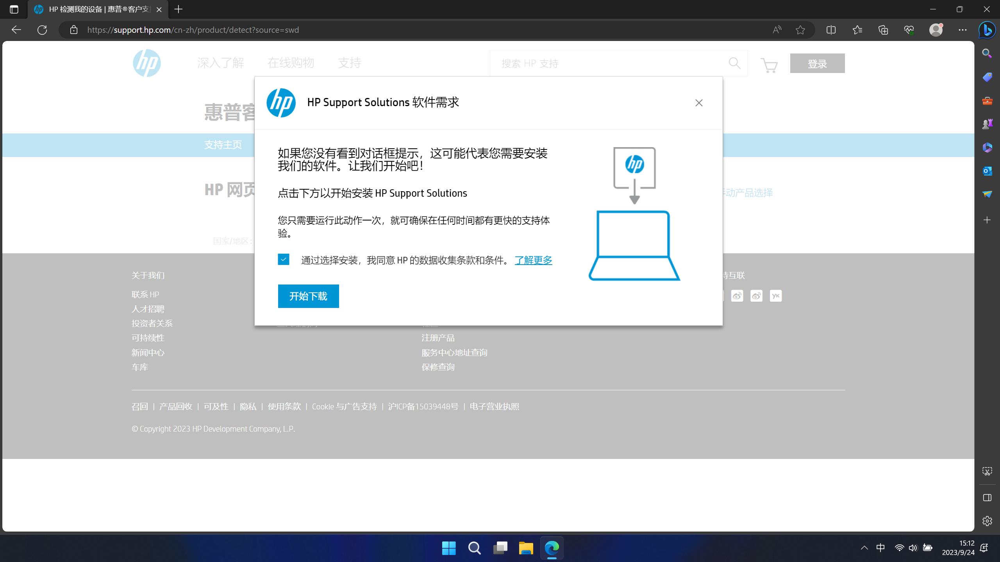

# 一次解决重装电脑系统后，(音频)无法找到输出设备的问题的记录

舍友因为不小心删了可能是显卡驱动相关的文件，导致游戏画面卡顿，并尝试在原系统装显卡驱动却仍然卡顿，所以打算重装系统。而重装系统之后，任务栏扬声器标识处却显示**无法找到输出设备**，经过许久的摸索和尝试最终解决问题。

<!-- more -->

## 尝试查找问题的原因

[已解决: 未安装任何音频输出设备？ - 惠普支持社区 - 862179 (hp.com)](https://h30471.www3.hp.com/t5/bi-ji-ben-dian-nao/wei-an-zhuang-ren-he-yin-pin-shu-chu-she-bei/td-p/862179)

由于不知道到底是没装好驱动的原因还是硬件本身有问题的原因(虽然我个人认为就是驱动的原因，因为重装系统前扬声器是能用的)，又看到[第一个回答](https://h30471.www3.hp.com/t5/bi-ji-ben-dian-nao/wei-an-zhuang-ren-he-yin-pin-shu-chu-she-bei/m-p/862185/highlight/true#M374701)中说到，重启后按 ++f2++ 测试硬件

重启再按 ++f2++ 后进入了一个测试的界面，然后我大概依次点击 *组件测试* - *音频* ，开始测试扬声器，并发现扬声器是能用的

然后看到了[这个回答](https://h30471.www3.hp.com/t5/bi-ji-ben-dian-nao/wei-an-zhuang-ren-he-yin-pin-shu-chu-she-bei/m-p/988926/highlight/true#M411584)，(经过测试，舍友的笔记本按 ++fn+esc++ 没反应)在 开始菜单 中搜索 **系统信息**

{ loading=lazy }

在 **系统摘要 -- 组件 -- ==有问题的设备==** 中，发现两个可能跟声音有关系(因为在之前看设备管理器的时候有看到类似的名字)的设备没有安装驱动：

-   SoundWire slave 1316
-   SoundWire slave 711

我怀疑是这两个设备没装驱动的原因，所以开始在网上查找相关的信息，然后找到有人也是有相同的情况(无法找到输出设备并且这两个设备没有安装驱动)

[已解决: 暗影精灵8pro WIN10 LTSC 缺少声卡驱动 - 惠普支持社区 - 1197495 (hp.com)](https://h30471.www3.hp.com/t5/you-xi-ben/an-ying-jing-ling8pro-WIN10-LTSC-que-shao-sheng-ka-qu-dong/td-p/1197495)

## 解决问题

由于有相同情况的[那个帖子](https://h30471.www3.hp.com/t5/you-xi-ben/an-ying-jing-ling8pro-WIN10-LTSC-que-shao-sheng-ka-qu-dong/td-p/1197495)中并没有发现我个人感觉比较好的解决方法，又由于是驱动没装，并且看到在之前看过的[另一个问题](https://h30471.www3.hp.com/t5/you-xi-ben/an-ying-jing-ling8-pro/td-p/1193443)中，[有一个回答](https://h30471.www3.hp.com/t5/you-xi-ben/an-ying-jing-ling8-pro/m-p/1193453/highlight/true#M73376)提到了官方的下载驱动的网址，所以我打算在官网上找到相应的驱动安装说不定就可以解决问题

[官方 HP® 驱动程序与软件下载 | 惠普®客户支持](https://support.hp.com/cn-zh/drivers/selfservice)

1.   选择笔记本电脑，然后检测产品(的序列号)

     { loading=lazy }

     { loading=lazy }

2.   发现没有安装 HP Support Solutions ，所以安装

     { loading=lazy }

     { loading=lazy }

3.   再次检测

     { loading=lazy }

     { loading=lazy }

4.   检测到之后选择相应的系统，然后检测驱动

     { loading=lazy }

     { loading=lazy }

     { loading=lazy }

5.   只检测出了两个与音频不相关的驱动，所以在 **所有驱动程序** 中查看音频的驱动程序，然后发现只有一个驱动，所以就打算安装这个试试看

     { loading=lazy }
     
6.   最后安装完这个驱动程序后，居然扬声器能找到设备了，并且在 系统信息 中 有问题的设备 里面之前那两个 未安装对应驱动 的设备也消失了

