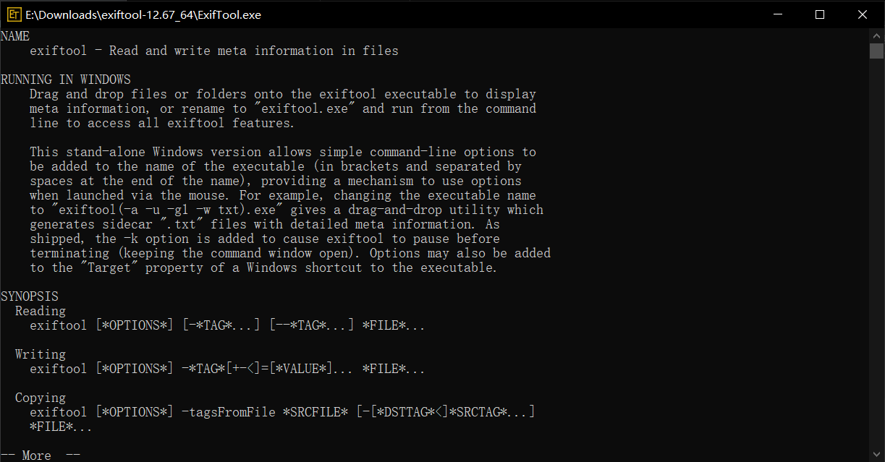

# 成功修改视频的exif信息(QuickTime创建时间)

由于之前问了别人要了一些录像，但发现录像是 `.MOV` 文件格式(好像是苹果使用的格式？)，我想转换成 `.mp4` 格式，但转换完之后，在手机上的相册查看时，文件时间显示的是转换完成的时间，所以打算进行修改

<!-- more -->

## 效果

修改之前，显示的是转换完的时间，修改后显示的是我修改的拍摄的时间

=== "修改前"

    { loading=lazy }

=== "修改后"

    { loading=lazy }

## 过程

我一开始以为是需要修改媒体创建时间，所以在谷歌上搜索

```txt
How to modify the media creation time of MP4
```

找到这个文章

[windows - How to change Media Created Date in Exiftool? - Stack Overflow](https://stackoverflow.com/questions/53926085/how-to-change-media-created-date-in-exiftool)

在[这个回答](https://stackoverflow.com/a/53926462)中，有提到

>   First you will probably want to rename the `exiftool(-k).exe` to just `exiftool.exe` and place it someplace in your PATH (see [install exiftool-Windows](https://exiftool.org/install.html#Windows)). There is also [Oliver Betz's Alternative Exiftool build for Windows](https://oliverbetz.de/pages/Artikel/ExifTool-for-Windows) which includes an installer and is a bit more security friendly. ...

然后进入 [Oliver Betz | Artikel / ExifTool Windows installer and portable package](https://oliverbetz.de/pages/Artikel/ExifTool-for-Windows) 网页下载了便携版的压缩包

但打开之后是命令行(不会用这个命令行)

{ loading=lazy }

然后在[另一个论坛的回答中](https://www.52pojie.cn/forum.php?mod=redirect&goto=findpost&ptid=1550645&pid=40791317)，看到了 exiftool gui ，所以搜索了一下，找到了下载网页

[Latest ExiftoolGUI version 5.16](https://exiftool.org/forum/index.php?topic=2750.0)

一开始打开时，显示找不到 exiftool ，查看 `ExifToolGUI_readme.txt` ，

>   However, for exiftool.exe, the BEST place is inside C:\Windows directory.

发现需要将我的 `ExifTool.exe` 移动到 `C:\Windows` 目录下，移动之后打开 exiftool-gui 就可以正常显示

---

在左侧 `Browse` 选中文件夹，在中间的 `Filelist` 框选中文件，就可以在右边 `Metadata` 看到一些信息，选择 `ALL` 能看到全部信息

{ loading=lazy }

然后我注意到修改这些数据好像也是需要一些命令行，

>   `Command (press Enter to execute)`

所以我参考了 [(80 条消息) mp4文件 媒体创建日期如何修改？ - 知乎 (zhihu.com)](https://www.zhihu.com/question/300778495)

然后复制了

```bash
-r -api "QuickTimeUTC" "-MediaCreateDate=2023:09:16 17:53:02"
```

回车，然后发现修改成功了

但是将修改后的文件移动到手机上查看，发现还是显示转换完成的时间，所以我认为可能没有修改对属性

然后我注意到 `QuickTime` 中有一个 `CreateDate` 

{ loading=lazy }

我怀疑可能应该要修改这个属性，所以执行

```bash
-r -api "QuickTimeUTC" "-CreateDate=2023:09:16 17:53:02"
```

最终，在手机相册中查看修改后的文件，文件时间显示的是修改的时间

---

发现有一点需要注意，==在输入命令回车之后，修改会对当前目录下(包括子目录下)的所有文件生效==
