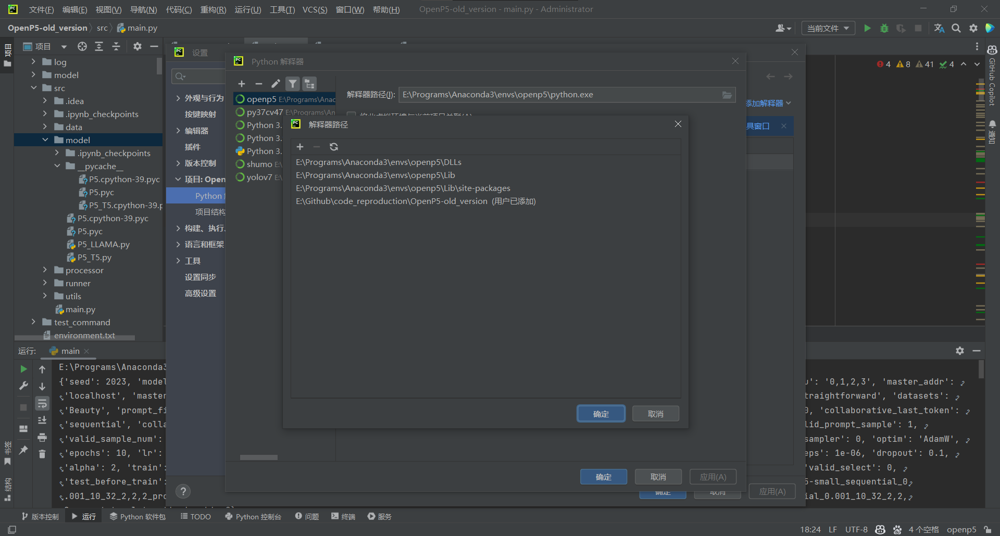
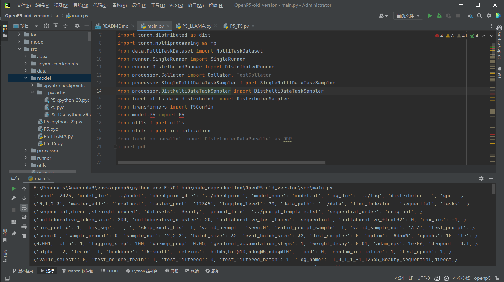

# 复现代码过程记录

## OpenP5

论文网址：

[OpenP5: Benchmarking Foundation Models for Recommendation | Papers With Code](https://paperswithcode.com/paper/openp5-benchmarking-foundation-models-for)

代码地址：

[agiresearch/OpenP5: OpenP5: An Open-source Platform for Developing, Fine-tuning, and Evaluating LLM-based Recommenders (github.com) - https://github.com/agiresearch/OpenP5](https://github.com/agiresearch/OpenP5)

<!-- more -->

环境 `environment.txt` :

```txt
python==3.9.7
transformers==4.26.0
torch==1.8.1+cu111
sklearn==1.1.2
torchvision==0.9.1+cu111
tqdm==4.64.1
time
collections
argparse
os
sys
numpy==1.23.1
```

由于 `time` `colloctions` `os` `sys` 好像都是自带的不能装，而 `torch` `torchvision` 需要装的是 cuda 版的，所以我将其修改为

```txt
transformers==4.26.0
scikit-learn==1.1.2
tqdm==4.64.1
argparse
numpy==1.23.1
```

其中 `sklearn` 在之前安装时发现说是更改成了 `scikit-learn` 所以我也进行了修改

这样就可以直接运行命令来安装对应的包

```bash
pip install -r environment.txt
```

---

安装好这些后，打开 clone 的仓库，发现 `train.py` 中还是有一些报错


并且 `README.md` 中写着

>   ## Usage
>
>   Download the data from [Google Drive link](https://drive.google.com/drive/folders/1W5i5ryetj_gkcOpG1aZfL5Y8Yk6RxwYE?usp=sharing), and put them into `./data` folder.
>
>   The training command can be found in `./command` folder. Run the command such as
>
>   ```bash
>   cd command
>   sh ML1M_random.sh
>   ```

然而并没有 `./command` 文件夹，然后我发现，从main分支里下载的文件里面并没有command文件夹，

而有一个 old_version分支里面有，并且 `./command/ML1M_random.sh` 文件中的命令是要运行 `./src/main.py` 文件，而这个文件只在 old_version 分支中有，并且几乎所装的包都在 `main.py` 中被导入，所以我决定使用 old_version

---

由于需要执行 `.sh` 文件，这个在windows的cmd中好像不能使用，只能在git bash终端中使用，而我又需要使用 conda 环境，

所以发现在 bash 中不能像cmd中一样运行 `conda activate openp5` 

搜索后发现了这个方法有效

[Conda environment fails to activate with Git Bash · Issue #19534 · microsoft/vscode-python (github.com)](https://github.com/microsoft/vscode-python/issues/19534#issuecomment-1194774160)

>   [手册 - Anaconda](https://ronaldln.github.io/MyPamphlet/系统%26环境/anaconda/#5)

`source` anaconda3 安装路径下的 `/Scripts/activate`

```bash
source /e/Programs/Anaconda3/Scripts/activate
```

然后就会启动 anaconda 的 base 环境，这时 `conda activate openp5` 就有可以使用 openp5 的虚拟环境了

---

### 解决 `.pyc` 文件导入问题

old_version的 `main.py` 中有一处报错，

{ loading=lazy }

是使用了自己的包，而好像 pycharm 中 `./src/model` 文件夹中并没有这个 `P5` 的东西

经过一顿折腾之后，偶然发现了，原本的仓库里面， `model` 文件夹下有一个 `__pycache__` 文件夹，里面有一个 `P5.cpython-39.pyc` 文件，我认为这个应该就是 `main.py` 要导的包，

所以开始查询如何在 pycharm 中才能导入这个包(因为最近也有一个类似的情况(编译Orbbec SDK) - 在终端中能使用/导入pyc文件，而在pycharm中会报错)，然后发现了

[python - Cannot see pyc files in PyCharm - Stack Overflow](https://stackoverflow.com/questions/64209855/cannot-see-pyc-files-in-pycharm)

这个的[回答](https://stackoverflow.com/a/64214290)

需要在 pycharm 的 **==设置 - 编辑器 - 文件类型 - 忽略的文件和文件夹==** 里，把 `*.pyc` 和 `__pycache__` 去掉

---

但经过测试之后发现，即使能看到pyc文件也还是会报错

想起来在 [Orbbec SDK for Python 使用手册 测试 Sample](https://vcp.developer.orbbec.com.cn:9001/project-2/doc-70/#测试-sample) 里，终端上使用时，需要设置一个 `PYTHONPATH` 的环境变量，

```bash
# set PYTHONPATH environment variable to include the lib directory in the install directory
export PYTHONPATH=$PYTHONPATH:$(pwd)/install/lib/
```

所以开始查询如何在 pycharm 中设置 `PYTHONPATH` 环境变量，然后从

[python - PyCharm and PYTHONPATH - Stack Overflow](https://stackoverflow.com/questions/28326362/pycharm-and-pythonpath)

[Manage interpreter paths | PyCharm Documentation (jetbrains.com)](https://www.jetbrains.com/help/pycharm/installing-uninstalling-and-reloading-interpreter-paths.html)

找到了方法：

**==项目 - Python解释器 - 在 `Python 解释器:` 右侧的框的右侧点击向下的三角/箭头 - 全部显示 - 在左上角图标中找到 `显示解释器路径` - 添加相应的路径==**

{ loading=lazy }

{ loading=lazy }

由于 `main.py` 文件中，是

```python
from model.P5 import P5
```

所以应该是把 `model` 的父目录(即项目的根目录)添加上

```txt
E:\Github\code_reproduction\OpenP5-old_version
```

添加完了之后，即使还是会有红色的警告，但能运行了

{ loading=lazy }