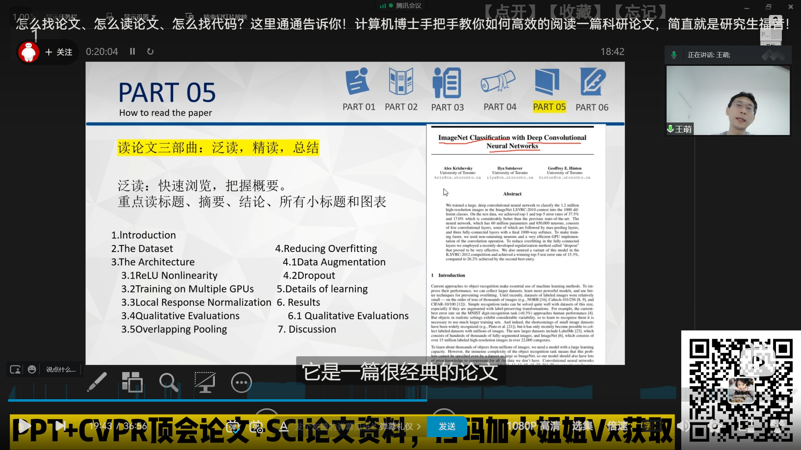
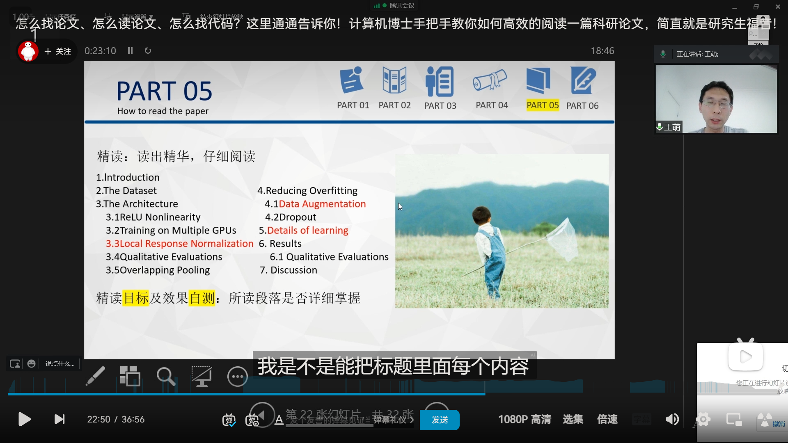

# 阅读第一篇论文 [*Neural Collaborative Filtering*](https://paperswithcode.com/paper/neural-collaborative-filtering)

## 起因

由于缺乏一定基础，所以学长告诉我可以阅读一些相对基础的论文，而 [Papers With Code](https://paperswithcode.com/) 上有一些高被引论文，是领域内相对基础的论文，

而 *推荐系统 (Recommendation Systems)* 相关的可见于 [Recommendation Systems | Papers With Code - https://paperswithcode.com/task/recommendation-systems](https://paperswithcode.com/task/recommendation-systems)

<!-- more -->

翻到页面下方有个 ***Most implemented papers*** 部分，就可以看到高被引论文

{ loading=lazy }

>   发现从主页点击 [Browse State-of-the-Art](https://paperswithcode.com/sota) 可以看到各个领域，然后可以找到 *推荐系统 Recommendation Systems* 
>
>   { loading=lazy }

所以我打算看看排在第一的论文 [*Neural Collaborative Filtering*](https://paperswithcode.com/paper/neural-collaborative-filtering)

## 准备

B站上简单搜索了应该如何去阅读论文文献，

[怎么找论文、怎么读论文、怎么找代码？这里通通告诉你！计算机博士手把手教你如何高效的阅读一篇科研论文，简直就是研究生福音！_哔哩哔哩_bilibili](https://www.bilibili.com/video/BV1ZM411C7cz)

=== "screenshot 1"

    { loading=lazy }

=== "screenshot 2"

    { loading=lazy }

=== "screenshot 3"

    { loading=lazy }

=== "screenshot 4"

    { loading=lazy }

=== "screenshot 5"

    { loading=lazy }

=== "screenshot 6"

    { loading=lazy }

## 泛读论文

### 摘要 Abstract

-   **背景**：
    -   *深度神经网络 DNN (Deep Neural Networks)* 在诸多领域取得巨大成功/广泛应用，但在推荐系统领域受到的关注相对较小
    -   推荐系统领域中，主流的方法在*模型化*关键的因素时，是将信息存储在矩阵当中，然后计算 *内积 (inner product)* 来表现潜在的特征
-   **采用的方法概述**：通过用一种神经架构来替代计算内积，提出了一个通用框架 Neural network-based Collaborative Filtering
-   **效果**：相比与(当时)最先进的方法显示出了巨大的提升

### 结论 Conclusion

他们的框架是 *简单而通用 simple and generic* 的，不局限于论文中的模型，而其设计目的是作为开发 *推荐 recommendation* 深度学习方法的指南，这补充了主流的筛选/过滤模型，开创了一个新的研究基于深度学习的*推荐*的通道

