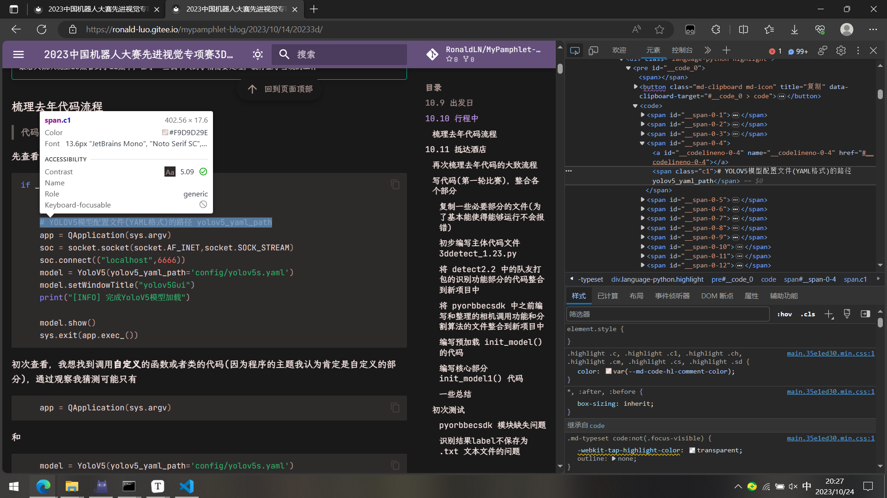
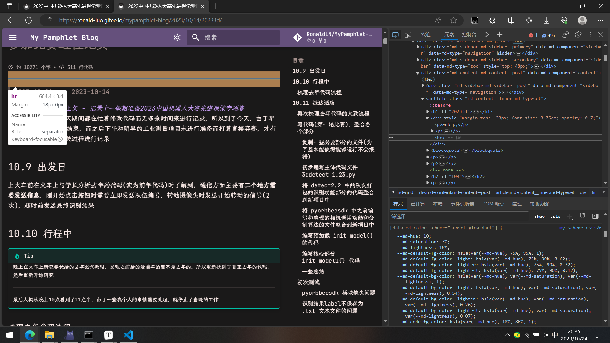
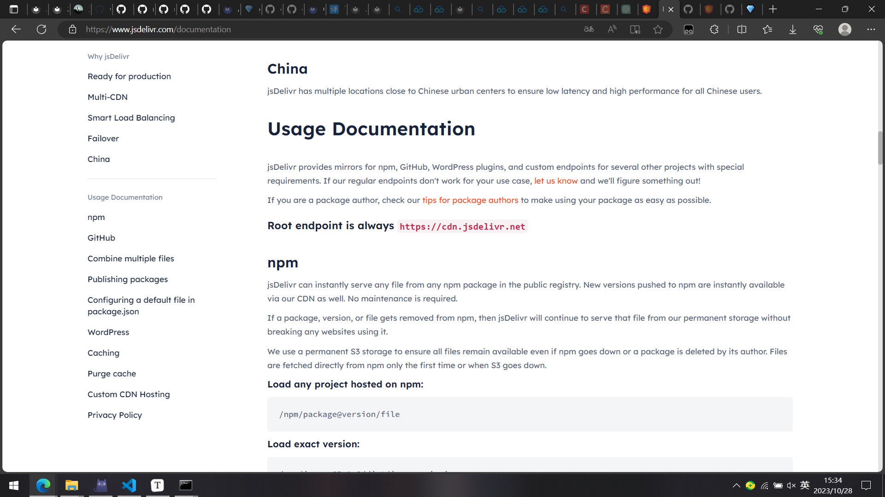
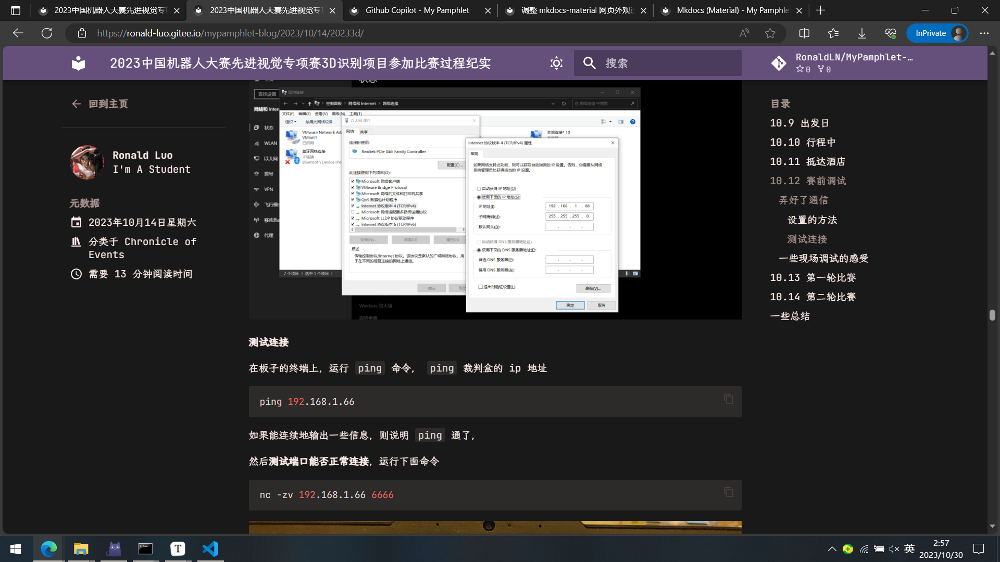
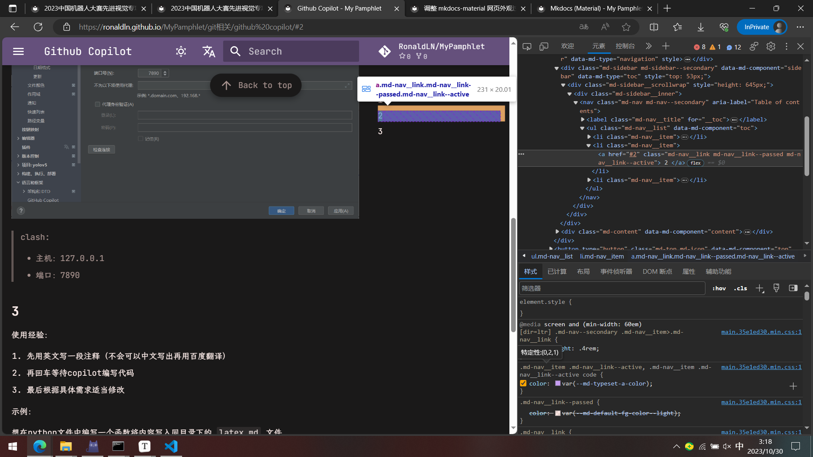
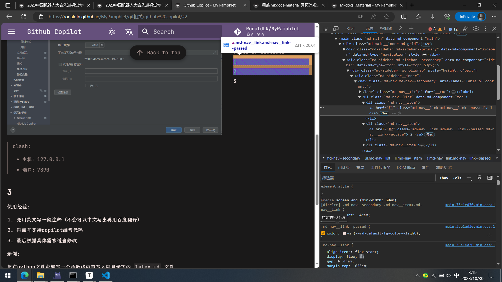

# 调整 mkdocs-material 网页外观过程记录

## 起因

跟前两篇一样😏，也是由于看到 [鹤翔万里的笔记本 (tonycrane.cc)](https://note.tonycrane.cc/) ，然后觉得比默认的设置要好看，所以打算对我的网页也尝试进行修改

<!-- more -->

## cv作者的css设置

[`/docs/css/custom.css`](https://github.com/TonyCrane/note/blob/master/docs/css/custom.css)

我先cv了

```css
@media screen and (min-width: 960px) {
  html {
    font-size: 137.5%;
  }
}

@media screen and (min-width: 100em) {
  html {
    font-size: 137.5%;
  }
}

@media screen and (min-width: 125em) {
  html {
    font-size: 137.5%;
  }
}
```

然后预览，发现左右侧边栏(导航栏和目录栏)相隔的间距变宽了，

然后继续cv了

```css
.md-typeset h1, .md-typeset h2 {
  font-weight: 600;
}

.md-typeset h3 {
  font-weight: 500;
}

.md-typeset h1, .md-typeset h2, .md-typeset h3, .md-typeset h4 {
  letter-spacing: 0;
}

.md-typeset {
  font-size: .7rem;
}

.md-typeset h3 {
  font-weight: 600;
}
```

然后经过几次代码注释的测试发现，

```css
.md-typeset {
  font-size: .7rem;
}
```

这一个设置是设置所有字体大小的，

继续复制，

```css
.md-typeset code:not(pre code) {
  font-size: inherit;
}
```

添加了这个设置之后，发现行内代码的字体变大了(而代码块中的代码没变大)，

>   此外还复制了
>
>   ```css
>   @media screen and (max-width: 59.9375em) {
>     .md-nav__source {
>       background-color: var(--md-primary-fg-color);
>     }
>   }
>   
>   @media screen and (max-width: 76.1875em) {
>     .md-nav--primary .md-nav__title {
>       background-color: var(--md-primary-fg-color);
>     }
>   }
>   ```
>
>   但还不清除有什么用

然后这时的效果如下

{ loading=lazy }

## 自己进行css的设置

这时我感觉代码块中的字/代码显得有些挤，所以想对代码块中的设置进行修改，

由于 `.md-typeset code:not(pre code)` 是只设置行内代码，然后我猜测可能去掉 `:not(pre code)` 说不定能设置代码块，发现果然可以，

```css
.md-typeset code {
  font-size: inherit;
}
```

{ loading=lazy }

但修改完发现，字体似乎又太大了，

然后因为感觉就这么盲目摸索摸不出来，所以搜索了一下 `css .md-typeset` ，然后看到了一篇文章

[如何在mkdocs中自定义css - 知乎 (zhihu.com)](https://zhuanlan.zhihu.com/p/568788779)

发现可以通过 ++f12++ 打开 ***开发人员工具*** (或者右键，点击 检查 (Edge 浏览器))，在其中可以看到对应外观的对应的css属性变量，并且可以直接在浏览器中修改进行效果的*预览*，

由于一开始没有找到修改属性的对应的区/窗口，又查看了另一篇文章作为辅助

[F12 - 开发者工具详解 - 知乎 (zhihu.com)](https://zhuanlan.zhihu.com/p/231865779)

然后摸索了一番，大致懂得如何操作了，

以我尝试的 ==查找 **代码块行间距** 和 **分割线宽度** 的对应属性== 为例，

**代码块行间距**

{ loading=lazy }

在开发者工具界面左上角点击 ***在页面中选择一个元素进行检查*** ，然后在页面中选择一个代码块的代码点击，

{ loading=lazy }

然后，*元素* 中就会选定并高亮对应的 html 语句，

然后就可以在下方的 ***样式*** 中，**==根据属性的英文名，以及属性的值的类型==**，来判断是否是想找的属性，

{ loading=lazy }

经过一会的翻找，我猜测 `line-height` 可能是设置代码块行间距的属性，

于是点击属性的值进行修改，看看是否代码块的行间距会变化

=== "修改后"

    { loading=lazy }

=== "修改前"

    { loading=lazy }

发现确实变化了，所以就可以得到，修改代码块行间距 应该添加的 css 代码

```css
.md-typeset pre {
  line-height: 1.8;
}
```

**分割线宽度**

大致的流程相同，

选中分割线进行查看

{ loading=lazy }

然后找到可能是设置 分割线宽度 的属性，改动它的值

=== "修改后"

    { loading=lazy }

=== "修改前"

    { loading=lazy }

发现 分割线宽度 确实改变了，所以得到相应的css设置代码

```css
.md-typeset hr {
  border-bottom: .10rem solid var(--md-default-fg-color--lightest);
}
```

---

经过一些尝试，最后代码的字体大小和行间距我设置成了我自认为比较合适的值

```css
/* 以下是从 TonyCrane/note 仓库 custom.css 复制的 */
@media screen and (min-width: 960px) {
  html {
    font-size: 137.5%;
  }
}

@media screen and (min-width: 100em) {
  html {
    font-size: 137.5%;
  }
}

@media screen and (min-width: 125em) {
  html {
    font-size: 137.5%;
  }
}

.md-typeset h1, .md-typeset h2 {
  font-weight: 600;
}

.md-typeset h3 {
  font-weight: 500;
}

.md-typeset h1, .md-typeset h2, .md-typeset h3, .md-typeset h4 {
  letter-spacing: 0;
}

.md-typeset {
  font-size: .7rem;
}

.md-typeset h3 {
  font-weight: 600;
}

@media screen and (max-width: 59.9375em) {
  .md-nav__source {
    background-color: var(--md-primary-fg-color);
  }
}

@media screen and (max-width: 76.1875em) {
  .md-nav--primary .md-nav__title {
    background-color: var(--md-primary-fg-color);
  }
}
/* 复制到此 */

/* 修改所有代码字体大小 */
.md-typeset code {
  font-size: .65rem;
}

/* (覆盖)修改行内代码字体大小 */
.md-typeset code:not(pre code) {
  font-size: inherit;
}

/* 修改代码块行间距 */
.md-typeset pre {
  line-height: 1.8;
}

/* 修改分割线的宽度 */
.md-typeset hr {
  border-bottom: .10rem solid var(--md-default-fg-color--lightest);
}
```

{ loading=lazy }

## 更改 giscus 评论区域的配色

经过在浏览器上测试发现了相关的几个属性

{ loading=lazy }

-   `--color-btn-primary-text` : 右下角 *:material-github: 使用 Github 登录* 的按钮处，设置字的颜色
-   `--color-btn-primary-bg` : 同上，设置按钮(整体填充)的颜色
-   `--color-btn-primary-border` : 同上，设置按钮边框的颜色
-   `--color-btn-primary-hover-bg` : 设置将鼠标放置在按钮上时，按钮(整体填充)的颜色
-   `--color-btn-primary-hover-border` : 同上，设置按钮边框的颜色
-   `--color-fg-default` : 设置 *`n` 个表情* 、 *`n` 条评论* 、*输入/预览* (选中那个) 的字体颜色
-   `--color-fg-muted` : 设置 *`n` 个表情* 下的笑脸:octicons-smiley-16: 、*输入/预览* (没选中那个) 、*右上处 `Aa`* 、*按钮上方的markdown标志:octicons-markdown-16:* 的颜色
-   `--color-canvas-default` : 设置 *输入* 和 按钮 所在的中空的(挖去中间输入评论文本的区域)的框的颜色
-   `--color-canvas-inset` : 设置 中间输入评论文本的区域 的颜色
-   `--color-canvas-subtle` : 设置 *预览* 所在的上方的框的颜色
-   `--color-border-default` : 设置所有勾勒边框的线的颜色
-   `--color-accent-fg` : 设置 将鼠标移动到 markdown标志:octicons-markdown-16: 或 `Aa` 处时，以及在评论文本的区域中输入时区域的框，改变的颜色
-    `--color-btn-primary-selected-bg` : 设置*登录按钮*点击时的颜色
-    `--color-btn-primary-disabled-text` : 设置登录之后，*评论按钮*的*评论*两个字的颜色
-    `--color-btn-primary-disabled-bg` : 同上，*评论按钮*的颜色
-    `--color-btn-primary-disabled-border` : 同上，*评论按钮*边框的颜色

### 搜索作者仓库，学习他是如何将 `css` 文件添加到网页中

一开始我直接将 这个css文件添加到 `mkdocs.yml` 的 `extra_css` 中，发现生成的网页中没有产生改变，

于是我开始去查看上面网站的作者是如何设置的。

在之前的摸索中，我发现了在 github 仓库中的所有文件中搜索内容的方法，

{ loading=lazy }

我一开始先是在一个文件中单击了某个属性( `md-sidebar--secondary` )，然后右侧会出现该属性在这个文件中所有用法的预览，

然后**下面会有一个 `Search for this symbol` 的标志，点击它可以在整个仓库中搜索对应的内容**，

于是我点击，然后跳转到了这个搜索界面，

[Code search results (github.com)](https://github.com/search?q=repo%3ATonyCrane/note md-sidebar--secondary&type=code)

是在 github 栏中搜索

```txt
repo:TonyCrane/note md-sidebar--secondary
```

{ loading=lazy }

于是，我就知道了**对仓库所有文件搜索指定内容的方法**，即**在 github 搜索栏中搜索**

```txt
repo:user/repo xxx
```

于是我开始搜索 `giscus.css` 在作者仓库中的用法

{ loading=lazy }

于是查看 `docs/js/scheme.js` 文件，发现主要是这两行使用了 `giscus.css` 文件，

```javascript
    var theme = document.querySelector("body").getAttribute("data-md-color-scheme") === "slate" ? "https://gcore.jsdelivr.net/gh/TonyCrane/note/docs/css/giscus.css" : "light"
```

```javascript
  var theme = scheme === "slate" ? "https://gcore.jsdelivr.net/gh/TonyCrane/note/docs/css/giscus.css" : "light"
```

而这个用法和我之前在 `overrides/partials/comments.html` 中的设置，给我的感觉很像

```html
  <script>
    var giscus = document.querySelector("script[src*=giscus]")

    // Set palette on initial load
    var palette = __md_get("__palette")
    if (palette && typeof palette.color === "object") {
      var theme = palette.color.scheme === "sunset-glow-dark"
        ? "noborder_dark"
        : "dark_dimmed"

      // Instruct Giscus to set theme
      giscus.setAttribute("data-theme", theme) 
    }
    ...
  </script>
```

所以我认为，在我的 `comments.html` 中，应该也可以直接把 `noborder_dark` `dark_dimmed` 换成对应的 `css` 文件的地址，

>   giscus 官网上，添加自定义的主题，也是添加 css 文件的地址
>
>   { loading=lazy }

但是经过我的尝试，**发现使用相对路径的方式不可行**，虽然最终生成的 html 文件中，我去查看 html 文件的源代码，是有 `css` 的相对路径的，但是**不同文件夹/路径下的 html 文件相对路径都是一样的，也就意味着，这个相对路径是不对的**

### 学会使用 `jsdelivr` 来使用 github 仓库中的 `css` 文件

一开始我看作者的用法，我以为 `jsdelivr` 是一个类似网盘的东西，然后作者是将 css 文件传到了上面，然后进行使用(之后发现，其实并非如此)

于是我前往 `jsdelivr` 网站，

[jsDelivr - A free, fast, and reliable CDN for JS and open source](https://www.jsdelivr.com/)

然后翻找一番发现并没有注册或登录的地方，

于是我就意识到，这可能就不需要注册就可以使用，于是我开始查看他的使用说明文档

[Documentation - jsDelivr](https://www.jsdelivr.com/documentation)

然后点击了 [`Github`](https://www.jsdelivr.com/documentation#id-github) 的选项，

{ loading=lazy }

!!! quote

    **GitHub**
    
    We recommend using npm for projects that support it for better UX - npm packages are searchable on our website, and package pages show additional useful information, such as descriptions and links to homepages.
    
    We use a permanent S3 storage to ensure all files remain available even if GitHub goes down or a repository or a release is deleted by its author. Files are fetched directly from GitHub only the first time or when S3 goes down.
    
    **Load any GitHub release, commit, or branch:**
    
    ```txt
    /gh/user/repo@version/file
    ```
    
    **Load exact version:**
    
    ```txt
    /gh/jquery/jquery@3.1.0/dist/jquery.min.js
    /gh/jquery/jquery@32b00373b3f42e5cdcb709df53f3b08b7184a944/dist/jquery.min.js
    ```
    
    **Use a version range instead of an exact version (only works with valid semver versions):**
    
    ```txt
    /gh/jquery/jquery@3/dist/jquery.min.js
    /gh/jquery/jquery@3.1/dist/jquery.min.js
    ```

查阅并理解了一下，我就突然意识到，**这个网站可以直接对github仓库中已经存在的文件使用 cdn 加速**，

然后我在 **Usage Documentation** 处得知了应该使用的域名为

```txt
https://cdn.jsdelivr.net
```

{ loading=lazy }

于是，我尝试使用链接(仿照作者的形式，不使用 `@` )

```txt
https://cdn.jsdelivr.net/gh/RonaldLN/MyPamphlet-Blog/docs/stylesheets/giscus.css
```

我访问这个链接，但浏览器显示

```txt
Package size exceeded the configured limit of 50 MB. Try https://github.com/RonaldLN/MyPamphlet-Blog/tree/master/docs/stylesheets/giscus.css instead.
```

然后我知道了，如果不 `@` 对应分支的话，会默认访问 `master` 分支，所以我添加上了 `@main` 

```txt
https://cdn.jsdelivr.net/gh/RonaldLN/MyPamphlet-Blog@main/docs/stylesheets/giscus.css
```

于是就变成了显示

```txt
Package size exceeded the configured limit of 50 MB. Try https://github.com/RonaldLN/MyPamphlet-Blog/tree/main/docs/stylesheets/giscus.css instead.
```

于是我开始编写 `css` 文件并打算先上传进行测试

### 编写 `css` 文件，并在相关文件中添加相应设置

我这时认为，giscus 的 css 文件中应该包含有全部属性(在查看作者的 `giscus.css` 文件时，发现也是如此)，

因此，我打算 浅色的 `sunset glow` 模式使用 `light` 为模板进行修改，而深色的 `sunset glow dark` 使用 `noborder_dark` 为模板进行修改，

于是先复制 [https://giscus.app/themes/light.css](https://giscus.app/themes/light.css) 和 [https://giscus.app/themes/noborder_dark.css](https://giscus.app/themes/noborder_dark.css) 

然后经过在网页的开发工具中不断尝试而确定(我需要设置的那几个)属性的最终的值，然后我将这些属性放在了下方，并将对应的原本的属性注释掉，

最终，

=== "giscus_sunset_glow.css"

    ???+ note "giscus_sunset_glow.css"
        
        ```css
        /*! MIT License
        * Copyright (c) 2018 GitHub Inc.
        * https://github.com/primer/primitives/blob/main/LICENSE
        */
        main {
        --color-prettylights-syntax-comment: #6e7781;
        --color-prettylights-syntax-constant: #0550ae;
        --color-prettylights-syntax-entity: #8250df;
        --color-prettylights-syntax-storage-modifier-import: #24292f;
        --color-prettylights-syntax-entity-tag: #116329;
        --color-prettylights-syntax-keyword: #cf222e;
        --color-prettylights-syntax-string: #0a3069;
        --color-prettylights-syntax-variable: #953800;
        --color-prettylights-syntax-brackethighlighter-unmatched: #82071e;
        --color-prettylights-syntax-invalid-illegal-text: #f6f8fa;
        --color-prettylights-syntax-invalid-illegal-bg: #82071e;
        --color-prettylights-syntax-carriage-return-text: #f6f8fa;
        --color-prettylights-syntax-carriage-return-bg: #cf222e;
        --color-prettylights-syntax-string-regexp: #116329;
        --color-prettylights-syntax-markup-list: #3b2300;
        --color-prettylights-syntax-markup-heading: #0550ae;
        --color-prettylights-syntax-markup-italic: #24292f;
        --color-prettylights-syntax-markup-bold: #24292f;
        --color-prettylights-syntax-markup-deleted-text: #82071e;
        --color-prettylights-syntax-markup-deleted-bg: #ffebe9;
        --color-prettylights-syntax-markup-inserted-text: #116329;
        --color-prettylights-syntax-markup-inserted-bg: #dafbe1;
        --color-prettylights-syntax-markup-changed-text: #953800;
        --color-prettylights-syntax-markup-changed-bg: #ffd8b5;
        --color-prettylights-syntax-markup-ignored-text: #eaeef2;
        --color-prettylights-syntax-markup-ignored-bg: #0550ae;
        --color-prettylights-syntax-meta-diff-range: #8250df;
        --color-prettylights-syntax-brackethighlighter-angle: #57606a;
        --color-prettylights-syntax-sublimelinter-gutter-mark: #8c959f;
        --color-prettylights-syntax-constant-other-reference-link: #0a3069;
        --color-btn-text: #24292f;
        --color-btn-bg: #f6f8fa;
        --color-btn-border: #1f232826;
        --color-btn-shadow: 0 1px 0 #1f23280a;
        --color-btn-inset-shadow: inset 0 1px 0 #ffffff40;
        --color-btn-hover-bg: #f3f4f6;
        --color-btn-hover-border: #1f232826;
        --color-btn-active-bg: #ebecf0;
        --color-btn-active-border: #1f232826;
        --color-btn-selected-bg: #eeeff2;
        /* --color-btn-primary-text: #fff; */
        /* --color-btn-primary-bg: #1f883d; */
        /* --color-btn-primary-border: #1f232826; */
        --color-btn-primary-shadow: 0 1px 0 #1f23281a;
        --color-btn-primary-inset-shadow: inset 0 1px 0 #ffffff08;
        /* --color-btn-primary-hover-bg: #1a7f37; */
        /* --color-btn-primary-hover-border: #1f232826; */
        /* --color-btn-primary-selected-bg: #187733; */
        --color-btn-primary-selected-shadow: inset 0 1px 0 #002d1133;
        /* --color-btn-primary-disabled-text: #fffc; */
        /* --color-btn-primary-disabled-bg: #94d3a2; */
        /* --color-btn-primary-disabled-border: #1f232826; */
        --color-action-list-item-default-hover-bg: #d0d7de52;
        --color-segmented-control-bg: #eaeef2;
        --color-segmented-control-button-bg: #fff;
        --color-segmented-control-button-selected-border: #8c959f;
        /* --color-fg-default: #1f2328; */
        /* --color-fg-muted: #656d76; */
        --color-fg-subtle: #6e7781;
        /* --color-canvas-default: #fff; */
        --color-canvas-overlay: #fff;
        /* --color-canvas-inset: #f6f8fa; */
        /* --color-canvas-subtle: #f6f8fa; */
        /* --color-border-default: #d0d7de; */
        --color-border-muted: #d8dee4;
        --color-neutral-muted: #afb8c133;
        /* --color-accent-fg: #0969da; */
        --color-accent-emphasis: #0969da;
        --color-accent-muted: #54aeff66;
        --color-accent-subtle: #ddf4ff;
        --color-success-fg: #1a7f37;
        --color-attention-fg: #9a6700;
        --color-attention-muted: #d4a72c66;
        --color-attention-subtle: #fff8c5;
        --color-danger-fg: #d1242f;
        --color-danger-muted: #ff818266;
        --color-danger-subtle: #ffebe9;
        --color-primer-shadow-inset: inset 0 1px 0 #d0d7de33;
        --color-scale-gray-1: #eaeef2;
        --color-scale-blue-1: #b6e3ff;
    
        /*! Extensions from @primer/css/alerts/flash.scss */
        --color-social-reaction-bg-hover: var(--color-scale-gray-1);
        --color-social-reaction-bg-reacted-hover: var(--color-scale-blue-1);
    
        /* Custom style for sunset-glow mode */
        --primary-default: 123, 117, 165;
        --bg-default: 219, 154, 165;
        --color-btn-primary-text: #000000de;
        --color-btn-primary-bg: rgba(var(--primary-default), 0.45);
        --color-btn-primary-border: rgba(var(--primary-default), 0.5);
        --color-btn-primary-hover-bg: rgba(var(--primary-default), 0.3);
        --color-btn-primary-hover-border: rgba(var(--primary-default), 0.75);
        --color-btn-primary-selected-bg: rgba(var(--primary-default), 0.75);
        --color-btn-primary-disabled-text: #000000de;
        --color-btn-primary-disabled-bg: var(--color-btn-primary-bg);
        --color-btn-primary-disabled-border: var(--color-btn-primary-border);
        --color-fg-default: #000000de;
        --color-fg-muted: #0000008a;
        --color-canvas-default: hsl(322 21% 77% / 1);
        --color-canvas-inset: hsl(0 21% 87% / 1);
        --color-canvas-subtle: hsl(274 21% 70% / 1);
        --color-border-default: hsl(274 21% 70% / 1);
        --color-accent-fg: hsl(274 21% 70% / 1);
        }
    
        main .pagination-loader-container {
        background-image: url(https://github.com/images/modules/pulls/progressive-disclosure-line.svg)
        }
    
        main .gsc-loading-image {
        background-image: url(https://github.githubassets.com/images/mona-loading-default.gif)
        }
        ```

=== "giscus_sunset_glow_dark.css"

    ???+ note "giscus_sunset_glow_dark.css"
        
        ```css
        main {
        --primary-default: 20, 222, 155;
        --bg-default: 22, 22, 24;
        --color-prettylights-syntax-comment: #8b949e;
        --color-prettylights-syntax-constant: #79c0ff;
        --color-prettylights-syntax-entity: #d2a8ff;
        --color-prettylights-syntax-storage-modifier-import: #c9d1d9;
        --color-prettylights-syntax-entity-tag: #7ee787;
        --color-prettylights-syntax-keyword: #ff7b72;
        --color-prettylights-syntax-string: #a5d6ff;
        --color-prettylights-syntax-variable: #ffa657;
        --color-prettylights-syntax-brackethighlighter-unmatched: #f85149;
        --color-prettylights-syntax-invalid-illegal-text: #f0f6fc;
        --color-prettylights-syntax-invalid-illegal-bg: #8e1519;
        --color-prettylights-syntax-carriage-return-text: #f0f6fc;
        --color-prettylights-syntax-carriage-return-bg: #b62324;
        --color-prettylights-syntax-string-regexp: #7ee787;
        --color-prettylights-syntax-markup-list: #f2cc60;
        --color-prettylights-syntax-markup-heading: #1f6feb;
        --color-prettylights-syntax-markup-italic: #c9d1d9;
        --color-prettylights-syntax-markup-bold: #c9d1d9;
        --color-prettylights-syntax-markup-deleted-text: #ffdcd7;
        --color-prettylights-syntax-markup-deleted-bg: #67060c;
        --color-prettylights-syntax-markup-inserted-text: #aff5b4;
        --color-prettylights-syntax-markup-inserted-bg: #033a16;
        --color-prettylights-syntax-markup-changed-text: #ffdfb6;
        --color-prettylights-syntax-markup-changed-bg: #5a1e02;
        --color-prettylights-syntax-markup-ignored-text: #c9d1d9;
        --color-prettylights-syntax-markup-ignored-bg: #1158c7;
        --color-prettylights-syntax-meta-diff-range: #d2a8ff;
        --color-prettylights-syntax-brackethighlighter-angle: #8b949e;
        --color-prettylights-syntax-sublimelinter-gutter-mark: #484f58;
        --color-prettylights-syntax-constant-other-reference-link: #a5d6ff;
        --color-btn-text: #ebebf5db;
        --color-btn-bg: rgba(var(--bg-default), 1);
        --color-btn-border: rgba(var(--bg-default), 1);
        --color-btn-shadow: 0 1px 0 rgba(var(--bg-default), 1);
        --color-btn-inset-shadow: inset 0 1px 0 rgba(var(--bg-default), 1);
        --color-btn-hover-bg: rgba(var(--bg-default), 0.5);
        --color-btn-hover-border: rgba(var(--bg-default), 0.5);
        --color-btn-active-bg: rgba(var(--primary-default), 0.2);
        --color-btn-active-border: rgba(var(--primary-default), 1);
        --color-btn-selected-bg: rgba(var(--primary-default), 0.15);
        /* --color-btn-primary-text: #fff; */
        /* --color-btn-primary-bg: rgba(var(--primary-default), 0.45); */
        /* --color-btn-primary-border: rgba(var(--primary-default), 0.5); */
        --color-btn-primary-shadow: 0 1px 0 #1b1f241a;
        --color-btn-primary-inset-shadow: inset 0 1px 0 #ffffff08;
        /* --color-btn-primary-hover-bg: rgba(var(--primary-default), 0.53); */
        /* --color-btn-primary-hover-border: rgba(var(--primary-default), 0.75); */
        /* --color-btn-primary-selected-bg: rgba(var(--primary-default), 0.45); */
        --color-btn-primary-selected-shadow: inset 0 1px 0 #002d1133;
        /* --color-btn-primary-disabled-text: #fffc; */
        /* --color-btn-primary-disabled-bg: rgba(var(--primary-default), 0.5); */
        /* --color-btn-primary-disabled-border: rgba(var(--primary-default), 0.5); */
        --color-action-list-item-default-hover-bg: #b1bac41f;
        --color-segmented-control-bg: #6e76811a;
        --color-segmented-control-button-bg: #0d1117;
        --color-segmented-control-button-selected-border: rgba(var(--bg-default), 0.85);
        /* --color-fg-default: #ebebf5db; */
        /* --color-fg-muted: #ebebf599; */
        --color-fg-subtle: #ebebf580;
        /* --color-canvas-default: #1e1e20; */
        --color-canvas-overlay: #1e1e20;
        /* --color-canvas-inset: rgba(var(--bg-default), 0.85); */
        /* --color-canvas-subtle: rgba(var(--bg-default), 1); */
        /* --color-border-default: rgba(var(--bg-default), 0.85); */
        --color-border-muted: #afb8c133;
        --color-neutral-muted: #afb8c133;
        /* --color-accent-fg: rgba(var(--primary-default), 0.85); */
        --color-accent-emphasis: rgba(var(--primary-default), 0.95);
        --color-accent-muted: rgba(var(--primary-default), 0.4);
        --color-accent-subtle: rgba(var(--primary-default), 0.1);
        --color-success-fg: #3fb950;
        --color-attention-fg: #d29922;
        --color-attention-muted: #bb800966;
        --color-attention-subtle: #bb800926;
        --color-danger-fg: #f85149;
        --color-danger-muted: #f8514966;
        --color-danger-subtle: #f851491a;
        --color-primer-shadow-inset: 0 1px 0 rgba(var(--bg-default), 1), inset 0 1px 0 rgba(var(--bg-default), 1);
        --color-scale-gray-7: #161618;
        --color-scale-blue-8: #10b98126;
    
        /*! Extensions from @primer/css/alerts/flash.scss */
        --color-social-reaction-bg-hover: var(--color-scale-gray-7);
        --color-social-reaction-bg-reacted-hover: var(--color-scale-blue-8);
    
        /* Custom style for sunset-glow mode */
        --custom-primary-default: 123, 117, 165;
        /* --custom-bg-default: 219, 154, 165; */
        --color-btn-primary-text: #fcece9;
        --color-btn-primary-bg: rgba(var(--custom-primary-default), 0.85);
        --color-btn-primary-border: rgba(var(--custom-primary-default), 0.5);
        --color-btn-primary-hover-bg: rgba(var(--custom-primary-default), 0.7);
        --color-btn-primary-hover-border: rgba(var(--custom-primary-default), 0.35);
        --color-btn-primary-selected-bg: rgba(var(--custom-primary-default), 0.5);
        --color-btn-primary-disabled-text: #fcece9;
        --color-btn-primary-disabled-bg: var(--color-btn-primary-bg);
        --color-btn-primary-disabled-border: var(--color-btn-primary-border);
        --color-fg-default: #fcece9;
        --color-fg-muted: #a4908c;
        --color-canvas-default: hsl(309 5% 15% / 1);
        --color-canvas-inset: hsl(8 5% 12% / 1);
        --color-canvas-subtle: rgb(75 59 92);
        --color-border-default: rgba(0, 0, 0, 0);
        --color-accent-fg: rgba(var(--custom-primary-default), 0.7);
        }
    
        main .pagination-loader-container {
        background-image: url(https://github.com/images/modules/pulls/progressive-disclosure-line-dark.svg)
        }
    
        main .gsc-loading-image {
        background-image: url(https://github.githubassets.com/images/mona-loading-dark.gif)
        }
        ```

然后我先将这两个文件上传到仓库中 `docs/stylesheets` ，

再将 `comments.html` 中修改成

```html

  <h2 id="__comments">{{ lang.t("meta.comments") }}</h2>
  <!-- Insert generated snippet here -->
  <script src="https://giscus.app/client.js"
        data-repo="RonaldLN/MyPamphlet-Blog"
        data-repo-id="R_kgDOKTCz0g"
        data-category="Announcements"
        data-category-id="DIC_kwDOKTCz0s4CZ2M5"
        data-mapping="pathname"
        data-strict="0"
        data-reactions-enabled="1"
        data-emit-metadata="1"
        data-input-position="top"
        data-theme="https://cdn.jsdelivr.net/gh/RonaldLN/MyPamphlet-Blog@main/docs/stylesheets/giscus_sunset_glow.css"
        data-lang="zh-CN"
        data-loading="lazy"
        crossorigin="anonymous"
        async>
  </script>
  <!-- Synchronize Giscus theme with palette -->
  <script>
    var giscus = document.querySelector("script[src*=giscus]")

    // Set palette on initial load
    var palette = __md_get("__palette")
    if (palette && typeof palette.color === "object") {
      var theme = palette.color.scheme === "sunset-glow-dark"
        ? "https://cdn.jsdelivr.net/gh/RonaldLN/MyPamphlet-Blog@main/docs/stylesheets/giscus_sunset_glow_dark.css"
        : "https://cdn.jsdelivr.net/gh/RonaldLN/MyPamphlet-Blog@main/docs/stylesheets/giscus_sunset_glow.css"

      // Instruct Giscus to set theme
      giscus.setAttribute("data-theme", theme) 
    }

    // Register event handlers after documented loaded
    document.addEventListener("DOMContentLoaded", function() {
      var ref = document.querySelector("[data-md-component=palette]")
      ref.addEventListener("change", function() {
        var palette = __md_get("__palette")
        if (palette && typeof palette.color === "object") {
          var theme = palette.color.scheme === "sunset-glow-dark"
            ? "https://cdn.jsdelivr.net/gh/RonaldLN/MyPamphlet-Blog@main/docs/stylesheets/giscus_sunset_glow_dark.css"
            : "https://cdn.jsdelivr.net/gh/RonaldLN/MyPamphlet-Blog@main/docs/stylesheets/giscus_sunset_glow.css"

          // Instruct Giscus to change theme
          var frame = document.querySelector(".giscus-frame")
          frame.contentWindow.postMessage(
            { giscus: { setConfig: { theme } } },
            "https://giscus.app"
          )
        }
      })
    })
  </script>

```

最后在预览效果中，就能看到修改后的 giscus 评论区域了😆😆

## 设置网页右侧 toc 目录自动展开收起

我一开始先是在 `/docs/css` 中看到了 [`fold_toc.css`](https://github.com/TonyCrane/note/blob/master/docs/css/fold_toc.css) ，然后我(这时)以为，是作者是通过这个 css 文件来实现 toc 目录自动展开收起功能的，于是开始[搜索 `fold_toc`](https://github.com/search?q=repo%3ATonyCrane%2Fnote+fold_toc&type=code) ，

{ loading=lazy }

发现在 [`overrides/base.html`](https://github.com/TonyCrane/note/blob/master/overrides/base.html) 中，(应该是)导入了 `fold_toc.css` ，于是去查看那一处代码

```html
...

<div class="md-sidebar md-sidebar--secondary" data-md-component="sidebar" data-md-type="toc">
  <div class="md-sidebar__scrollwrap">
    <div class="md-sidebar__inner">
      
      
        
      
    </div>
  </div>
</div>
<script src="/js/toc.js" defer></script>
<link rel="stylesheet" href="/css/fold_toc.css">

...
```

然后我**注意**到， `fold_toc.css` 上面一行

```html
<script src="/js/toc.js" defer></script>
```

导入了 `toc.js` 脚本，我认为可能也跟这个功能有关，于是去查看

[note/docs/js/toc.js at master · TonyCrane/note (github.com)](https://github.com/TonyCrane/note/blob/master/docs/js/toc.js)

发现是用 javascript 写了一个函数，我认为这个函数应该就是实现这个功能的主要/核心部分，

于是，我下载好两个文件 `docs/javascripts/toc.js` `docs/stylesheets/fold_toc.css` ，并且打算将这两行代码添加到生成的html页面中，

由于作者好像是直接对整个网页的模板进行覆写了(参考 [`overrides/base.html`](https://github.com/TonyCrane/note/blob/master/overrides/base.html) )，而我并不像这么做，然后我根据之前的经验(添加百度统计的功能，在生成的页面中插入百度统计的脚本)，我去查看了官方文档中的 [Extending the theme](https://squidfunk.github.io/mkdocs-material/customization/#extending-the-theme)，

然后我发现了，在 [Overriding blocks](https://squidfunk.github.io/mkdocs-material/customization/#overriding-blocks) 中，有一个*块*好像就是对应导航和目录部分的，

!!! quote

    The following template blocks are provided by the theme:
    
    | Block name | Purpose                                         |
    | :--------- | :---------------------------------------------- |
    | ...        | ...                                             |
    | `site_nav` | Wraps the site navigation and table of contents |
    | ...        | ...                                             |

于是仿照官方文档中的示例，我在 `overrides/main.html` 中添加了

```html

  <!-- Add scripts that need to run before here -->
  {{ super() }}
  <!-- Add scripts that need to run afterwards here -->
  
    <script src="/javascripts/toc.js" defer></script>
    <link rel="stylesheet" href="/stylesheets/fold_toc.css">
  

```

然后进行预览，发现目录能自动展开折叠了😆

>   还查看了源代码，发现预览生成页面源代码中，导入这两个文件的位置跟作者网站中的差不多，都**是在设置目录之后导入**，
>
>   -   我预览生成的页面部分源代码
>
>       ```html
>                 <li class="md-nav__item">
>         <a href="#css_2" class="md-nav__link">
>           编写 css 文件，并在相关文件中添加相应设置
>         </a>
>                                                 
>       </li>
>                                                       
>             </ul>
>           </nav>
>                                                 
>       </li>
>                                                     
>               <li class="md-nav__item">
>         <a href="#toc" class="md-nav__link">
>           设置网页右侧 toc 目录自动展开收起
>         </a>
>                                                 
>       </li>
>                                                     
>           </ul>
>                                                 
>       </nav>
>                         </div>
>                       </div>
>                     </div>
>                   
>                 
>         <!-- Add scripts that need to run afterwards here -->
>                                                 
>           <script src="/javascripts/toc.js" defer></script>
>           <link rel="stylesheet" href="/stylesheets/fold_toc.css">
>       ```
>
>   -   作者网页的部分源代码
>
>       ```html
>       <li class="md-nav__item">
>       <a class="md-nav__link" href="#32_2">
>           32 位超前进位加法器
>         </a>
>       </li>
>       <li class="md-nav__item">
>       <a class="md-nav__link" href="#_5">
>           仿真测试与上板测试
>         </a>
>       </li>
>       </ul>
>       </nav>
>       </li>
>       </ul>
>       </nav>
>       </div>
>       </div>
>       </div>
>       <script defer="" src="/js/toc.js"></script>
>       <link href="/css/fold_toc.css" rel="stylesheet"/>
>       <div class="md-content" data-md-component="content">
>       ```

但在上传到仓库上之后，发现并没有成功能自动折叠展开目录，进入源代码查看，点击 `/javascripts/toc.js` 发现进入的地址是 https://ronaldln.github.io/javascripts/toc.js ，

所以得知一件事，html 中的绝对路径是相对于*域名*的，于是进行修改，在两个文件前加上 `/MyPamphlet-Blog` ，

最后上传后的网页也能成功自动折叠展开目录

## 调整 `fold_toc.css` 和 `toc.js` 使得浏览过的标题会颜色变淡

>   10-29

偶然间发现，修改过后的目录，不会像原来一样，浏览过的标题会变深/浅一些，并且当前所在标题的颜色也不一样，

=== "添加自动折叠展开功能的toc目录"

    { loading=lazy }

=== "原本默认的目录"

    { loading=lazy }

**通过开发工具查看**，修改后生成的网页中，*当前标题*显示有 `is-active` ，

{ loading=lazy }

 `fold_toc.css` 有对应的属性

>   ```css
>   .md-nav__list a.is-active {
>     color: var(--md-default-fg-color--light);
>   }
>   ```

而修改前的网页中，*当前标题*是 `active` ，*浏览过的标题*是 `passed`

=== "当前标题"

    { loading=lazy }

=== "浏览过的标题"

    { loading=lazy }

于是我在 `fold_toc.css` 中添加了 `is-passed` ，并修改了相应的颜色(设置成与之前默认的值一样)，

```css
.md-nav__list a.is-active {
  /* color: var(--md-default-fg-color--light); */
  color: var(--md-typeset-a-color);
}

.md-nav__list a.is-passed {
  color: var(--md-default-fg-color--light);
}
```

然后打算在 `toc.js` 中相应进行修改，使得能让*浏览过的标题*被标记上 `is-passed` ，

于是我开始尝试让 chatgpt 来帮我进行修改(因为我不会 javascript 😅)，

>   中间还去通过开发工具找到了默认生成的 toc 的 ts 脚本
>
>   { loading=lazy }

一开始，gpt让我把

```javascript
if ($heading && headingToMenu.has($heading)) {
  $menus.forEach(($menu) => $menu.classList.remove('is-active'));

  const $menu = headingToMenu.get($heading);
  $menu.classList.add('is-active');
  let $menuList = $menu.parentElement.parentElement.parentElement;
  while (
    $menuList.classList.contains('md-nav') &&
    $menuList.parentElement.tagName.toLowerCase() === 'li'
  ) {
    $menuList.parentElement.children[0].classList.add('is-active');
    $menuList = $menuList.parentElement.parentElement.parentElement;
  }
}
```

这部分替换成

```javascript
// Update classes based on the currentInView and $headings
for (const [heading, menu] of headingToMenu) {
  if (heading === $heading) {
    menu.classList.add('is-active');
  } else {
    menu.classList.remove('is-active');
    if ($headings.indexOf(heading) < $headings.indexOf($heading)) {
      menu.classList.add('is-passed');
    } else {
      menu.classList.remove('is-passed');
    }
  }
}
```

然后我进行预览，发现，在**只有一级标题(其实是md文件的二级标题，一级标题是大标题)时**，大致能够显示正常，但当我向上翻网页的时候，*当前标题*却不是显示的高亮，而是显示的变淡的颜色，即*浏览过*的颜色，

于是我根据代码分析，觉得应该是在向上滑动时，被标记过 `is-passed` 的标题重新被标记 `is-active` ，所以就会同时有两个标记，**因此 `fold_toc.css` 中的两个设置都会对其生效，而 `is-passed` 的设置在后(会覆盖之前的 `is-active` 的设置)，所以最后会显示成变淡的颜色**，

于是我让 chatgpt 修改 `toc.js` 的代码(其实也可以将 `fold_toc.css` 中的两个设置的顺序交换一下，应该也可以)，使得在添加 `is-active` 标记前先移除 `is-passed` 标记，

然后 chatgpt 让我添加了一行

```javascript
// Update classes based on the currentInView and $headings
for (const [heading, menu] of headingToMenu) {
  if (heading === $heading) {
    menu.classList.remove('is-passed'); // Remove 'is-passed' if present
    menu.classList.add('is-active');
  } else {
    menu.classList.remove('is-active');
    if ($headings.indexOf(heading) < $headings.indexOf($heading)) {
      menu.classList.add('is-passed');
    } else {
      menu.classList.remove('is-passed');
    }
  }
}
```

修改后预览，发现向上滑动时，*当前标题*也能正常显示高亮了，

**但是还有一个重要的问题**，在有多级标题时(即有低一级的标题时)，本来应该是停留在低级的标题下，包含当前的高级的标题就会一直展开(要不然会看不见当前的标题)，但是在预览时发现，**==只有在*当前标题*停留在对应的父标题下，这个父标题才会展开，而一移动到下一个标题(即第一个子标题)时，父标题就会折叠起来==**，

根据代码分析，我觉得问题的原因应该是，**==当移动到子标题时，父标题就会移除 `is-active` 标记，所以就会折叠起来==**，

>   我参考/联系了 `fold_toc.css` 中的代码
>
>   ```css
>   .md-sidebar--secondary .md-nav > .md-nav__list > li > a + .md-nav {
>     display: none;
>   }
>   .md-sidebar--secondary .md-nav > .md-nav__list > li > a.is-active + .md-nav {
>     display: block;
>   }
>   ```

于是我开始思考要如何让父标题(以及父标题的父标题，如果有的话)也要(暂时)保持 `is-active` ，

然后我想到了最开始的 `toc.js` 中，就是这样的，

>   原本的代码
>
>   ```javascript
>   if ($heading && headingToMenu.has($heading)) {
>     $menus.forEach(($menu) => $menu.classList.remove('is-active'));
>   
>     const $menu = headingToMenu.get($heading);
>     $menu.classList.add('is-active');
>     let $menuList = $menu.parentElement.parentElement.parentElement;
>     while (
>       $menuList.classList.contains('md-nav') &&
>       $menuList.parentElement.tagName.toLowerCase() === 'li'
>     ) {
>       $menuList.parentElement.children[0].classList.add('is-active');
>       $menuList = $menuList.parentElement.parentElement.parentElement;
>     }
>   }
>   ```

于是经过一番思考，我觉得可以将两版代码合并，就是**先把*当前标题*之前的所有标题标记 `is-passed` ，在将当前标题的所有父标题再修改成 `is-active` **，

最后合并的代码(还注释掉或者添加了一些代码)

```javascript
// Update classes based on the currentInView and $headings
for (const [heading, menu] of headingToMenu) {
  if (heading === $heading) {
    menu.classList.remove('is-passed'); // Remove 'is-passed' if present
    menu.classList.add('is-active');
  } else {
    menu.classList.remove('is-active');
    if ($headings.indexOf(heading) < $headings.indexOf($heading)) {
      menu.classList.add('is-passed');
    } else {
      menu.classList.remove('is-passed');
    }
  }
}

if ($heading && headingToMenu.has($heading)) {
  // $menus.forEach(($menu) => $menu.classList.remove('is-active'));

  const $menu = headingToMenu.get($heading);
  $menu.classList.add('is-active');
  let $menuList = $menu.parentElement.parentElement.parentElement;
  while (
    $menuList.classList.contains('md-nav') &&
    $menuList.parentElement.tagName.toLowerCase() === 'li'
  ) {
    $menuList.parentElement.children[0].classList.remove('is-passed');
    $menuList.parentElement.children[0].classList.add('is-active');
    $menuList = $menuList.parentElement.parentElement.parentElement;
  }
}
```

??? note "toc.js"

    ```javascript
    (function (window, document) {
      function register($toc) {
        const currentInView = new Set();
        const headingToMenu = new Map();
        const $menus = Array.from($toc.querySelectorAll('.md-nav__list > li > a'));
    
        for (const $menu of $menus) {
          const elementId = $menu.getAttribute('href').trim().slice(1);
          const $heading = document.getElementById(elementId);
          if ($heading) {
            headingToMenu.set($heading, $menu);
          }
        }
    
        const $headings = Array.from(headingToMenu.keys());
    
        const callback = (entries) => {
          for (const entry of entries) {
            if (entry.isIntersecting) {
              currentInView.add(entry.target);
            } else {
              currentInView.delete(entry.target);
            }
          }
          let $heading;
          if (currentInView.size) {
            // heading is the first in-view heading
            $heading = [...currentInView].sort(($el1, $el2) => $el1.offsetTop - $el2.offsetTop)[0];
          } else if ($headings.length) {
            // heading is the closest heading above the viewport top
            $heading = $headings
              .filter(($heading) => $heading.offsetTop < window.scrollY)
              .sort(($el1, $el2) => $el2.offsetTop - $el1.offsetTop)[0];
          }
    
          // Update classes based on the currentInView and $headings
          for (const [heading, menu] of headingToMenu) {
            if (heading === $heading) {
              menu.classList.remove('is-passed'); // Remove 'is-passed' if present
              menu.classList.add('is-active');
            } else {
              menu.classList.remove('is-active');
              if ($headings.indexOf(heading) < $headings.indexOf($heading)) {
                menu.classList.add('is-passed');
              } else {
                menu.classList.remove('is-passed');
              }
            }
          }
    
          if ($heading && headingToMenu.has($heading)) {
            // $menus.forEach(($menu) => $menu.classList.remove('is-active'));
    
            const $menu = headingToMenu.get($heading);
            $menu.classList.add('is-active');
            let $menuList = $menu.parentElement.parentElement.parentElement;
            while (
              $menuList.classList.contains('md-nav') &&
              $menuList.parentElement.tagName.toLowerCase() === 'li'
            ) {
              $menuList.parentElement.children[0].classList.remove('is-passed');
              $menuList.parentElement.children[0].classList.add('is-active');
              $menuList = $menuList.parentElement.parentElement.parentElement;
            }
          }
        };
        const observer = new IntersectionObserver(callback, { threshold: 0 });
    
        for (const $heading of $headings) {
          observer.observe($heading);
          // smooth scroll to the heading
          if (headingToMenu.has($heading)) {
            const $menu = headingToMenu.get($heading);
            $menu.setAttribute('data-href', $menu.getAttribute('href'));
            $menu.setAttribute('href', 'javascript:;');
            $menu.addEventListener('click', () => {
              if (typeof $heading.scrollIntoView === 'function') {
                $heading.scrollIntoView({ behavior: 'smooth' });
              }
              const anchor = $menu.getAttribute('data-href');
              if (history.pushState) {
                history.pushState(null, null, anchor);
              } else {
                location.hash = anchor;
              }
            });
            $heading.style.scrollMargin = '4em';
          }
        }
      }
    
      if (typeof window.IntersectionObserver === 'undefined') {
        return;
      }
    
      document.querySelectorAll('.md-sidebar--secondary').forEach(register);
    })(window, document);
    
    ```

最后预览发现达到了我最终想要的效果😄

=== "调整后"

    { loading=lazy }

=== "调整前"

    { loading=lazy }

