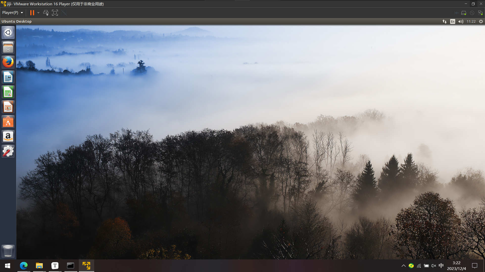

# 记录 VMware (Ubuntu 16.04)虚拟机 『安装 VMware Tools』 选项显示灰色的解决办法

学校的*计算机系统基础实验*课需要使用一个 Ubuntu 16.04 的虚拟机，我打算在 VMware 打开这个虚拟机(虽然学校的说明文件中让用 VirtualBox，但我发现 VMWare 也能打开)。然后需要安装 VMware Tools ，但是打开虚拟机后发现『安装 VMware Tools』 选项显示为灰色(点击不了)

<!-- more -->

{ loading=lazy }

然后在网上搜索，看到一篇文章中

[Ubuntu 安装VMware Tools选项显示灰色的正确解决办法_ubuntu的“重新安装vmtools“变成灰色-CSDN博客](https://blog.csdn.net/qq_19734597/article/details/106335934)

通过修改虚拟机设置中 CD/DVD 硬件设备的选项来解决，

于是我在我虚拟机上查看，

{ loading=lazy }

发现并没有 CD/DVD 的设备，于是进行添加，

{ loading=lazy }

然后『安装 VMware Tools』 选项就可以点击了，

{ loading=lazy }

于是将 VMwareTools `tar.gz` 文件解压到用户目录中(原本想在终端中用 `tar -zxvf` 命令解压但失败，可能是权限不够的原因，然后我就直接用压缩包查看器解压了)，

{ loading=lazy }

之后再运行文件夹中的 `vmware-install.pl` 文件即可(一开始没加 `sudo` 提示我权限不够)，

```bash
sudo ./vmware-install.pl
```

然后就装好了(运行完命令终端还需要输一下 `yes` 再按几下回车 ++enter++ )，然后重启就发现虚拟机系统能 自动适配分辨率 以及 复制粘贴文件/文本

{ loading=lazy }