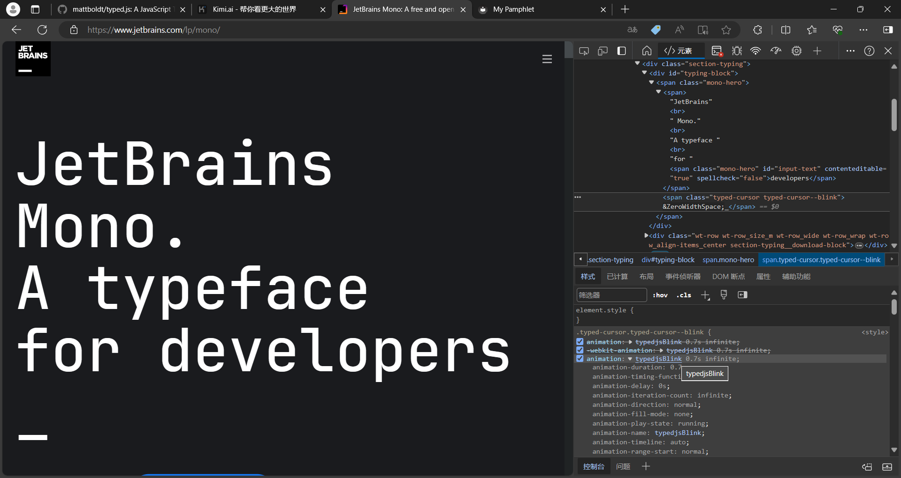

# 借助typed.js实现网页打字效果

由于在[JetBrains Mono字体网页](https://www.jetbrains.com/lp/mono/)上看到了打字的动画效果，然后想将这个效果应用到[手册首页](https://ronaldln.github.io/MyPamphlet/)的介绍文字上，于是开始进行尝试。

<!-- more -->

先是通过 开发者工具，查看打字区域的css样式

{ loading=lazy }

注意到了 `typedjsBlink` 的字样。

然后我拿网页的html源代码问AI

```html
<div id="typing-block">
  <span class="mono-hero">
    <span>
      "JetBrains"
      <br>
      " Mono."
      <br>
      "A typeface "
      <br>
      "for "
      <span class="mono-hero" id="input-text" contenteditable="true" spellcheck="false">developers</span>
    </span>
    <span class="typed-cursor typed-cursor--blink">​_</span>
  </span>
</div>
```

AI提到这样的打字效果可以用typed.js来实现，

于是去github上查看

[mattboldt/typed.js: A JavaScript Typing Animation Library (github.com)](https://github.com/mattboldt/typed.js)

在 `README.md` 中看到，最简单的使用方法是

```html
<!-- Element to contain animated typing -->
<span id="element"></span>

<!-- Load library from the CDN -->
<script src="https://unpkg.com/typed.js@2.1.0/dist/typed.umd.js"></script>

<!-- Setup and start animation! -->
<script>
  var typed = new Typed('#element', {
    strings: ['<i>First</i> sentence.', '&amp; a second sentence.'],
    typeSpeed: 50,
  });
</script>
```

即**先用 `<span>` 设置一个 `id`** ，并加载 `typed.js` 文件，然后需要使用 `<script>` 来编写或加载js脚本来设置对应 `id` 的属性(在 `new Typed(...)` 中的第一个参数中传入 `id` 名，并**注意需要加上 `#`** )，

然后查看官方的演示示例

[Typed.js - Type your heart out (mattboldt.github.io)](https://mattboldt.github.io/typed.js/)

通过查看示例了解到

-   `fadeOut: True` 设置(如果开启循环)最后内容会淡化至透明
-   `cursorChar: '_'` 设置**输入光标**的样子，如果不设置的话就默认是 `|`
-   在 `string:` 中
    -   `^` 之后加数字，如 `^1000` ，设置的是输入到这里之后进行一个**暂停**，数值越大暂停越久
    -   如果想不一个个输入(即一个个显示)文字，而是**直接显示某段文本**，可以使用 <code>\`...\`</code> 来设置要直接显示的文本(可以参考上面演示示例中的 `Bulk Typing` )
    -   在 `Bulk Typing` 中，换行用的是 `\n` ，但可能是因为markdown不支持 `\n` 换行，所以我就换成了用 `<br>` 来换行，并且用mkdocs预览能正确显示换行
-   `typeSpeed` 设置的是打字的速度，**数值越大打字的速度越慢**

于是最后我就将手册首页的介绍文字改成

```html title="index.md"
<script src="https://unpkg.com/typed.js@2.1.0/dist/typed.umd.js"></script>
<span id="typed-des"></span> 
<script src="javascripts/typed_content.js"></script>
```

```js title="typed_content.js"
var description = 'This is a ^1000 s`mall` pa`mphlet` ^500 `<br>` that records^100 the pits^100 I have stepped on.';
var typed = new Typed('#typed-des', {
  strings: [description],
  typeSpeed: 20,
  backSpeed: 0,
  cursorChar: '_',
  smartBackspace: true, // this is a default
  // fadeOut: true,
  // shuffle: true,
  loop: false
});
```

>   我把配置属性的javascripts代码放到了 `typed_content.js` 中，所以直接加载这个js文件就可以了
