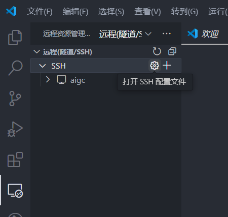
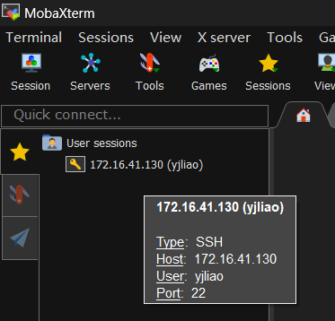

# 记录第一次使用远程服务器

## 起因

由于大创项目需要跑一个**文生3D模型**，于是给开了一个学校服务器的账号，

## 使用vscode连接

提到需要使用ssh方式连接，并且推荐使用MobaXterm和vscode，于是先搜索了如何使用vscode连接远程服务器，

>   参考了这个文章
>
>   [「效率」使用VScode连接远程服务器进行开发 - 知乎 (zhihu.com)](https://zhuanlan.zhihu.com/p/141205262)

<!-- more -->

首先需要安装 *Remote - SSH* 插件(安装好之后可能需要重启一下才会生效)，

点击左侧图标 :material-remote-desktop: (远程资源管理器)，再点击 SSH 的 :octicons-gear-24: 图标(打开 SSH 配置文件)，

{ loading=lazy }

可以选择第一个配置文件进行配置，

{ loading=lazy }

```python
# Read more about SSH config files: https://linux.die.net/man/5/ssh_config
Host aigc
    HostName 172.16.41.130
    User yjliao
```

`Host` 好像可以自行写，`HostName` 填写服务器IP，`User` 填写用户名，

然后点击配置好的服务器的 :material-arrow-right: 图标连接服务器，

{ loading=lazy }

然后需要输入密码(如果没密码可能就不需要输入?)

{ loading=lazy }

## 使用MobaXterm连接

由于使用vscode上传和下载文件感觉挺慢，而且没有进度条，不知道传输的进度如何，

于是搜索如何给远程服务器传输文件，

>   参考了这个文章
>
>   [连接远程服务器、传conda环境和数据集进行深度学习模型训练 - 知乎 (zhihu.com)](https://zhuanlan.zhihu.com/p/501487659)

发现文章中提到了使用MobaXterm来传输文件，于是去下载安装，

点击『Sessions』添加新的服务器，

{ loading=lazy }

选择SSH并添加服务器IP和用户名(但用户名似乎是可选的?)

{ loading=lazy }

然后双击新添的服务器就可以打开了

{ loading=lazy }

之后将文件上传至远程服务器，有显示进度条，并且速度也不慢