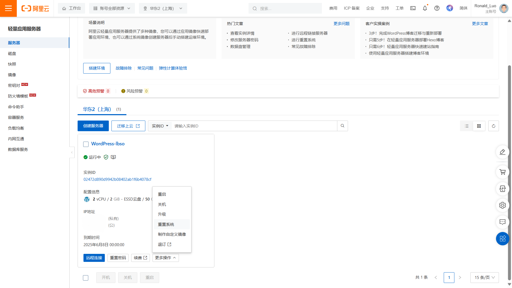

# 使用云服务器从零安装宝塔面板记录

因为618促销，于是买了一个一年的服务器打算玩一玩。

由于原来的服务器的系统是WordPress系统，于是重置系统为CentOS

<!-- more -->

{ loading=lazy }

{ loading=lazy }

## 使用Termius SSH远程连接服务器

安装好Termius之后，在顶部的输入栏输入ssh连接的命令(==默认端口是22==)

```bash
ssh -p 22 root@x.x.x.x
```

{ loading=lazy }

然后发现，需要使用密钥

{ loading=lazy }

### 配置密钥

在控制台『密钥对』中创建密钥，并绑定实例

{ loading=lazy }

然后会下载密钥pem文件，再把这个pem文件拖入到Termius的框中，就可以连接上服务器了

{ loading=lazy }

## 安装宝塔面板

!!! quote "安装方法"

    [查看详细教程 >>](https://www.bt.cn/bbs/thread-79460-1-1.html)
    
    >   使用 SSH 连接工具，如[堡塔SSH终端](https://download.bt.cn/xterm/BT-Term.zip)连接到您的 Linux 服务器后，[挂载磁盘](https://www.bt.cn/bbs/thread-50002-1-1.html)，根据系统执行相应命令开始安装（大约2分钟完成面板安装）：
    >
    >   Centos安装脚本
    >
    >   ```bash
    >   yum install -y wget && wget -O install.sh http://download.bt.cn/install/install_6.0.sh && sh install.sh ed8484bec
    >   ```
    >
    >   Ubuntu/Deepin安装脚本
    >
    >   ```bash
    >   wget -O install.sh http://download.bt.cn/install/install-ubuntu_6.0.sh && sudo bash install.sh ed8484bec
    >   ```
    >
    >   Debian安装脚本
    >
    >   ```bash
    >   wget -O install.sh http://download.bt.cn/install/install-ubuntu_6.0.sh && bash install.sh ed8484bec
    >   ```
    >
    >   Fedora安装脚本
    >
    >   ```bash
    >   wget -O install.sh http://download.bt.cn/install/install_6.0.sh && bash install.sh ed8484bec
    >   ```
    
    注意：必须为没装过其它环境如Apache/Nginx/php/MySQL的新系统,推荐使用centos 7.X的系统安装宝塔面板

安装成功，显示

```bash hl_lines="12"
==================================================================
Congratulations! Installed successfully!
=============注意：首次打开面板浏览器将提示不安全=================

 请选择以下其中一种方式解决不安全提醒
 1、下载证书，地址：https://dg2.bt.cn/ssl/baota_root.pfx，双击安装,密码【www.bt.cn】
 2、点击【高级】-【继续访问】或【接受风险并继续】访问
 教程：https://www.bt.cn/bbs/thread-117246-1-1.html

========================面板账户登录信息==========================

 【云服务器】请在安全组放行 24751 端口
 外网面板地址: https://x.x.x.x:24751/xxxxxxxx
 内网面板地址: https://x.x.x.x:24751/xxxxxxxx
 username: xxxxxxxx
 password: xxxxxxxx

 浏览器访问以下链接，添加宝塔客服
 https://www.bt.cn/new/wechat_customer
==================================================================
```

浏览器访问面板地址发现无法访问，于是在**安全组放行端口**。

经过一番摸索，发现阿里云 ==轻量应用服务器== 需要点击**实例ID**，进入实例内部进行设置，

在『防火墙』中添加一条新规则

{ loading=lazy }

然后就能访问宝塔面板了

{ loading=lazy }

