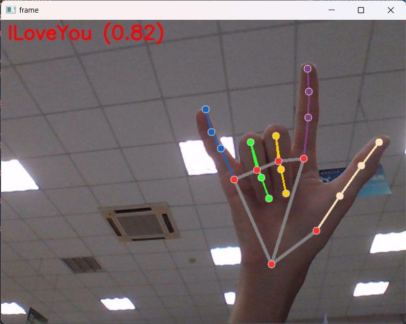

# 在Python中实现使用MediaPipe摄像头视频流识别手势并显示标注图像

由于mediapipe官方的文档以及python的代码示例中，

>   -   [Python 手势识别指南  | Google AI Edge  | Google for Developers](https://ai.google.dev/edge/mediapipe/solutions/vision/gesture_recognizer/python?hl=zh-cn)
>   -   [gesture_recognizer.ipynb - Colab (google.com)](https://colab.research.google.com/github/googlesamples/mediapipe/blob/main/examples/gesture_recognizer/python/gesture_recognizer.ipynb?hl=zh-cn)

没有给出摄像头视频流检测的代码，代码示例中只提供了对4张示例图片进行检测的代码，于是开始参考代码示例进行代码的编写。

<!-- more -->

先是将 [gesture_recognizer.ipynb](https://colab.research.google.com/github/googlesamples/mediapipe/blob/main/examples/gesture_recognizer/python/gesture_recognizer.ipynb?hl=zh-cn) 中 **Visualization Utilities** 中的代码复制到 `utils/visualization_utils.py`

```python title="utils/visualization_utils.py" linenums="1" hl_lines="6"
#@markdown We implemented some functions to visualize the gesture recognition results. <br/> Run the following cell to activate the functions.
from matplotlib import pyplot as plt
import mediapipe as mp
from mediapipe.framework.formats import landmark_pb2

import math

plt.rcParams.update({
    'axes.spines.top': False,
    'axes.spines.right': False,
    'axes.spines.left': False,
    'axes.spines.bottom': False,
    'xtick.labelbottom': False,
    'xtick.bottom': False,
    'ytick.labelleft': False,
    'ytick.left': False,
    'xtick.labeltop': False,
    'xtick.top': False,
    'ytick.labelright': False,
    'ytick.right': False
})

mp_hands = mp.solutions.hands
mp_drawing = mp.solutions.drawing_utils
mp_drawing_styles = mp.solutions.drawing_styles


def display_one_image(image, title, subplot, titlesize=16):
    """Displays one image along with the predicted category name and score."""
    plt.subplot(*subplot)
    plt.imshow(image)
    if len(title) > 0:
        plt.title(title, fontsize=int(titlesize), color='black', fontdict={'verticalalignment':'center'}, pad=int(titlesize/1.5))
    return (subplot[0], subplot[1], subplot[2]+1)


def display_batch_of_images_with_gestures_and_hand_landmarks(images, results):
    """Displays a batch of images with the gesture category and its score along with the hand landmarks."""
    # Images and labels.
    images = [image.numpy_view() for image in images]
    gestures = [top_gesture for (top_gesture, _) in results]
    multi_hand_landmarks_list = [multi_hand_landmarks for (_, multi_hand_landmarks) in results]

    # Auto-squaring: this will drop data that does not fit into square or square-ish rectangle.
    rows = int(math.sqrt(len(images)))
    cols = len(images) // rows

    # Size and spacing.
    FIGSIZE = 13.0
    SPACING = 0.1
    subplot=(rows,cols, 1)
    if rows < cols:
        plt.figure(figsize=(FIGSIZE,FIGSIZE/cols*rows))
    else:
        plt.figure(figsize=(FIGSIZE/rows*cols,FIGSIZE))

    # Display gestures and hand landmarks.
    for i, (image, gestures) in enumerate(zip(images[:rows*cols], gestures[:rows*cols])):
        title = f"{gestures.category_name} ({gestures.score:.2f})"
        dynamic_titlesize = FIGSIZE*SPACING/max(rows,cols) * 40 + 3
        annotated_image = image.copy()

        for hand_landmarks in multi_hand_landmarks_list[i]:
            hand_landmarks_proto = landmark_pb2.NormalizedLandmarkList()
            hand_landmarks_proto.landmark.extend([
                landmark_pb2.NormalizedLandmark(x=landmark.x, y=landmark.y, z=landmark.z) for landmark in hand_landmarks
            ])

            mp_drawing.draw_landmarks(
                annotated_image,
                hand_landmarks_proto,
                mp_hands.HAND_CONNECTIONS,
                mp_drawing_styles.get_default_hand_landmarks_style(),
                mp_drawing_styles.get_default_hand_connections_style())

        subplot = display_one_image(annotated_image, title, subplot, titlesize=dynamic_titlesize)

    # Layout.
    plt.tight_layout()
    plt.subplots_adjust(wspace=SPACING, hspace=SPACING)
    plt.show()
```

然后参考 **Running inference and visualizing the results** 中的**几个步骤**来编写主文件的代码

>   ```python linenums="1"
>   # STEP 1: Import the necessary modules.
>   import mediapipe as mp
>   from mediapipe.tasks import python
>   from mediapipe.tasks.python import vision
>   
>   # STEP 2: Create an GestureRecognizer object.
>   base_options = python.BaseOptions(model_asset_path='gesture_recognizer.task')
>   options = vision.GestureRecognizerOptions(base_options=base_options)
>   recognizer = vision.GestureRecognizer.create_from_options(options)
>   
>   images = []
>   results = []
>   for image_file_name in IMAGE_FILENAMES:
>       # STEP 3: Load the input image.
>       image = mp.Image.create_from_file(image_file_name)
>   
>       # STEP 4: Recognize gestures in the input image.
>       recognition_result = recognizer.recognize(image)
>   
>       # STEP 5: Process the result. In this case, visualize it.
>       images.append(image)
>       top_gesture = recognition_result.gestures[0][0]
>       hand_landmarks = recognition_result.hand_landmarks
>       results.append((top_gesture, hand_landmarks))
>   
>   display_batch_of_images_with_gestures_and_hand_landmarks(images, results)
>   ```

在**STEP 3**中，由于是需要加载用opencv从摄像头中读取到的帧，而参考[官方文档中的**准备数据**](https://ai.google.dev/edge/mediapipe/solutions/vision/gesture_recognizer/python?hl=zh-cn#prepare_data)，需要修改成类似这样

```python
# Convert the frame received from OpenCV to a MediaPipe’s Image object.
mp_image = mp.Image(image_format=mp.ImageFormat.SRGB, data=numpy_frame_from_opencv)
```

>   opencv调用摄像头读取出来的图像的数据类型就是numpy数组 `numpy.ndarray`

而注意到，这里使用的是**RGB**格式( `image_format=mp.ImageFormat.SRGB` )，所以需要多一步转换帧的格式

```python
rgb_frame = cv2.cvtColor(frame, cv2.COLOR_BGR2RGB)
```

>   一开始没有进行转换，最后发现手势识别断断续续

**STEP 5**中，结合 `visualization_utils.py` ，发现只需要 `top_gesture` `hand_landmarks` 就够标注当前画面了，但**还需要考虑图像中没有手势的情况**(这一点是后面测试时发现的，如果不加判断，画面中如果没有手的话会报错 `Index out of range` )，于是修改成

```python
if recognition_result.gestures:
    # STEP 5: Process the result. In this case, visualize it.
    top_gesture = recognition_result.gestures[0][0]
    hand_landmarks = recognition_result.hand_landmarks

    annotated_image = draw_one_image_with_gestures_and_hand_landmarks(mp_image, top_gesture, hand_landmarks)
```

并且在 `visualization_utils.py` 中编写 `draw_one_image_with_gestures_and_hand_landmarks` 函数(用于对单帧图像进行绘制标注)，

!!! tip

    参考 `display_batch_of_images_with_gestures_and_hand_landmarks` 中的代码，发现有一个值得注意的地方，`mediapipe.Image` 对象使用 `.numpy_view()` 方法就可以获取到numpy数组的格式(但注意是**RGB**格式的)

于是最后将函数写成

```python title="utils/visualization_utils.py" linenums="85"
def draw_one_image_with_gestures_and_hand_landmarks(image, gesture, multi_hand_landmarks):
    """Draws the gesture category and its score along with the hand landmarks on the image."""
    title = f"{gesture.category_name} ({gesture.score:.2f})"
    annotated_image = image.numpy_view().copy()

    # convert the image from RGB to BGR
    annotated_image = cv2.cvtColor(annotated_image, cv2.COLOR_RGB2BGR)

    for hand_landmarks in multi_hand_landmarks:
        hand_landmarks_proto = landmark_pb2.NormalizedLandmarkList()
        hand_landmarks_proto.landmark.extend([
            landmark_pb2.NormalizedLandmark(x=landmark.x, y=landmark.y, z=landmark.z) for landmark in hand_landmarks
        ])

        mp_drawing.draw_landmarks(
            annotated_image,
            hand_landmarks_proto,
            mp_hands.HAND_CONNECTIONS,
            mp_drawing_styles.get_default_hand_landmarks_style(),
            mp_drawing_styles.get_default_hand_connections_style())
        
    # put the gesture category and its score on the image
    cv2.putText(annotated_image, title, (10, 30), cv2.FONT_HERSHEY_SIMPLEX, 1, (0, 0, 255), 2, cv2.LINE_AA)

    return annotated_image
```

最后运行主文件中的代码，发现就可以**流畅**地在相机实时图像中检测手势并标注出来了

{ loading=lazy }