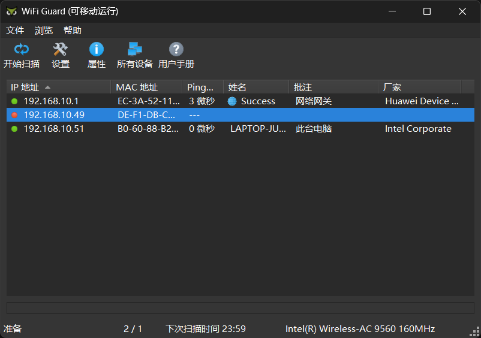

# 在电脑上查看连接手机热点的设备的ip

打算通过电脑和树莓派同时连接手机热点，然后ssh远程连接树莓派。但是由于用来开热点的手机是小米的，发现在小米设置里面不能看到连接的设备的ip地址(只能看到mac地址)，于是**使用英文**在bing上搜索相应的方法

>   [how to check ip of device connected to phone's hotspot - 搜索 (bing.com)](https://www.bing.com/search?pglt=131&q=how+to+check+ip+of+device+connected+to+phone's+hotspot&cvid=c23e69b4653e4faf90530a6d01a41879&gs_lcrp=EgZjaHJvbWUyBggAEEUYOTIGCAEQRRg80gEJMjU1NzlqMGoxqAIIsAIB&FORM=ANNTA1&adppc=EdgeStart&PC=NMTS&mkt=zh-CN)

然后在这个文章上找到了可用的方法，

-   [How To See Hotspot Connected Devices On Android (safewiper.com)](https://www.safewiper.com/blog/how-to-see-hotspot-connected-devices-on-android.html)

<!-- more -->

一开始先是尝试了文中提到的手机上的Fing app，

>   <h2>Method 2: Using Third-Party Apps</h2>
>
>   Another way to see connected devices on your Android phone is by using third-party apps. There are several apps available on the Play Store that can help you do this. Here’s how to do it using one such app – Fing:
>
>   1.   Install the Fing app from the Play Store.
>   2.   Open the app and select your hotspot network.
>   3.   You should now be able to see a list of devices connected to your hotspot, along with their names and IP addresses.

但是下载安装后发现在不能在我的手机上打开。

---

于是就换文章中提到的另一个方法尝试

>   <h2>Method 4: Using Third-Party Software</h2>
>
>   If you’re looking for even more detailed information about connected devices, you might consider installing third-party software on your computer. There are several options available, including Wireshark and SoftPerfect WiFi Guard. Here’s how to do it using SoftPerfect WiFi Guard:
>
>   1.   Install SoftPerfect WiFi Guard on your computer.
>   2.   Connect your Android phone to your computer via USB cable.
>   3.   Open SoftPerfect WiFi Guard and select your wireless adapter.
>   4.   Start the scanning process.
>   5.   You should now be able to see a comprehensive list of devices connected to your hotspot, including detailed information like MAC addresses and device vendor names.

提到了在电脑上安装**SoftPerfect WiFi Guard**软件，并连接手机的热点，然后就可以查看到连接热点的设备的ip地址了

>   SoftPerfect WiFi Guard官方下载界面
>
>   [SoftPerfect WiFi Guard : keep your Wi-Fi network secure](https://www.softperfect.com/products/wifiguard/)

下载好后打开软件(编写版可以直接打开运行，安装版可能需要安装)，点击『开始扫描』，就可以扫描所连的局域网中的其他设备的ip了

{ loading=lazy }