# 人工智能前沿课程大作业过程简要记录

## 阅读原论文

>   为了能够快速而准确地理解论文，借助豆包的翻译功能以中英文对照阅读理解

<!-- more -->

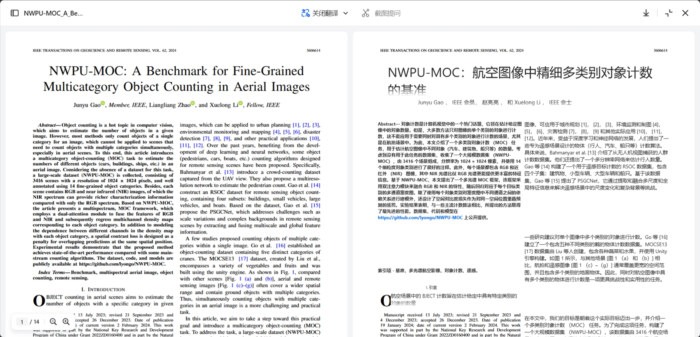{ loading=lazy }

大致阅读完论文之后，知道了论文内容有这4个重点

-   引入了 *Multicategory Object Counting (MOC)* 多类别目标计数任务
-   创建了NWPU-MOC数据集
-   设计了一个 *multichannel density map counting (MCC)* 多通道密度图计数框架
-   提出了空间对比损失和新的用于MOC任务的评估指标

## 复现代码

在论文中提到了实现的代码的github仓库地址

>   [https://github.com/lyongo/NWPU-MOC](https://github.com/lyongo/NWPU-MOC)

将代码克隆到本地

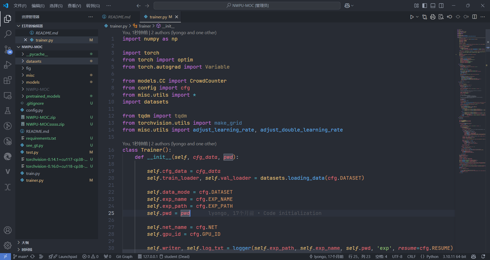{ loading=lazy }

再将数据集下载下来

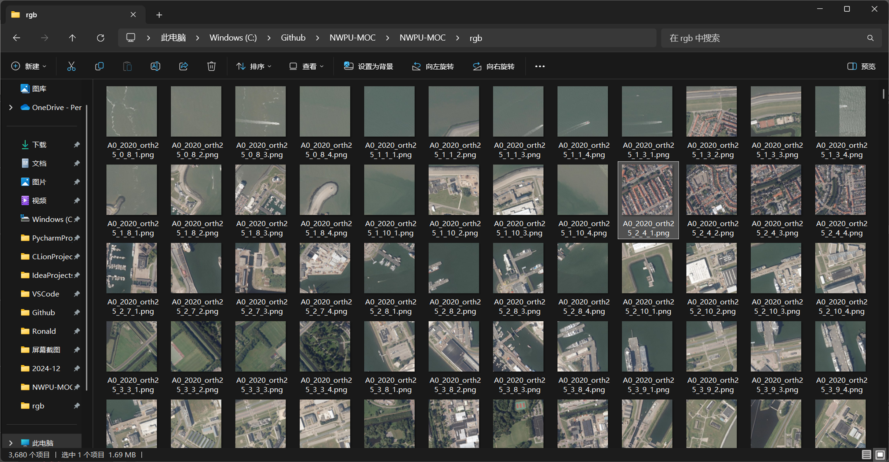{ loading=lazy }

一开始尝试在我的笔记本上运行，发现报错显示需要cuda，

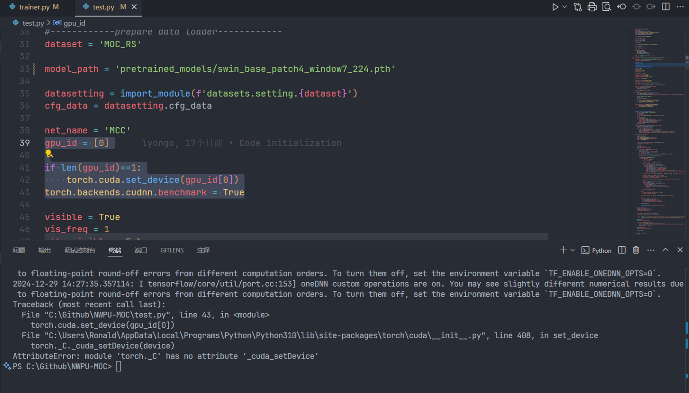{ loading=lazy }

由于我的电脑没有n卡，所以打算将代码和数据集传到服务器上尝试运行

### 借助百度网盘bypy将数据集快速传输到服务器中

由于数据集大小有7g，而直接通过ssh来传输速率只有1mb/s这样，于是上网搜索是否有其他办法能够较为快速地给服务器传输大文件，然后通过这篇文章知道了，可以通过bypy包，借助百度网盘来快速地传输大文件

-   [远程服务器快速传输大文件必备(Linux服务器接收1G以上大文件)_bypy上传大文件-CSDN博客](https://blog.csdn.net/weixin_50761068/article/details/142977262)

数据集在服务器上下载好之后，尝试运行然后出现了这样的报错

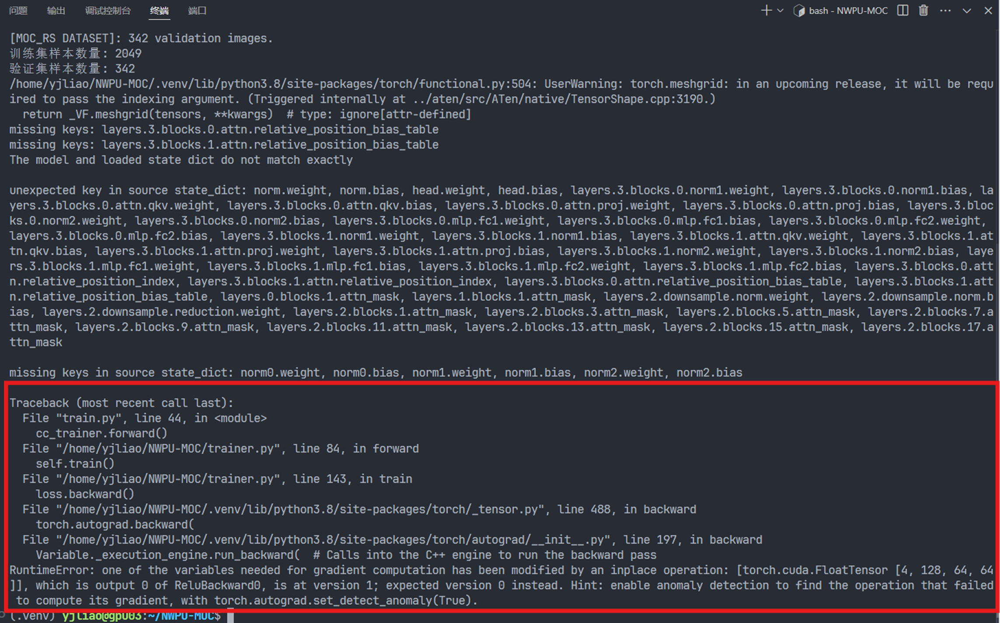{ loading=lazy }

一开始先是通过谷歌搜索相关的报错信息，发现查找不到较为有用的信息，然后询问copilot

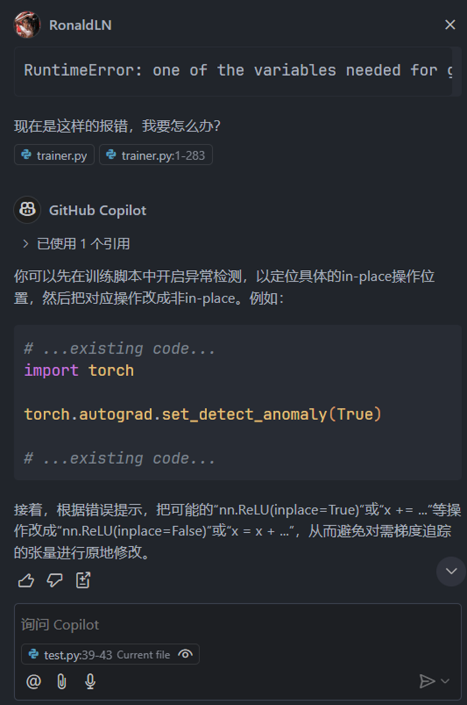{ loading=lazy style="zoom: 33%" }

得知加上这行代码，

```python
torch.autograd.set_detect_anomaly(True)
```

可以显示更加详细的报错信息。于是添加之后再次运行，报错如下

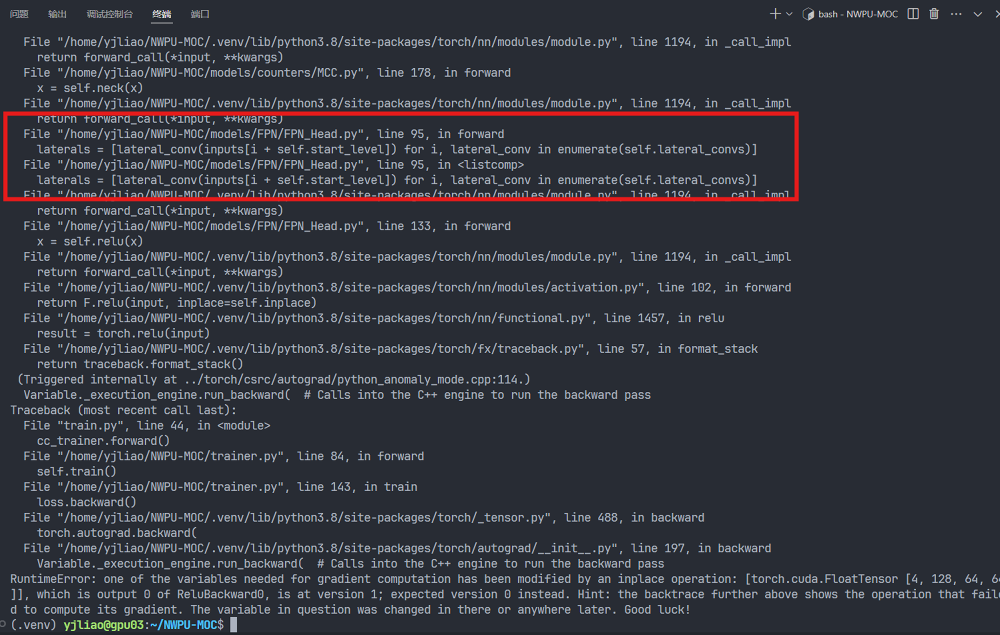{ loading=lazy }

定位到错误可能出在 `FPN_Head.py` 中，但是不知道具体要如何修改，于是继续询问copilot

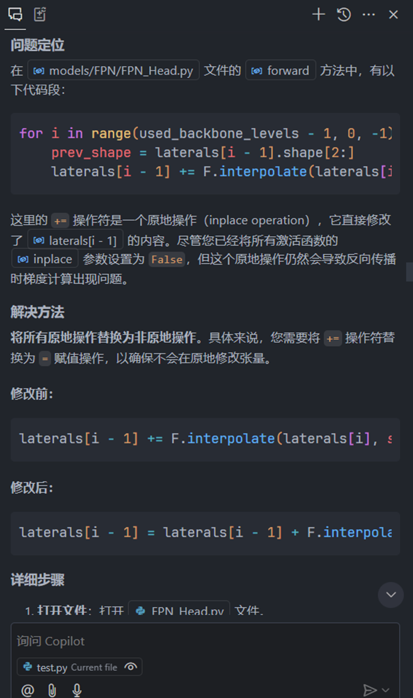{ loading=lazy style="zoom: 33%" }

然后按照copilot的回复修改相应的代码，再次运行，就可以开始训练模型了

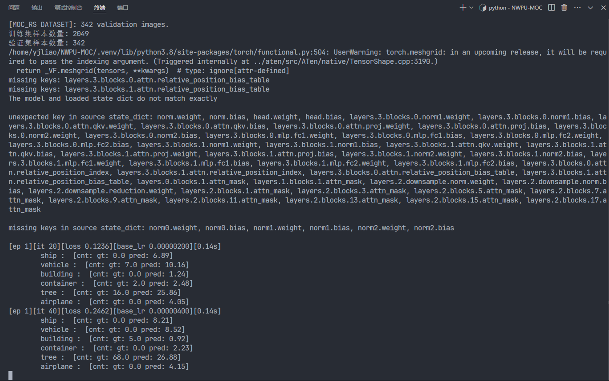{ loading=lazy }

再将训练的模型在测试集上进行预测，

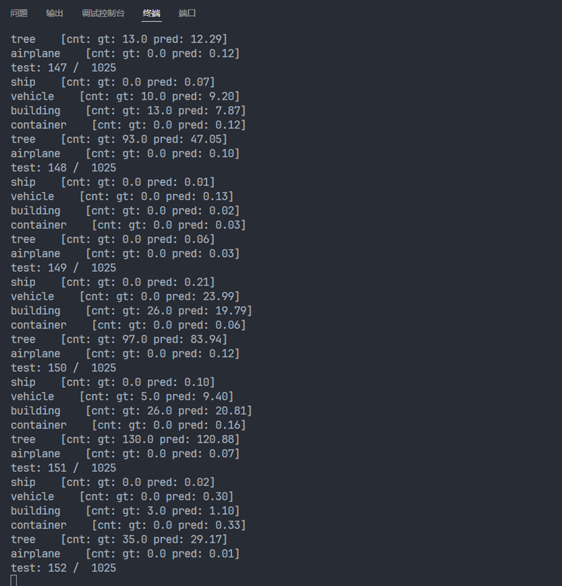{ loading=lazy }

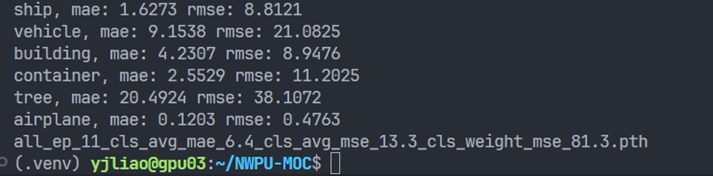{ loading=lazy }

>   期间发现使用多卡训练的速度竟然比单卡训练的速度要慢😂
>
>   -   单卡训练
>
>       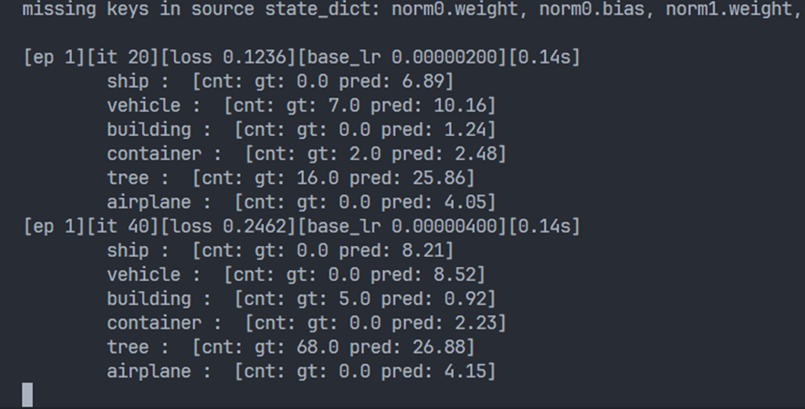{ loading=lazy }
>
>   -   多卡训练
>
>       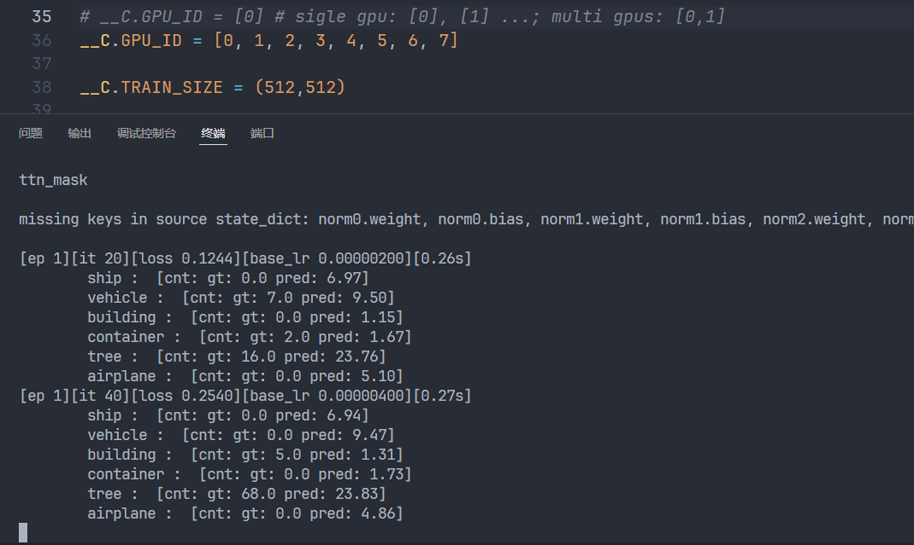{ loading=lazy }

## 尝试理解代码

直接借助copilot来理解整个仓库的结构

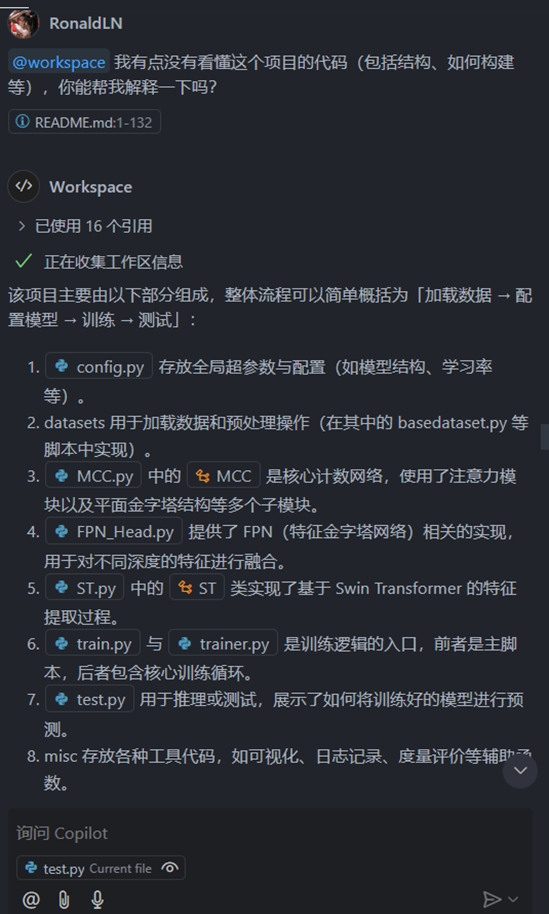{ loading=lazy style="zoom: 33%" }

## 查看数据集

官方github仓库中给出的数据集的文件结构如下，

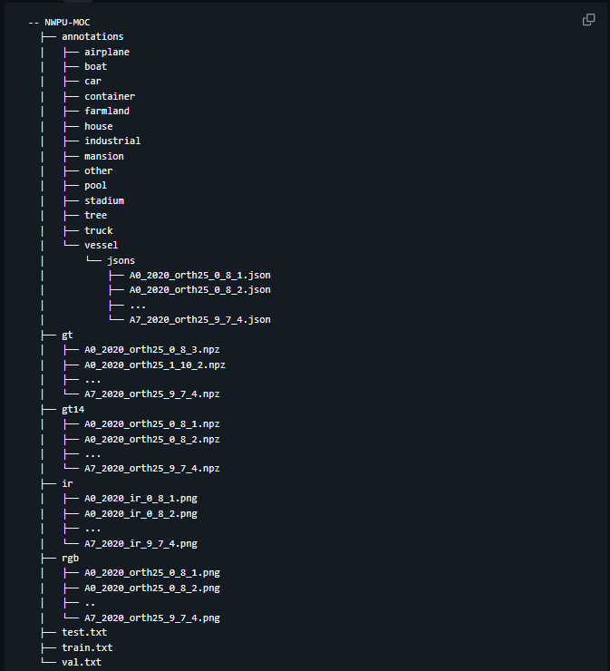{ loading=lazy }

由于好奇 `.npz` 文件(NumPy的数据文件)中的数据是什么样的，于是生成了简单的代码查看了一下

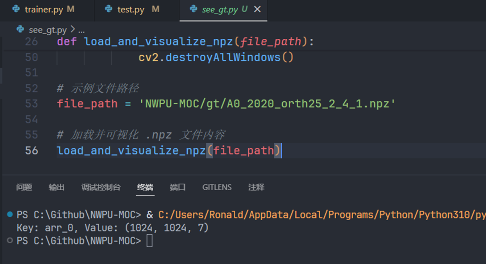{ loading=lazy style="zoom: 50%" }

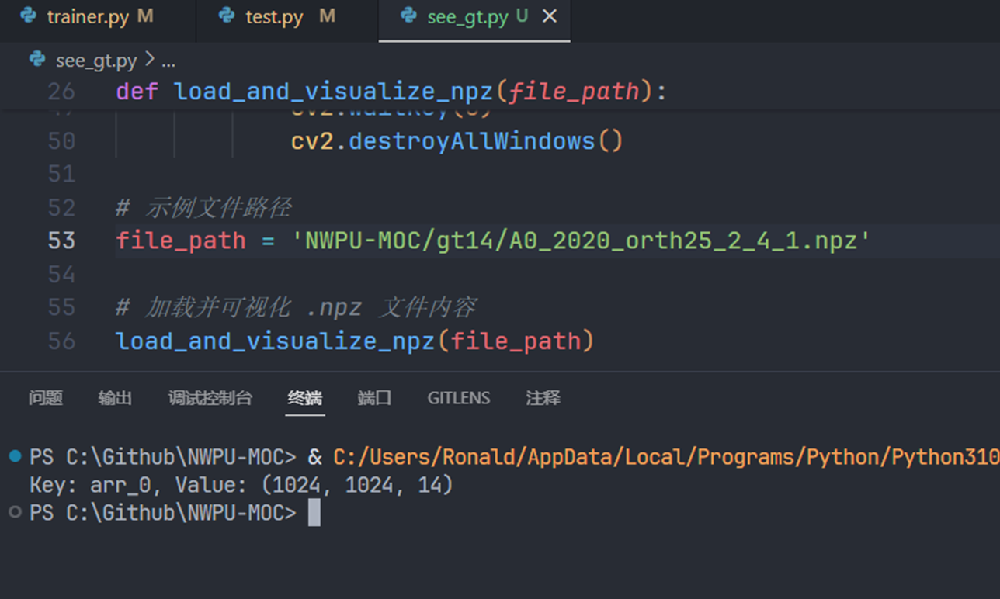{ loading=lazy style="zoom: 50%" }

发现这些 `.npz` 文件中的元素的值都是0或者1(1表示是这个类别，0表示不是)，每个通道表示一种类别

>   gt14刚好14个类别对应14个通道，但是gt只有6个类别不知道为什么会有7个通道😅

## 脑洞

想尝试把训练好的模型尝试应用于视频流的检测中(打算在网上随便找一些航拍的视频)，于是让copilot基于源代码进行修改

{ loading=lazy }

>   但是由于时间不够了就没有去进一步深入了...😅
