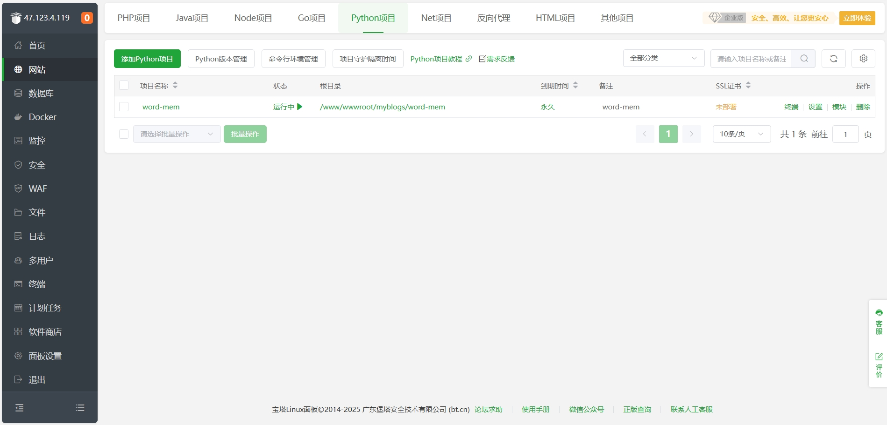
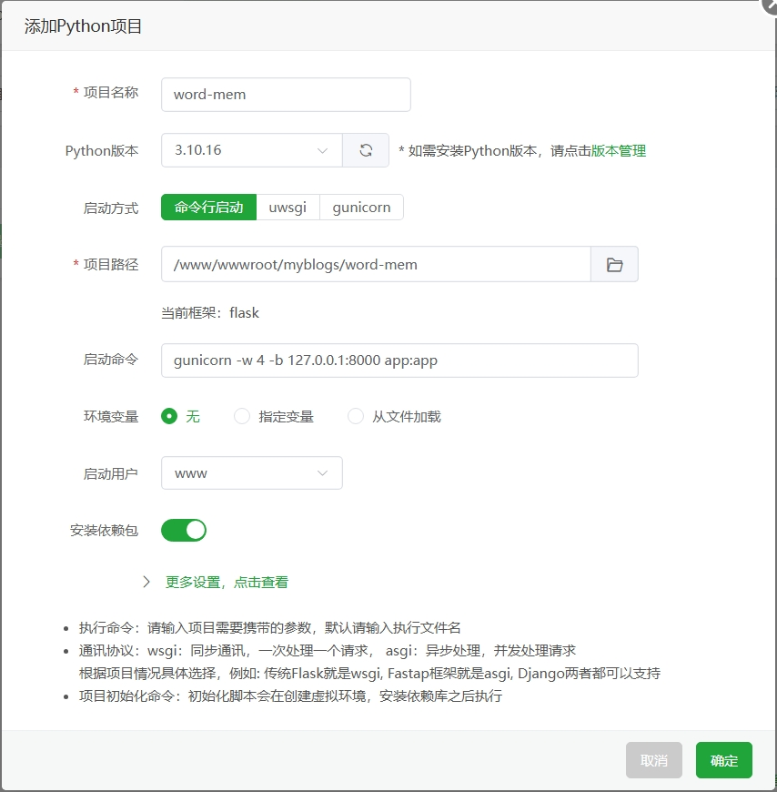

# 借助DeepSeek将Python程序转换为Flask网页并实现服务器部署的记录

背单词的过程中，由于按照自测也是按照背的顺序，因此比较容易想到对应的词义，但是突然见到其中一个单词时，发现会想不起来。于是就想让deepseek写一个可以随机显示单词，并且根据“记不清”的次数调整出现概率的python程序

## 用Python实现单词记忆测试功能

<!-- more -->

???+ example "对话记录"

    **You**:
    
    我想要把这个pdf中的表格中的所有的单词(以表格单元格为单位)提取到程序中，以便我随机输出来测试，我应该如何进行提取？
    
    &nbsp;
    
    **DeepSeek**:
    
    ...
    
    &nbsp;
    
    **You**:
    
    我现在提取出这些单词了，我想要编写一个程序，能够随机从这个词库中挑选单词显示在终端中，我看终端中的单词，如果我记得单词的含义，就按y，不记得就按n，然后程序会记录我的历史数据，并且在显示下一个单词时，要与当前的单词不同并且根据历史数据来加权(不记得次数多的单词赋予更大的权重/出现概率)。如果我不想继续测试单词记忆了，就按q退出这个程序，并且程序会将这一次的数据添加/更新到过往所有的历史数据中(历史数据我想使用yaml文件的形式来存储)。
    
    &nbsp;
    
    **DeepSeek**:
    
    ??? quote "已深度思考（用时 35 秒）"
    
        >   嗯，用户的问题是想编写一个程序，实现一个根据记忆情况动态调整单词出现概率的测试工具。用户已经提取了单词，现在需要程序随机显示，记录用户记忆情况，用yaml存储历史数据，并且下次运行时能根据历史数据调整权重。我得一步步想怎么实现这个功能。
        >
        >   首先，程序的结构应该包括读取现有的yaml历史数据，如果没有就初始化。然后每次测试时，根据每个单词的权重（不记得次数越多权重越高）来随机选择单词。用户输入y或n后，更新该单词的记录，并调整权重。退出时保存到yaml。
        >
        >   关于加权随机选择，用户提到不记得次数多的单词出现概率更高。这需要用到带权重的随机选择方法。根据之前的搜索结果，比如网页1和网页2提到的，Python的random.choices函数支持weights参数，可以直接用。权重可以设计为每个单词的“忘记次数+1”（避免零权重）。
        >
        >   然后是数据结构的设计。每个单词需要存储总测试次数和忘记次数，这样每次选择时可以计算权重。历史数据用yaml存储，结构可能是字典，键是单词，值是两个数字的列表，比如{'apple': [5, 3]}，表示测试5次，忘记3次。
        >
        >   程序流程大概是这样的：
        >
        >   1.   启动时加载yaml文件，读取历史数据。
        >
        >   2.   如果用户有新增的单词（当前词库），合并到历史数据中，新增的单词初始化为[0,0]。
        >
        >   3.   进入循环，每次根据权重选择单词。
        >
        >   4.   显示单词，等待用户输入。
        >
        >   5.   更新该单词的测试次数和忘记次数（如果输入n）。
        >
        >   6.   直到用户输入q，保存数据到yaml。
        >
        >   需要注意的问题：
        >
        >   -   如何处理新单词，确保它们被加入历史数据。
        >
        >   -   每次选择时要排除当前显示的单词，避免重复。可能需要维护一个已显示列表，或者从列表中临时移除当前单词。
        >
        >   -   yaml的读写需要使用PyYAML库，dump时注意格式。
        >
        >   根据网页25、27、35等，yaml的读写可以通过PyYAML库实现。使用safe_load和safe_dump来处理数据。此外，合并当前词库和历史数据时，需要检查每个单词是否存在，不存在则初始化。
        >
        >   对于加权随机，每次生成权重列表时，根据每个单词的忘记次数+1作为权重，这样即使新单词从未测试过，权重为1，也有机会被选中。而忘记次数多的权重更高。
        >
        >   另外，用户希望每次显示下一个单词时与当前的不同，所以在选择下一个单词时，需要排除当前显示的单词。可以通过在random.choices时传入一个排除当前单词的列表，或者在选择后暂时从候选列表中移除，但这样可能影响权重计算。可能需要重新生成候选列表，排除当前单词，并重新计算权重。
        >
        >   例如，在选择下一个单词时，先复制当前词库，移除当前单词，然后根据剩余单词的权重进行选择。但这样可能会影响整体的权重分布，但用户的需求是确保下一个单词不同，所以必须这样做。
        >
        >   综合这些考虑，代码的大致步骤是：
        >
        >   1.   加载历史数据。
        >
        >   2.   合并当前词库，确保所有单词都有历史记录。
        >
        >   3.   进入循环：
        >
        >        1.   根据权重生成候选列表（排除当前单词）。
        >
        >        2.   使用random.choices选择单词。
        >
        >        3.   显示单词，获取输入。
        >
        >        4.   更新历史数据。
        >
        >        5.   保存当前单词，以便下次排除。
        >
        >   4.   退出时保存到yaml。
        >
        >   代码结构可能如下：
        >
        >   -   使用PyYAML读取和写入yaml文件。
        >
        >   -   使用random.choices的weights参数实现加权随机。
        >
        >   -   维护一个last_word变量，记录当前显示的单词，下次选择时排除。
        >
        >   现在，需要处理排除当前单词的情况。例如，在候选列表中排除last_word，然后计算对应的权重列表。如果候选列表为空（比如只有一个单词），则允许重复。
        >
        >   此外，处理用户输入时，需要循环直到输入有效（y/n/q），忽略其他输入。
        >
        >   测试时，需要确保每次更新历史数据正确，并且yaml文件正确保存。
        >
        >   最后，示例代码应该包括这些部分，并给出注释说明关键步骤。
    
    根据你的需求，我将为你设计一个基于Python的单词记忆测试系统。以下是分步骤的实现方案及代码实现：
    
    ---
    
    <h3>一、技术方案设计</h3>
    
    1.  **权重计算**：使用`random.choices`的`weights`参数实现加权随机，权重=忘记次数+1（避免0权重）
    2.  **数据存储**：YAML文件存储历史记录，格式为`{单词: [总测试次数, 忘记次数]}`
    3.  **流程控制**：循环显示单词，记录用户反馈，退出时更新YAML文件
    
    ---
    
    <h3>二、代码实现</h3>
    
    ```python
    import random
    import yaml
    from pathlib import Path
    
    class WordMemoryTest:
        def __init__(self, word_list, history_file='history.yaml'):
            self.word_list = word_list
            self.history_file = Path(history_file)
            self.history = self._load_history()
            self.last_word = None
    
        def _load_history(self):
            """加载历史记录"""
            if self.history_file.exists():
                with open(self.history_file, 'r') as f:
                    return yaml.safe_load(f) or {}
            return {}
    
        def _save_history(self):
            """保存历史记录"""
            with open(self.history_file, 'w') as f:
                yaml.safe_dump(self.history, f)
    
        def _update_history(self, word, remembered):
            """更新单词记忆数据"""
            if word not in self.history:
                self.history[word] = [0, 0]
            self.history[word][0] += 1  # 总次数
            if not remembered:
                self.history[word][1] += 1  # 忘记次数
    
        def _get_weights(self):
            """生成权重列表（排除当前单词）"""
            candidates = [w for w in self.word_list if w != self.last_word]
            return [self.history.get(w, [0,0])[1] + 1 for w in candidates]
    
        def run(self):
            """运行测试"""
            # 合并新单词到历史记录
            for word in self.word_list:
                if word not in self.history:
                    self.history[word] = [0, 0]
    
            while True:
                # 生成候选列表和权重
                candidates = [w for w in self.word_list if w != self.last_word]
                weights = self._get_weights()
                
                if not candidates:  # 处理只剩一个单词的情况
                    candidates = self.word_list
                    weights = [self.history[w][1]+1 for w in candidates]
    
                # 加权随机选择
                chosen = random.choices(candidates, weights=weights, k=1)[0]
                self.last_word = chosen
                
                # 用户交互
                print(f"\n当前单词：{chosen}")
                action = input("记得按y，忘记按n，退出按q：").lower()
                
                if action == 'q':
                    self._save_history()
                    print("已保存学习记录")
                    break
                elif action in ('y', 'n'):
                    self._update_history(chosen, action == 'y')
    
    # 使用示例
    if __name__ == "__main__":
        # 你的单词列表（示例）
        words = ["apple", "banana", "cognitive", "paradigm", "algorithm"]
        
        test = WordMemoryTest(words)
        test.run()
    ```
    
    ---
    
    <h3>三、核心功能说明</h3>
    
    1.  **YAML数据存储**：
        
        -   自动创建`history.yaml`文件
        
        -   格式示例：
            
            ```yaml
            apple: [3, 1]
            banana: [5, 2]
            cognitive: [2, 2]
            ```
    
    2.  **动态权重计算**：
        
        -   新单词初始权重为1
        
        -   每次忘记会使权重+1
        
        -   自动排除当前显示的单词
    
    3.  **历史数据合并**：
        
        -   自动检测新增单词
        
        -   保留原有学习记录
    
    ---
    
    <h3>四、扩展建议</h3>
    
    1.  **记忆曲线优化**：参考艾宾浩斯遗忘曲线，添加间隔重复算法
    
    2.  **可视化报告**：使用`matplotlib`生成学习进度图表
    
    3.  **多维度权重**：结合测试时间、词频等因素计算综合权重
    
    4.  **云端同步**：增加Google Drive/Dropbox API实现多设备同步
    
    ---
    
    <h3>五、运行说明</h3>
    
    1.  安装依赖：
        
        ```bash
        pip install pyyaml
        ```
    
    2.  将你的单词列表替换`words`变量
    
    3.  每次运行会自动创建/更新`history.yaml`文件
    
    这个系统可以帮助你高效记忆单词，随着使用时间的增加，程序会智能强化你不熟悉的词汇训练。如果需要进一步的功能扩展，可以参考注释中的扩展建议进行开发。

然后我把deepseek编写的代码测试修改整理了一下，换成了使用 `json` 的格式来存储数据(因为yaml在存储的时候，字典中的key中的空格会被去除，而我想保留下来)。

## 将Python程序转换成网页

然后我想到，这个程序只能在我有电脑的时候才能运行和使用，那我能不能部署到服务器上，这样我在路上通过手机也能使用。

于是打开deepseek

???+ example "对话记录"

    **You**:
    
    ??? note "Python代码"
    
        ```python linenums="1"
        import random
        # import yaml
        import json
        from pathlib import Path
    
        class WordMemoryTest:
            def __init__(self, word_list, history_file='history.json'):
                self.word_list = word_list
                self.history_file = Path(history_file)
                self.history = self._load_history()
                self.last_word = None
    
            def _load_history(self):
                """加载历史记录"""
                if self.history_file.exists():
                    with open(self.history_file, 'r') as f:
                        return json.load(f) or {}
                return {}
    
            def _save_history(self):
                """保存历史记录"""
                with open(self.history_file, 'w') as f:
                    json.dump(self.history, f, indent=4)
    
            def _update_history(self, word, remembered):
                """更新单词记忆数据"""
                if word not in self.history:
                    self.history[word] = [0, 0]
                self.history[word][0] += 1  # 总次数
                if not remembered:
                    self.history[word][1] += 1  # 忘记次数
    
            def _get_weights(self):
                """生成权重列表（排除当前单词）"""
                candidates = [w for w in self.word_list if w != self.last_word]
                return [self.history.get(w, [0,0])[1] + 1 for w in candidates]
    
            def run(self):
                """运行测试"""
                # 合并新单词到历史记录
                for word in self.word_list:
                    if word not in self.history:
                        self.history[word] = [0, 0]
    
                while True:
                    # 生成候选列表和权重
                    candidates = [w for w in self.word_list if w != self.last_word]
                    weights = self._get_weights()
    
                    if not candidates:  # 处理只剩一个单词的情况
                        candidates = self.word_list
                        weights = [self.history[w][1]+1 for w in candidates]
    
                    # 加权随机选择
                    chosen = random.choices(candidates, weights=weights, k=1)[0]
                    self.last_word = chosen
    
                    # 用户交互
                    print(f"\n当前单词：{chosen}")
                    action = input("记得按y，忘记按n，退出按q：").lower()
    
                    if action == 'q':
                        self._save_history()
                        print("已保存学习记录")
                        break
                    elif action in ('y', 'n'):
                        self._update_history(chosen, action == 'y')
    
        def load_words_from_json(file_path):
            with open(file_path, 'r') as f:
                return json.load(f).keys()
        
        # 使用示例
        if __name__ == "__main__":
            # 你的单词列表（示例）
            words = load_words_from_json('history.json')
    
            test = WordMemoryTest(words)
            test.run()
        ```
    
    这是我编写好并测试之后的单词记忆训练python文件，我现在想要编写一个简单的网页，并部署到服务器上(这样我就可以随时随地使用这个功能)，并且需要设置一个密码，防止他人使用以致我的历史数据被“污染”。你能帮我实现这个东西吗？
    
    &nbsp;
    
    **DeepSeek**:
    
    ??? quote "已深度思考（用时 242 秒）"
    
        >   好的，我需要帮助用户将一个Python脚本转换为一个带有密码保护的网页应用，并部署到服务器上。首先，我需要理解用户的需求和现有的代码结构。
        >
        >   用户现有的代码是一个命令行下的单词记忆测试程序，使用JSON来存储历史记录。现在用户想要一个网页版本，并且需要设置密码来防止他人使用导致数据污染。此外，用户希望部署到服务器上，方便随时访问。
        >
        >   首先，我需要考虑如何将命令行程序转换为网页应用。常见的做法是使用Web框架，比如Flask或Django。考虑到这是一个简单的应用，Flask可能更合适，因为它轻量且易于配置。
        >
        >   接下来，密码保护的问题。用户需要登录后才能使用，这样可以防止未经授权的访问。在Flask中，可以使用Flask-Login扩展来处理用户认证。不过，如果用户只需要一个简单的密码保护，可能不需要复杂的用户系统。可以考虑在首页设置一个密码输入框，验证通过后设置会话（session）变量，后续检查该会话是否存在来决定是否允许访问。
        >
        >   然后，数据存储的问题。现有的历史数据是存储在history.json文件中。在网页应用中，可能需要将这个文件放在服务器的安全位置，或者考虑每个用户单独的历史文件。但根据用户描述，可能用户自己使用，所以可以继续使用同一个文件，但需要确保在Web环境下读写文件时的线程安全，比如使用文件锁或者确保单线程处理。
        >
        >   接下来，前端部分需要设计。网页需要显示当前单词，并提供按钮让用户选择“记得”或“忘记”，以及退出功能。可能需要使用HTML/CSS/JavaScript来构建界面，并通过AJAX与后端交互，或者使用表单提交。考虑到实时性，AJAX可能更合适，避免页面刷新。
        >
        >   关于部署，用户需要将应用部署到服务器上。可能需要使用Gunicorn或uWSGI作为WSGI服务器，配合Nginx反向代理。同时，需要考虑服务器的配置，比如静态文件处理、SSL加密等。但用户可能只需要基本的部署步骤，所以可以提供简单的Flask自带的服务器用于测试，并说明如何用生产服务器部署。
        >
        >   密码存储方面，如果只是单一密码，可以将密码哈希后存储在环境变量中，或者在配置文件中。但简单起见，可能直接在代码中设置一个密码，或者让用户通过环境变量设置。更安全的方式是使用哈希和加盐，但用户可能只需要基础的保护，所以可以先实现一个简单的密码验证，输入正确后设置会话。
        >
        >   还需要考虑跨用户的问题，如果多个用户同时访问，历史文件会被互相覆盖。但用户可能只是自己使用，所以可能不需要处理多用户的情况，保持单用户即可。
        >
        >   现在，步骤大致如下：
        >
        >   1.  使用Flask搭建Web应用框架。
        >
        >   2.  添加密码保护，通过会话管理。
        >
        >   3.  将原Python脚本的逻辑整合到Flask的路由中。
        >
        >   4.  设计前端页面，使用AJAX处理用户操作。
        >
        >   5.  确保文件读写在Web环境下的安全。
        >
        >   6.  部署到服务器，配置相关服务。
        >
        >   在整合代码时，需要将WordMemoryTest类适配到Web环境中。例如，每次用户请求新单词时，调用相应的方法，处理用户输入，并更新历史记录。由于Web是无状态的，需要使用会话来跟踪当前用户的进度，比如当前显示的单词、历史记录等。但原代码中的历史记录是存储在文件中的，可能需要每个会话有自己的历史，但用户需求是防止他人污染数据，所以应该保持单一历史文件，但通过密码保护确保只有授权用户访问。
        >
        >   或者，可能用户希望即使不同设备访问，历史记录也是同步的，所以继续使用同一个history.json文件，但通过密码防止他人修改。这时候，Web应用中的WordMemoryTest实例需要正确处理并发访问，比如使用锁机制，避免多个请求同时读写文件导致数据损坏。
        >
        >   这可能需要使用文件锁，例如在读写文件时使用flock，或者在Flask中使用线程锁，但需要注意Flask的多线程环境。
        >
        >   或者，将历史数据存储在数据库（如SQLite）中，更安全地处理并发。但用户现有的代码使用JSON文件，可能需要调整数据结构，或者继续使用文件，但每次访问时加锁。
        >
        >   综合考虑时间和复杂度，可能继续使用JSON文件，但在每次读写时使用锁，例如使用fcntl模块在Linux系统上锁定文件，或者在代码中使用try-except来处理冲突，尽管这可能不够完善，但对于个人项目可能足够。
        >
        >   接下来，具体实现：
        >
        >   创建Flask应用，路由包括登录页面和主功能页面。登录后，会话中标记已认证，之后才能访问主页面。
        >
        >   主页面需要显示当前单词，并通过按钮让用户选择记得或忘记。可能需要使用JavaScript来发送用户的选择到后端，并接收下一个单词，无需刷新页面。
        >
        >   每次用户操作后，后端调用WordMemoryTest的方法更新历史记录，并返回下一个单词。
        >
        >   在代码结构上，可能需要将WordMemoryTest实例保存在用户的会话中，但Flask的会话是基于cookie的，存储大小有限，不能存储对象。因此，可能需要每次请求时重新创建WordMemoryTest实例，并加载最新的历史数据。
        >
        >   或者，将必要的数据（如last_word）存储在用户会话中，但需要注意并发问题。
        >
        >   这可能比较复杂，因为原代码中的WordMemoryTest在run()方法中使用了一个循环，但在Web应用中，每个用户操作都是一个独立的HTTP请求，无法保持循环。因此，需要将原来的循环逻辑拆分为多个请求处理。
        >
        >   例如：
        >
        >   -   用户访问主页，显示当前单词。
        >
        >   -   用户点击“记得”或“忘记”，发送POST请求，后端处理并更新历史，然后生成下一个单词，返回给前端显示。
        >
        >   这样，每次用户操作都是一个独立的请求，后端需要维护状态，比如当前显示的单词。这可能需要将last_word存储在用户会话中，或者每次根据历史记录动态生成下一个单词。
        >
        >   这可能需要对原代码中的run()方法进行重构，将生成下一个单词的逻辑提取出来，作为单独的方法，比如get_next_word()，然后在每次用户操作后调用该方法。
        >
        >   因此，可能需要修改WordMemoryTest类，添加一个方法来选择下一个单词，而不是在run()循环中处理。
        >
        >   例如：
        >
        >   在WordMemoryTest中添加方法：
        >
        >   ```python
        >   def get_next_word(self):
        >       # 生成候选列表和权重
        >       candidates = [w for w in self.word_list if w != self.last_word]
        >       weights = self._get_weights()
        >       if not candidates:  # 处理只剩一个单词的情况
        >           candidates = self.word_list
        >           weights = [self.history[w][1]+1 for w in candidates]
        >       chosen = random.choices(candidates, weights=weights, k=1)[0]
        >       self.last_word = chosen
        >       return chosen
        >   ```
        >
        >   然后，在Web应用中，当用户访问时，调用get_next_word()来显示单词，用户提交操作后，处理并再次调用get_next_word()。
        >
        >   但问题在于，每次请求都是独立的，如何保持last_word的状态？因为Web应用是无状态的，每次请求可能需要重新初始化WordMemoryTest实例，这样last_word会被重置。
        >
        >   因此，可能需要将last_word存储在用户会话中，或者每次根据历史记录重新计算下一个单词，而不依赖last_word。但原代码中的逻辑是排除上一次的单词，所以需要跟踪上一次的单词。
        >
        >   这可能意味着，在用户会话中保存last_word的值，这样每次请求时，可以根据会话中的last_word来生成下一个单词。
        >
        >   因此，在Flask应用中，用户会话（session）可以存储last_word。每次用户提交操作后，更新last_word到会话中。
        >
        >   但需要注意，多个用户同时使用时，会话是独立的，因此每个用户会有自己的last_word，但这与原代码的逻辑不同，原代码是单用户的。但用户需求是防止他人使用，所以实际上只有一个用户，即自己，因此可能不需要处理多用户的情况。或者，当部署到服务器后，用户可能在不同设备上使用，但通过同一个账户登录，所以会话中的last_word可能不同步。这会导致问题，比如在手机上测试后，电脑上的会话可能显示不同的last_word，导致重复出现同一个单词。
        >
        >   这可能需要重新考虑设计，是否将last_word存储在历史文件中，而不是会话中。例如，在历史记录中添加一个字段记录last_word，这样无论从哪个设备访问，都能获取到上一次的单词。
        >
        >   但修改历史文件的结构可能需要调整现有代码，比如将history.json中的每个单词的记录之外，添加一个last_word字段。这可能会影响原来的命令行程序的数据兼容性。
        >
        >   或者，可以接受在Web应用中的last_word不跨会话同步，即每次会话开始时随机选择，但这样可能影响算法效果。原代码中的逻辑是避免连续出现同一个单词，所以需要跨请求保持last_word的状态。因此，在Web应用中，必须将会话中的last_word持久化存储，或者在历史文件中保存。
        >
        >   或者，在每次生成下一个单词时，不依赖last_word，而是通过其他方式避免重复。比如，原代码中的逻辑可能可以调整，比如允许同一个单词连续出现，但概率较低。这可能影响用户体验，但可能简化Web实现。
        >
        >   或者，将last_word存储在用户的会话中，这样在同一个浏览器会话中，可以保持last_word的状态。但这样，当用户在不同的标签页或设备上使用时，可能会有不同的last_word。这可能需要用户接受这种限制，或者调整算法，不再依赖last_word，而是其他方式计算权重。
        >
        >   这可能需要对原算法进行调整。例如，是否必须排除上一次的单词？或者是否可以降低其权重？
        >
        >   例如，原代码中的_get_weights()方法生成权重时，排除了last_word。如果无法在Web应用中可靠跟踪last_word，可能需要修改这个逻辑。例如，可以调整权重计算方式，使得上一次出现的单词的权重降低，而不是完全排除。这样，即使无法跟踪last_word，也能减少连续出现的概率。
        >
        >   但这样可能需要修改原程序的核心逻辑，用户是否接受？或者是否必须保持与原程序相同的行为？
        >
        >   用户可能希望保持与原程序相同的逻辑，因此需要找到在Web环境中可靠跟踪last_word的方法。
        >
        >   因此，可行的解决方案是将last_word存储在用户会话中。在Flask中，session对象可以存储数据，但默认情况下，Flask的session是基于cookie的，且数据是签名的，但存储内容需要能够序列化为JSON。因此，可以在用户登录后，在session中存储last_word的值，每次请求时读取和更新。
        >
        >   这样，在每次生成下一个单词时，使用session中的last_word来排除上一次的单词。
        >
        >   但需要注意，当多个请求同时发生时（比如用户快速点击按钮），可能导致并发问题，但考虑到是个人使用，这种情况可能较少，可以暂时忽略。
        >
        >   现在，整合这些思路，具体步骤：
        >
        >   安装必要的库：Flask, Flask-Login（如果需要用户登录），或者其他认证方式。
        >
        >   但用户只需要一个简单的密码，可能不需要复杂的用户系统。可以设计一个登录页面，输入密码，验证通过后设置session['authenticated'] = True，并在其他路由中检查该值。
        >
        >   密码可以存储在环境变量中，或者在配置文件中，或者硬编码（不推荐，但简单）。更好的方式是从环境变量读取，比如设置一个SECRET_PASSWORD变量。
        >
        >   但用户可能希望密码在代码中设置，或者通过某种方式配置。例如，可以在代码中设置一个密码哈希，并在登录时比较输入密码的哈希。
        >
        >   不过，为了简单起见，可能先实现一个简单的密码验证，密码明文存储在环境变量中，或者代码中（虽然不安全，但快速实现）。
        >
        >   例如，在Flask应用中：
        >
        >   设置一个密码，比如在config.py中：
        >
        >   ```python
        >   PASSWORD = 'mypassword'
        >   ```
        >
        >   然后在登录路由中，比较用户输入的密码是否等于该密码。如果正确，设置session['authenticated'] = True。
        >
        >   然后，其他路由检查session.get('authenticated')是否为True，否则重定向到登录页面。
        >
        >   这种方法虽然不够安全，但适合个人使用，特别是如果部署在HTTPS环境下，可以防止密码在传输中被截获。
        >
        >   接下来，设计路由：
        >
        >   -   /login：GET显示登录表单，POST处理密码验证。
        >
        >   -   /：主页面，显示当前单词和操作按钮。
        >
        >   -   /next_word：处理用户操作（记得/忘记），并返回下一个单词。
        >
        >   -   /logout：注销。
        >
        >   前端部分，可以使用简单的HTML表单，或者使用JavaScript实现动态交互。例如，当用户点击“记得”或“忘记”时，发送AJAX请求到后端，后端处理并返回下一个单词，前端更新页面内容而无需刷新。
        >
        >   这样，用户的操作体验更接近原命令行程序。
        >
        >   现在，代码实现的大致结构：
        >
        >   ```python
        >   from flask import Flask, render_template, request, session, redirect, url_for
        >   import random
        >   from pathlib import Path
        >   import json
        >   
        >   app = Flask(__name__)
        >   app.secret_key = 'supersecretkey'  # 需要设置为安全的密钥
        >   PASSWORD = 'mypassword'  # 或从环境变量获取
        >   
        >   class WordMemoryTest:
        >       # 类似原有代码，但可能需要调整，比如不需要run()循环
        >       @app.route('/login', methods=['GET', 'POST'])
        >       def login():
        >           if request.method == 'POST':
        >               password = request.form.get('password')
        >               if password == PASSWORD:
        >                   session['authenticated'] = True
        >                   return redirect(url_for('index'))
        >           else:
        >               return "密码错误"
        >           return render_template('login.html')
        >   
        >       @app.route('/logout')
        >       def logout():
        >           session.pop('authenticated', None)
        >           return redirect(url_for('login'))
        >   
        >       @app.route('/')
        >       def index():
        >           if not session.get('authenticated'):
        >               return redirect(url_for('login'))
        >   
        >           # 初始化或获取当前单词
        >           # 需要处理WordMemoryTest实例，可能每次请求都创建新的实例？
        >           # 或者将实例保存在全局变量中，但会有多用户的问题
        >           # 更安全的是每个用户有自己的状态，但需要会话存储
        >           # 但由于是单用户，可能可以全局使用，但需要注意并发
        >           # 这里可能需要调整逻辑，因为每个用户可能有不同的会话
        >           # 可能将WordMemoryTest的状态存储在用户的session中
        >           # 但 session 存储大小有限，不能存储整个对象
        >           # 因此，每次请求时重新创建实例，并保存必要的数据到session中
        >           # 例如，保存last_word到session，history从文件加载
        >           # 初始化WordMemoryTest
        >   
        >           word_list = load_words_from_json('history.json')
        >           test = WordMemoryTest(word_list, history_file='history.json')
        >   
        >           # 从session中获取last_word
        >           last_word = session.get('last_word')
        >           test.last_word = last_word
        >   
        >           # 获取下一个单词
        >           next_word = test.get_next_word()
        >   
        >           # 保存last_word到session
        >           session['last_word'] = next_word
        >   
        >           return render_template('index.html', current_word=next_word)
        >   
        >       @app.route('/process', methods=['POST'])
        >       def process():
        >           if not session.get('authenticated'):
        >               return redirect(url_for('login'))
        >           remembered = request.form.get('remembered') == 'y'
        >           current_word = request.form.get('current_word')
        >   
        >           # 更新历史记录
        >           word_list = load_words_from_json('history.json')
        >           test = WordMemoryTest(word_list, history_file='history.json')
        >           test._update_history(current_word, remembered)
        >           test._save_history()
        >   
        >           # 获取下一个单词
        >           last_word = current_word
        >           session['last_word'] = last_word
        >           next_word = test.get_next_word()
        >           session['last_word'] = next_word
        >           return {'next_word': next_word}
        >   ```
        >
        >   但这样处理可能有问题，因为每次请求都会创建新的WordMemoryTest实例，而历史数据在文件中，所以每次都会正确加载。但last_word需要从session中获取，并在处理后保存到session中。
        >
        >   或者，在index路由中，每次显示一个单词，用户提交后，处理该单词的记忆状态，并生成下一个单词。
        >
        >   但前端可能需要使用AJAX来避免页面刷新。例如，用户点击按钮后，发送POST请求到/process，处理并返回下一个单词，前端用JavaScript更新页面。
        >
        >   因此，index.html可能包含JavaScript代码，监听按钮点击，发送请求，并更新显示的单词。
        >
        >   现在，设计前端模板：
        >
        >   login.html:
        >
        >   ```html
        >   <html>
        >   <body>
        >       <form method="post">
        >           <input type="password" name="password" required>
        >           <button type="submit">登录</button>
        >       </form>
        >   </body>
        >   </html>
        >   ```
        >
        >   index.html:
        >
        >   ```html
        >   <html>
        >   <body>
        >       <div id="current-word"></div>
        >       <button onclick="handleAction('y')">记得</button>
        >       <button onclick="handleAction('n')">忘记</button>
        >       <button onclick="logout()">退出</button>
        >   
        >       <script>
        >           let currentWord = "{{ current_word }}";
        >   
        >           document.getElementById('current-word').textContent = `当前单词：${currentWord}`;
        >   
        >           function handleAction(action) {
        >               fetch('/process', {
        >                   method: 'POST',
        >                   headers: {
        >                       'Content-Type': 'application/json',
        >                   },
        >                   body: JSON.stringify({
        >                       current_word: currentWord,
        >                       remembered: action === 'y'
        >                   })
        >               })
        >               .then(response => response.json())
        >               .then(data => {
        >                   currentWord = data.next_word;
        >                   document.getElementById('current-word').textContent = `当前单词：${currentWord}`;
        >               });
        >           }
        >   
        >           function logout() {
        >               fetch('/logout')
        >               .then(() => {
        >                   window.location.href = '/login';
        >               });
        >           }
        >       </script>
        >   </body>
        >   </html>
        >   ```
        >
        >   但这样，前端使用JavaScript发送POST请求到/process，后端需要处理JSON数据，并返回下一个单词。
        >
        >   因此，/process路由需要调整，接收JSON数据，并返回JSON响应。
        >
        >   修改后的/process路由：
        >
        >   ```python
        >   @app.route('/process', methods=['POST'])
        >   def process():
        >       if not session.get('authenticated'):
        >           return {'error': '未认证'}, 403
        >   
        >       data = request.get_json()
        >       current_word = data.get('current_word')
        >       remembered = data.get('remembered', False)
        >   
        >       # 加载单词列表和历史
        >       word_list = load_words_from_json('history.json')
        >       test = WordMemoryTest(word_list, history_file='history.json')
        >       test._update_history(current_word, remembered)
        >       test._save_history()
        >       
        >       # 获取下一个单词
        >       test.last_word = current_word
        >       next_word = test.get_next_word()
        >       session['last_word'] = next_word
        >       return {'next_word': next_word}
        >   ```
        >
        >   同时，index路由在初始加载时，显示当前单词：
        >
        >   ```python
        >   @app.route('/')
        >   def index():
        >       if not session.get('authenticated'):
        >           return redirect(url_for('login'))
        >   
        >       word_list = load_words_from_json('history.json')
        >       test = WordMemoryTest(word_list, 'history.json')
        >       last_word = session.get('last_word')
        >       test.last_word = last_word
        >       next_word = test.get_next_word()
        >       session['last_word'] = next_word
        >       return render_template('index.html', current_word=next_word)
        >   ```
        >
        >   但这样，每次用户访问主页时，会生成一个新的单词，覆盖之前的last_word。这可能与用户操作流程不符，因为用户可能在主页加载时生成一个新单词，但尚未进行操作。
        >
        >   因此，可能需要在用户访问主页时，显示当前的last_word（如果有），否则生成新单词。或者在用户第一次访问时生成一个单词，之后每次操作更新。
        >
        >   或者，初始时没有单词，用户需要点击“开始”按钮，但这样会增加复杂度。可能更好的方式是在用户登录后，立即显示第一个单词，用户操作后更新。
        >
        >   但根据原程序的逻辑，每次循环显示一个单词，用户选择后立即显示下一个。因此，在Web应用中，初始加载时显示第一个单词，用户操作后，通过AJAX获取下一个。
        >
        >   因此，index路由可能不需要生成下一个单词，而是显示一个初始单词或等待用户开始。或者，在用户访问主页时，如果session中没有last_word，则生成一个，否则继续。
        >
        >   这可能需要调整：
        >
        >   在index路由中：
        >
        >   ```python
        >   @app.route('/')
        >   def index():
        >       if not session.get('authenticated'):
        >           return redirect(url_for('login'))
        >   
        >       # 如果session中没有last_word，生成初始单词
        >       if 'last_word' not in session:
        >           word_list = load_words_from_json('history.json')
        >           test = WordMemoryTest(word_list, 'history.json')
        >           next_word = test.get_next_word()
        >           session['last_word'] = next_word
        >       return render_template('index.html', current_word=session['last_word'])
        >   ```
        >
        >   但这样，每次用户访问主页时，会显示session中的last_word，可能是之前操作后的结果。当用户第一次登录时，生成一个新的单词。
        >
        >   当用户点击“记得”或“忘记”时，发送当前单词到后端，后端处理，生成下一个单词，保存到session，并返回给前端更新显示。
        >
        >   这可能更合理，因为用户的操作会触发下一个单词的生成。
        >
        >   因此，修改后的index.html中的JavaScript部分：
        >
        >   在页面加载时，显示当前的单词：
        >
        >   ```javascript
        >   currentWord = "{{ current_word }}";
        >   ```
        >
        >   当用户点击按钮时，发送当前单词和操作到后端，后端处理，返回下一个单词，并更新currentWord变量。
        >
        >   这样，每次操作后，当前单词更新为下一个。
        >
        >   同时，在index路由中，如果session中有last_word，就显示它，否则生成初始单词。
        >
        >   但需要注意，当用户第一次登录时，session中没有last_word，所以需要生成一个初始单词，并存入session。
        >
        >   综上，整个流程大致如下：
        >
        >   1.  用户登录后，进入主页。
        >
        >   2.  如果session中有last_word，显示它；否则生成初始单词，存入session。
        >
        >   3.  用户点击“记得”或“忘记”，发送当前单词和操作到后端。
        >
        >   4.  后端更新历史记录，生成下一个单词，存入session，返回下一个单词。
        >
        >   5.  前端更新显示的单词。
        >
        >   现在，测试这个流程是否正确：
        >
        >   例如，用户第一次登录，session中没有last_word，因此生成初始单词A，存入session，并显示A。
        >
        >   用户点击“记得”，发送A和remembered=True。后端处理，更新A的历史记录，生成下一个单词B，存入session，返回B。前端显示B。
        >
        >   这样循环下去。
        >
        >   但可能存在问题：当用户连续点击多次，导致多个请求同时处理，可能导致session中的last_word被覆盖。例如，用户点击“记得”后，前端尚未收到响应，又点击一次，可能导致竞态条件。但由于是个人使用，且操作频率不高，可以暂时忽略这个问题。
        >
        >   此外，文件锁的问题：当多个请求同时读写history.json文件时，可能导致数据损坏。因此，在保存历史记录时，需要确保文件操作的原子性。可以引入文件锁，例如使用fcntl.flock在写入时加锁，但需要注意跨平台兼容性。
        >
        >   在Python中，可以使用如下方式加锁：
        >
        >   ```python
        >   import fcntl
        >   
        >   def _save_history(self):
        >       with open(self.history_file, 'w') as f:
        >           fcntl.flock(f, fcntl.LOCK_EX)
        >           json.dump(self.history, f, indent=4)
        >           fcntl.flock(f, fcntl.LOCK_UN)
        >   ```
        >
        >   但Windows系统不支持fcntl，可能需要使用其他方式。或者，使用第三方库如portalocker。
        >
        >   或者，在写入文件时，使用临时文件，然后原子替换原文件，以避免数据损坏。
        >
        >   例如：
        >
        >   ```python
        >   def _save_history(self):
        >       temp_file = self.history_file.with_suffix('.tmp')
        >       with open(temp_file, 'w') as f:
        >           json.dump(self.history, f, indent=4)
        >       temp_file.replace(self.history_file)
        >   ```
        >
        >   这种方法在大多数操作系统上是原子的，但可能不适用于Windows。需要根据部署环境来处理。
        >
        >   假设部署在Linux服务器上，使用原子替换是可行的。
        >
        >   因此，在_save_history方法中，修改保存逻辑，确保写入的原子性。
        >
        >   这可能需要在原WordMemoryTest类中进行调整。
        >
        >   此外，在Web应用中，每次处理用户请求时，都会加载历史记录，这可能导致性能问题，但考虑到是个人使用，数据量不大，可以接受。
        >
        >   最后，部署到服务器：
        >
        >   用户需要安装Flask、Gunicorn等库，配置Nginx作为反向代理，设置静态文件路径，配置SSL等。可以提供简单的部署步骤，例如：
        >
        >   1.  在服务器上安装Python和必要的依赖。
        >
        >   2.  使用Gunicorn运行应用：gunicorn -w 4 app:app
        >
        >   3.  配置Nginx将请求代理到Gunicorn。
        >
        >   4.  设置环境变量或配置文件中的密码。
        >
        >   总结需要修改的地方：
        >
        >   1.  将原命令行程序转换为Flask Web应用。
        >
        >   2.  添加登录验证。
        >
        >   3.  调整WordMemoryTest类，使其适合在无状态的Web环境中使用，通过会话保存last_word。
        >
        >   4.  实现AJAX交互的前端。
        >
        >   5.  处理文件读写的并发安全。
        >
        >   6.  提供部署指南。
        >
        >   现在，编写具体的代码示例，包括上述调整。
    
    根据你的需求，我将提供一个基于Flask的Web应用解决方案。以下是详细的步骤和代码：
    
    <h3>第一步：安装必要依赖</h3>
    
    ```bash
    pip install flask python-dotenv gunicorn
    ```
    
    <h3>第二步：项目结构</h3>
    
    ```txt
    /word-memory-web
      ├── app.py
      ├── config.py
      ├── .env
      ├── requirements.txt
      ├── templates/
      │   ├── index.html
      │   └── login.html
      └── history.json（自动生成）
    ```
    
    <h3>第三步：实现代码</h3>
    
    1.  **app.py**
    
        ```python linenums="1"
        from flask import Flask, render_template, request, session, redirect, url_for, jsonify
        from pathlib import Path
        import random
        import json
        import os
        from dotenv import load_dotenv
    
        load_dotenv()
    
        app = Flask(__name__)
        app.secret_key = os.getenv('SECRET_KEY', 'dev-secret')
        PASSWORD = os.getenv('APP_PASSWORD', 'default-password')
    
        class WordMemoryTest:
            def __init__(self, word_list, history_file='history.json'):
                self.word_list = word_list
                self.history_file = Path(history_file)
                self.history = self._load_history()
                self.last_word = None
    
            def _load_history(self):
                if self.history_file.exists():
                    with open(self.history_file, 'r') as f:
                        return json.load(f) or {}
                return {}
    
            def _save_history(self):
                temp_file = self.history_file.with_suffix('.tmp')
                with open(temp_file, 'w') as f:
                    json.dump(self.history, f, indent=4)
                temp_file.replace(self.history_file)
    
            def _update_history(self, word, remembered):
                if word not in self.history:
                    self.history[word] = [0, 0]
                self.history[word][0] += 1
                if not remembered:
                    self.history[word][1] += 1
    
            def _get_weights(self):
                candidates = [w for w in self.word_list if w != self.last_word]
                return [self.history.get(w, [0,0])[1] + 1 for w in candidates]
    
            def get_next_word(self):
                candidates = [w for w in self.word_list if w != self.last_word]
                if not candidates:
                    candidates = self.word_list
                weights = self._get_weights()
                chosen = random.choices(candidates, weights=weights, k=1)[0]
                self.last_word = chosen
                return chosen
    
        def load_words_from_json():
            if Path('history.json').exists():
                with open('history.json', 'r') as f:
                    return list(json.load(f).keys())
            return []
    
        @app.route('/login', methods=['GET', 'POST'])
        def login():
            if request.method == 'POST':
                if request.form.get('password') == PASSWORD:
                    session['authenticated'] = True
                    session.pop('last_word', None)
                    return redirect(url_for('index'))
                return "密码错误", 401
            return render_template('login.html')
    
        @app.route('/logout')
        def logout():
            session.pop('authenticated', None)
            session.pop('last_word', None)
            return redirect(url_for('login'))
    
        @app.route('/')
        def index():
            if not session.get('authenticated'):
                return redirect(url_for('login'))
            return render_template('index.html')
    
        @app.route('/next', methods=['POST'])
        def next_word():
            if not session.get('authenticated'):
                return jsonify({'error': 'Unauthorized'}), 401
            
            data = request.get_json()
            current_word = data.get('current_word')
            remembered = data.get('remembered', False)
            
            word_list = load_words_from_json()
            test = WordMemoryTest(word_list)
            
            # 更新历史记录
            if current_word:
                test.last_word = current_word
                test._update_history(current_word, remembered)
                test._save_history()
            
            # 获取新单词
            new_word = test.get_next_word()
            session['last_word'] = new_word
            
            return jsonify({'word': new_word})
    
        if __name__ == '__main__':
            app.run(debug=True)
        ```
    
    2.  **templates/login.html**
    
        ```html
        <!DOCTYPE html>
        <html>
        <head>
            <title>单词记忆 - 登录</title>
            <style>
                body { max-width: 300px; margin: 50px auto; padding: 20px; }
                input, button { width: 100%; padding: 10px; margin: 5px 0; }
            </style>
        </head>
        <body>
            <form method="post">
                <input type="password" name="password" placeholder="输入密码" required>
                <button type="submit">登录</button>
            </form>
        </body>
        </html>
        ```
    
    3.  **templates/index.html**
    
        ```html linenums="1"
        <!DOCTYPE html>
        <html>
        <head>
            <title>单词记忆训练</title>
            <style>
                body { max-width: 600px; margin: 50px auto; padding: 20px; text-align: center; }
                #word { font-size: 2em; margin: 20px; padding: 20px; border: 1px solid #ccc; }
                button { padding: 15px 30px; margin: 10px; font-size: 1.1em; cursor: pointer; }
            </style>
        </head>
        <body>
            <div id="word">加载中...</div>
            <button onclick="handleAction(true)">记得 ✓</button>
            <button onclick="handleAction(false)">忘记 ✗</button>
            <button onclick="location.href='/logout'">退出</button>
    
            <script>
                let currentWord = null;
                
                function updateWord(word) {
                    document.getElementById('word').textContent = word || '加载中...';
                }
    
                function handleAction(remembered) {
                    fetch('/next', {
                        method: 'POST',
                        headers: { 'Content-Type': 'application/json' },
                        body: JSON.stringify({
                            current_word: currentWord,
                            remembered: remembered
                        })
                    })
                    .then(response => response.json())
                    .then(data => {
                        currentWord = data.word;
                        updateWord(currentWord);
                    });
                }
    
                // 初始加载
                fetch('/next', { method: 'POST' })
                    .then(response => response.json())
                    .then(data => {
                        currentWord = data.word;
                        updateWord(currentWord);
                    });
            </script>
        </body>
        </html>
        ```
    
    4.  **config.py**
    
        ```python
        import os
    
        class Config:
            SECRET_KEY = os.getenv('SECRET_KEY', 'dev-secret-key')
            APP_PASSWORD = os.getenv('APP_PASSWORD', 'your-strong-password')
        ```
    
    5.  **.env**
    
        ```ini
        SECRET_KEY=your-secret-key-here
        APP_PASSWORD=your-strong-password-here
        ```
    
    6.  **requirements.txt**
    
        ```txt
        flask
        python-dotenv
        gunicorn
        ```
    
    <h3>第四步：部署指南</h3>
    
    1.  服务器准备
    
        -   安装Python和虚拟环境
        
        ```bash
        sudo apt update
        sudo apt install python3-pip python3-venv nginx
        ```
    
    2.  上传项目文件到服务器
    
    3.  创建虚拟环境并安装依赖
    
        ```bash
        python3 -m venv venv
        source venv/bin/activate
        pip install -r requirements.txt
        ```
    
    4.  配置Gunicorn
    
        ```bash
        gunicorn -w 4 app:app
        ```
    
    5.  配置Nginx
    
        创建 `/etc/nginx/sites-available/word-memory`：
    
        ```nginx
        server {
            listen 80;
            server_name your-domain.com;
    
            location / {
                proxy_pass http://localhost:8000;
                proxy_set_header Host $host;
                proxy_set_header X-Real-IP $remote_addr;
                proxy_set_header X-Forwarded-For $proxy_add_x_forwarded_for;
            }
        }
        ```
    
        启用配置：
        
        ```bash
        sudo ln -s /etc/nginx/sites-available/word-memory /etc/nginx/sites-enabled/
        sudo nginx -t
        sudo systemctl reload nginx
        ```
    
    6.  使用systemd服务（可选）
    
        创建 `/etc/systemd/system/word-memory.service`：
    
        ```ini
        [Unit]
        Description=Word Memory Service
        After=network.target
    
        [Service]
        User=your-user
        WorkingDirectory=/path/to/word-memory-web
        Environment="PATH=/path/to/venv/bin"
        ExecStart=/path/to/venv/bin/gunicorn -w 4 app:app
    
        [Install]
        WantedBy=multi-user.target
        ```
    
    7.  启动服务
    
        ```bash
        sudo systemctl start word-memory
        sudo systemctl enable word-memory
        ```
    
    <h3>第五步：使用说明</h3>
    
    1.  访问 `http://your-domain.com/login`
    
    2.  输入预设的密码
    
    3.  开始记忆训练
    
    4.  点击"记得"或"忘记"按钮进行训练
    
    5.  历史数据会自动保存到服务器的`history.json`
    
    <h3>注意事项</h3>
    
    1.  安全性增强建议：
    
        -   使用HTTPS（可以使用Let's Encrypt免费证书）
    
        -   定期更换密码
    
        -   限制服务器访问IP
    
        -   定期备份history.json文件
    
    2.  功能扩展建议：
    
        -   添加数据统计展示
    
        -   支持多用户（需修改数据结构）
    
        -   增加单词分类管理
    
        -   实现自动同步备份
    
    这个解决方案实现了：
    
    1.  密码保护访问
    
    2.  响应式网页界面
    
    3.  与原始脚本兼容的数据存储
    
    4.  自动保存学习进度
    
    5.  服务器部署能力
    
    你可以根据实际需求进一步调整样式和功能逻辑。

>   没想到竟然这个问题让deepseek输出了那么久😂(一直持续输出了5 6分钟才结束)

于是我将deepseek生成的代码按照它提供的项目结构新建成文件，并在本地运行，发现是能够运行的，并且在退出后，数据也能更新到 `history.json` 中。所以打算继续尝试将这个部署到服务器上。

???+ example "对话记录"

    **You**:
    
    由于我没有别的域名可以拿来给这个web程序使用了，我想把这个网页部署在原有域名的一级目录下(例如：47.123.4.0/word-mem)，我具体应该怎么做呢？
    
    &nbsp;
    
    **DeepSeek**:
    
    ??? quote "已深度思考（用时 40 秒）"
    
        >   好的，我现在需要帮助用户将他们的Flask应用部署到现有域名的一级目录下，比如47.123.4.0/word-mem。他们之前已经有一个Web应用在运行，现在想添加这个单词记忆应用到子目录中。我需要思考如何配置Nginx和Flask来支持这个设置。
        >
        >   首先，用户的原有的Nginx配置可能已经处理了主域名的请求，现在需要在同一个server块中添加一个location块来处理/word-mem路径的请求。这里的关键是配置Nginx将/word-mem的请求正确地反向代理到Gunicorn运行的Flask应用，同时处理静态文件路径的问题。
        >
        >   然后，Flask应用本身需要知道它是在一个子目录下运行的，否则生成的URL可能会错误地指向根路径而不是子目录。这通常通过设置APPLICATION_ROOT或使用ProxyFix中间件来解决。用户的应用使用url_for生成链接，所以必须确保这些链接都带有正确的前缀。
        >
        >   接下来，检查用户提供的代码，特别是app.py中的路由。原来的代码中的路由都是基于根路径的，比如@app.route('/')，当应用部署在子目录下时，这些路由实际上应该在/word-mem下访问。因此，可能需要调整Flask的配置，设置应用根路径，或者在Nginx层处理URL重写。
        >
        >   另外，静态文件的路径也需要考虑。虽然在这个应用中可能没有太多静态文件，除了可能的CSS和JS，但需要确保这些文件的路径正确。不过，根据用户提供的代码，他们可能主要使用模板，所以静态文件的问题可能不大，但需要确认。
        >
        >   接下来，用户的Nginx配置需要修改，添加一个location /word-mem/的块，将请求转发到后端的Gunicorn服务。这里需要注意的是使用proxy_pass的正确配置，以及处理路径中的斜杠，避免404错误。可能需要使用rewrite来去掉子目录前缀，或者确保Flask应用正确处理带前缀的请求。
        >
        >   然后，考虑Flask应用的WSGI配置。由于应用部署在子目录下，WSGI应用需要知道请求的根路径是/word-mem，而不是/。这可以通过设置SCRIPT_NAME环境变量来实现，或者在Gunicorn启动时传递参数。例如，使用--proxy-allow-from来处理代理头，或者使用中间件来调整WSGI环境中的SCRIPT_NAME。
        >
        >   可能还需要在Flask应用中配置APPLICATION_ROOT设置，这样url_for生成的URL会自动包含子目录前缀。不过，根据Flask的文档，APPLICATION_ROOT默认是'/'，需要设置为'/word-mem'，但这可能需要在应用工厂或配置中设置。
        >
        >   另外，用户提到的密码保护功能已经通过Flask的session和登录路由实现，这部分在子目录下应该不需要修改，只要URL生成正确，登录和注销的路由都能正确指向子目录下的路径。
        >
        >   最后，测试部署后的应用是否所有链接和AJAX请求都正确指向了子目录下的路径。例如，在index.html中的JavaScript发起的fetch请求应该是相对于子目录的，或者使用绝对路径，但如果在模板中使用url_for，应该会自动处理。
        >
        >   总结步骤应该是：
        >
        >   1.   修改Nginx配置，添加location /word-mem/块，配置proxy_pass到Gunicorn端口，并处理路径重写。
        >
        >   2.   配置Flask应用，设置APPLICATION_ROOT为/word-mem，或者在启动时设置SCRIPT_NAME。
        >
        >   3.   调整Gunicorn的启动参数，确保正确处理反向代理的头信息。
        >
        >   4.   测试所有路由和静态资源，确保在子目录下正常工作。
        >
        >   5.   处理可能出现的404或路径错误，检查Nginx日志和Flask日志进行调试。
        >
        >   在实施过程中，可能会遇到问题，比如静态文件404，或者AJAX请求路径错误，需要逐步排查，确保所有URL都正确包含子目录前缀。同时，确保密码保护功能在子目录下仍然有效，session管理没有问题。
        
    要将应用部署到现有域名的子目录（如 `http://47.123.4.0/word-mem`），需要进行以下关键配置：
    
    ---
    
    <h3>一、Nginx 配置修改</h3>
    
    修改服务器上的Nginx配置（假设原配置文件在 `/etc/nginx/sites-available/your-config`）：
    
    ```nginx
    server {
        listen 80;
        server_name 47.123.4.0;
    
        # 原有其他配置...
    
        # 新增单词记忆应用配置
        location /word-mem {
            # 处理路径前缀（关键配置）
            rewrite ^/word-mem/?(.*)$ /$1 break;
            
            proxy_pass http://localhost:8000;  # 指向Gunicorn端口
            proxy_set_header Host $host;
            proxy_set_header X-Real-IP $remote_addr;
            proxy_set_header X-Forwarded-For $proxy_add_x_forwarded_for;
            proxy_set_header X-Script-Name /word-mem;  # 关键头信息
        }
    }
    ```
    
    验证并重载配置：
    
    ```bash
    sudo nginx -t
    sudo systemctl reload nginx
    ```
    
    ---
    
    <h3>二、Flask 应用配置</h3>
    
    修改 `app.py` 添加子目录支持：
    
    ```python
    from flask import Flask, url_for
    
    app = Flask(__name__)
    
    # 添加应用前缀中间件
    class ReverseProxied:
        def __init__(self, app):
            self.app = app
    
        def __call__(self, environ, start_response):
            script_name = environ.get('HTTP_X_SCRIPT_NAME', '')
            if script_name:
                environ['SCRIPT_NAME'] = script_name
                path_info = environ['PATH_INFO']
                if path_info.startswith(script_name):
                    environ['PATH_INFO'] = path_info[len(script_name):]
            return self.app(environ, start_response)
    
    app.wsgi_app = ReverseProxied(app.wsgi_app)
    ```
    
    ---
    
    <h3>三、Gunicorn 启动调整</h3>
    
    使用以下命令启动服务（注意端口匹配）：
    
    ```bash
    gunicorn -w 4 -b 127.0.0.1:8000 app:app
    ```
    
    ---
    
    <h3>四、前端模板调整</h3>
    
    修改 `templates/index.html` 中的JavaScript请求路径：
    
    ```javascript
    // 原代码
    fetch('/next', ...)
    
    // 修改为
    fetch('/word-mem/next', ...)
    ```
    
    或者使用动态路径（推荐）：
    
    ```html
    <script>
        const BASE_PATH = '{{ url_for("index") }}'.replace('/','');  // 获取应用基础路径
    
        function handleAction(remembered) {
            fetch(`${BASE_PATH}/next`, {  // 动态拼接路径
                // ...保持其他代码不变
            })
        }
    </script>
    ```
    
    ---
    
    <h3>五、验证部署</h3>
    
    通过以下步骤测试：
    
    1.  访问 `http://47.123.4.0/word-mem/login`
    
    2.  输入密码后应看到训练界面
    
    3.  点击按钮检查请求是否发送到正确路径：
        
        ```text
        正确请求路径示例：
        POST /word-mem/next
        GET /word-mem/logout
        ```
    
    ---
    
    <h3>六、常见问题排查</h3>
    
    1.  **出现404错误**：
        
        -   检查Nginx的 `rewrite` 规则是否正确
        
        -   查看Gunicorn日志：`journalctl -u word-memory.service`
        
        -   在Chrome开发者工具中检查请求路径
    
    2.  **静态资源加载失败**：
        
        ```nginx
        location /word-mem/static {
            alias /path/to/your/static/files;
        }
        ```
    
    3.  **Session失效**：
        
        -   确保所有请求都携带正确的Cookie
        
        -   检查Flask的 `SECRET_KEY` 配置
    
    ---
    
    <h3>七、最终部署结构</h3>
    
    ```txt
    http://47.123.4.0
    ├── / (原有应用)
    └── /word-mem (新增的单词记忆应用)
        ├── /login
        ├── /next
        └── /logout
    ```
    
    通过以上配置，你的应用就可以通过子目录访问，且不会干扰原有网站的运行。如果需要HTTPS，只需在Nginx主配置中统一添加SSL证书即可。

在尝试和摸索中发现，由于我之前在服务器上安装的是宝塔面板，所以deepseek给出的部分步骤并不完全和我的情况相对应。

{ loading=lazy }

在宝塔面板中，需要在『网站』→『Python项目』中，点击『添加Python项目』。这里如果之前没有安装python(python3)需要先花几分钟安装python，安装好之后就可以添加Python项目了。

{ loading=lazy }

这里『启动命令』一栏需要填的是deepseek的回复中的***Gunicorn 启动调整***部分的命令

```bash
gunicorn -w 4 -b 127.0.0.1:8000 app:app
```

创建好项目之后，可能需要点击『终端』，在终端中

```bash
pip install -r requirements.txt
```

>   不知道python的依赖会不会自动安装

再『启动』项目就好了。

???+ example "对话记录"

    **You**:
    
    index.html中的“退出”按钮，如何动态退出到正确的地址？(现在是错误地返回到了/logout中)
    
    &nbsp;
    
    **DeepSeek**:
    
    ??? quote "已深度思考（用时 33 秒）"
    
        >   好的，用户现在的问题是退出按钮的链接错误，原本的代码是直接跳转到/logout，但当应用部署在子目录下时，这个路径会变成/word-mem/logout，而原来的写法没有考虑子目录的情况，导致跳转到错误的地址。我需要帮他解决这个问题。
        >
        >   首先，我需要理解问题所在。原来的退出按钮使用的是硬编码的路径“/logout”，当应用部署在子目录下时，比如“/word-mem”，正确的退出路径应该是“/word-mem/logout”。但是目前的代码没有动态生成这个路径，所以需要修改。
        >
        >   用户使用的是Flask框架，Flask提供了url_for函数来动态生成URL，这可以自动处理子目录的问题。原来的模板中退出按钮用的是相对路径，导致错误。所以解决办法是使用Flask的url_for来生成正确的URL。
        >
        >   接下来，我需要检查用户提供的代码。在原来的index.html中，退出按钮的HTML代码是：
        >
        >   ```html
        >   <button onclick="location.href='/logout'">退出</button>
        >   ```
        >
        >   这会导致无论应用部署在哪个路径下，都会跳转到根目录下的/logout，而不是子目录下的正确路径。
        >
        >   解决方案是将硬编码的路径改为使用Flask的url_for函数。修改后的按钮应该是：
        >
        >   ```html
        >   <button onclick="location.href='{{ url_for('logout') }}'">退出</button>
        >   ```
        >
        >   这样，Flask会自动生成正确的URL，包含子目录的前缀，比如“/word-mem/logout”。
        >
        >   但是，用户可能在之前的修改中已经调整了模板，或者在JavaScript中处理了路径。需要确认用户是否在模板中正确使用了url_for。另外，用户提到现在返回到了/logout，这说明当前的退出链接没有正确包含子目录路径，必须用url_for来动态生成。
        >
        >   还需要检查Flask的路由是否正确定义了logout视图函数，确保url_for('logout')能正确指向该路由。在app.py中，logout的路由是@app.route('/logout')，所以url_for('logout')应该生成正确的路径，包括子目录。
        >
        >   此外，用户可能没有在Flask应用中配置子目录处理，导致url_for生成的路径不正确。之前用户配置了ReverseProxied中间件来处理SCRIPT_NAME，这样url_for应该能正确生成包含子目录的URL。需要确认中间件是否正常工作，确保HTTP_X_SCRIPT_NAME头被正确设置，这样Flask才能识别子目录。
        >
        >   总结步骤：
        >
        >   1.  修改index.html中的退出按钮，使用url_for生成正确的logout路径。
        >
        >   2.  确保Flask应用配置了处理子目录的中间件，如ReverseProxied。
        >
        >   3.  测试修改后的应用，确认退出按钮跳转到正确的子目录下的logout路径。
        >
        >   可能遇到的问题：如果中间件配置不正确，url_for可能仍然生成不带子目录的路径。需要检查Nginx配置中的proxy_set_header X-Script-Name是否正确传递了子目录路径，例如设置为/word-mem。同时，确保Flask的ReverseProxied中间件正确处理了这个头信息，修改SCRIPT_NAME和PATH_INFO环境变量。
        >
        >   最后，测试退出按钮的跳转，确保点击后正确跳转到子目录下的logout，并重定向到登录页面，路径应为/word-mem/login。
    
    要使退出按钮正确跳转到子目录下的地址，需要进行以下修改：
    
    <h3>解决方案（分两步）：</h3>
    
    ---
    
    <h4>第一步：修改模板中的退出按钮链接</h4>
    
    在 `templates/index.html` 中将硬编码路径改为使用Flask的 `url_for`
    
    原代码：
    
    ```html
    <button onclick="location.href='/logout'">退出</button>
    ```
    
    修改后：
    
    ```html
    <button onclick="location.href='{{ url_for("logout") }}'">退出</button>
    ```
    
    ---
    
    <h4>第二步：确保Flask正确处理子目录路由</h4>
    
    在 `app.py` 中补充路由处理（需要与之前的ReverseProxied中间件配合）：
    
    ```python
    @app.route('/logout')
    def logout():
        session.pop('authenticated', None)
        session.pop('last_word', None)
        # 使用url_for确保重定向路径正确
        return redirect(url_for('login', _external=True))
    ```
    
    ---
    
    <h3>完整原理说明：</h3>
    
    1.  **模板渲染机制**：
    
        -   `url_for()` 会根据当前应用的上下文自动生成正确的URL
      
        -   当应用部署在 `/word-mem` 子目录时，`url_for('logout')` 会自动生成 `/word-mem/logout`
    
    2.  **Nginx与WSGI协作**：
        
        ```nginx
        location /word-mem {
            proxy_set_header X-Script-Name /word-mem;  # 关键配置
            proxy_pass http://localhost:8000;
        }
        ```
        
        -   这个头部信息会被ReverseProxied中间件捕获
        
        -   Flask通过 `url_for()` 自动将路径前缀添加到所有生成的URL
    
    3.  **会话管理**：
       
        -   退出时清除所有会话数据
       
        -   使用 `_external=True` 确保生成完整URL（应对某些代理场景）
    
    ---
    
    <h3>验证方法：</h3>
    
    1.  在浏览器中打开开发者工具 -> Network标签
    
    2.  点击退出按钮应看到：
        
        ```text
        302 Redirect 到 /word-mem/login
        ```
    3.  查看实际的请求路径：
        
        ```http
        GET /word-mem/logout HTTP/1.1
        ```
    
    ---
    
    <h3>补充：如果仍然有问题，可添加路径调试信息</h3>
    
    在模板底部添加调试信息：
    
    ```html
    <!-- 在index.html底部添加 -->
    <script>
        console.log("退出路径：", '{{ url_for("logout") }}')
    </script>
    ```
    
    正确输出应为：
    
    ```text
    退出路径： /word-mem/logout
    ```
    
    ---
    
    <h3>最终效果：</h3>
    
    | 部署位置 | 点击退出按钮后的跳转地址 |
    |---------|------------------------|
    | 根目录   | /logout → /login       |
    | 子目录   | /word-mem/logout → /word-mem/login |
    
    这个方案可以自动适应不同的部署路径，无需硬编码任何URL地址。

最后按照deepseek给出的方法修改，就可以正确地退出了

