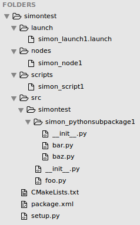
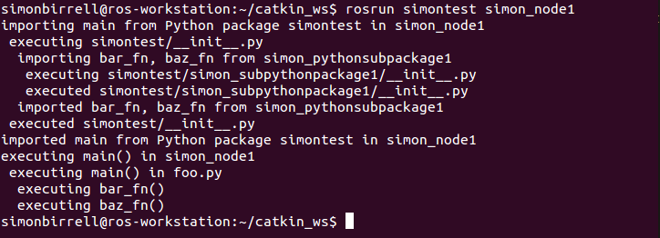

# Simon Birrell的 *如何构建基于Python的ROS软件包* 的中英文对比机翻

在询问ChatGPT如何组织一个python的ros包的过程中，它的回复中提到了一篇Simon Birrell写的文章 [How to structure a Python-based ROS package](https://www.artificialhumancompanions.com/structure-python-based-ros-package/)，去拜读了一下感觉受益匪浅。

由于文章篇幅略微有点长，每次打开加载翻译都要挺久，所以将原文和机翻搬运过来，方便自己之后的查阅。

<!-- more -->

!!! quote

    <h1>How to structure a Python-based ROS package<br>如何构建基于 Python 的 ROS 软件包</h1>
    
    My apologies for the long wait since the last post. I started a PhD in AI and Robotics at Cambridge University, which has been absorbing all my spare time. This post is actually quite old, but I never got around to publishing it. The good news is that I’ve learned a ton about robotics, biomimetics, ROS, MoveIt, deep learning, the Jetson TX1 and more, all of which I hope to share in due course. My apologies also for comments that waited months to be approved. When I finally dragged myself back to comments section I found only 4 real comments out of more than 600 bits of spam.
    
    对于上次发布后长时间的等待，我深表歉意。我在剑桥大学开始了人工智能和机器人学博士研究，这占用了我所有的业余时间。这篇帖子实际上已经很久了，但我一直没有找到时间发布它。好消息是，我在机器人学、仿生学、ROS、MoveIt、深度学习、Jetson TX1 等方面学到了很多，我希望能适时分享。对于等待了数月的评论，我也表示歉意。当我终于回到评论部分时，我发现 600 多条垃圾信息中只有 4 条是真正的评论。
    
    This rather specific post grew out of a frustrating attempt to write a fairly complex ROS package in Python which was continually stymied by seemingly random import errors when my node was launched in different ways. In fairness, I am neither an experienced Python programmer nor a ROS expert, so my problems were due to ignorance. However, clearing up that ignorance was non-trivial and led me down one rabbit hole in terms of how Python manages packages and another rabbit hole in terms of how ROS does it.
    
    这篇相当具体的帖子源于一次令人沮丧的尝试，即编写一个相当复杂的 Python ROS 包，在以不同方式启动节点时，我的节点总是因为看似随机的导入错误而受阻。公平地说，我既不是经验丰富的 Python 程序员，也不是 ROS 专家，所以我的问题源于无知。然而，消除这种无知并非易事，它让我陷入了一个关于 Python 如何管理包的兔子洞，另一个关于 ROS 如何做的兔子洞。
    
    This post is intended to be a shortcut for novice ROS developers who want to develop a Python node that involves more than one source file and imports Python libraries.
    
    本文旨在为希望开发涉及多个源文件和导入 Python 库的 Python 节点的 ROS 新手开发者提供捷径。
    
    My earlier ignorance (at least on this subject) can be summarised as:
    
    我早期的无知（至少在这个问题上）可以总结为：
    
    1.  I didn’t really understand how Python’s import statement worked
    
        我并没有真正理解 Python 的导入语句是如何工作的。
    
    2.  I didn’t know how to structure the source files in a Python-based ROS package
    
        我不知道如何组织基于 Python 的 ROS 包的源文件
    
    3.  I didn’t really know what the purpose of Catkin was for Python-based ROS packages
    
        我并不真正了解 Catkin 对基于 Python 的 ROS 包的作用
    
    4.  I didn’t know what boilerplate needed to be applied so that Catkin could deal with my ROS package
    
        我不知道需要应用哪些模板代码，以便 Catkin 能够处理我的 ROS 包
    
    5.  I didn’t know how to declare dependencies in my ROS package
    
        我不知道如何在 ROS 包中声明依赖项
    
    ## Why we structure the source files in a Python-based ROS package the way we do<br>我们为什么以这种方式在基于 Python 的 ROS 包中组织源文件
    
    Python-based ROS packages will generally contain nodes, scripts and launch files.
    
    基于 Python 的 ROS 包通常包含节点、脚本和启动文件。
    
    Launch files are a set of instructions to launch one or more ROS nodes as well as the ROS master if it isn’t already running.
    
    启动文件是一组指令，用于启动一个或多个 ROS 节点，以及如果尚未运行，启动 ROS 主节点。
    
    ### Nodes and Scripts<br>节点和脚本
    
    The difference between nodes and scripts is largely semantic: they are both Python files that can be executed from the command line with
    
    节点与脚本的差异主要在于语义：它们都是可以用于命令行执行的 Python 文件
    
    rosrun <package name\> <node or script name\>
    
    rosrun <包名\> <节点或脚本名\>
    
    Nodes are assumed to create and launch ROS Nodes, whereas scripts can be used for any purpose. This distinction is a convention to make our packages easier to understand, not a technical difference.
    
    节点通常用于创建和启动 ROS 节点，而脚本可用于任何目的。这种区别是一种约定，旨在使我们的包更容易理解，并非技术上的差异。
    
    For convenience we put nodes and scripts into folders called <base dir\>/nodes and <base dir\>/scripts respectively, although this isn’t strictly necessary. They should be given execute permissions with chmod
    
    为了方便，我们将节点和脚本分别放入名为 <基础目录\>/nodes 和 <基础目录\>/scripts 的文件夹中，尽管这并非绝对必要。它们应该被赋予执行权限，使用 chmod 命令
    
    ```bash
    cd <base dir>
    chmod +x nodes/mynode1
    chmod +x scripts/myscript1
    ```
    
    For aesthetics, mynode1 and myscript1 won’t have a .py extension (which means the first line of the file must be labelled with #!/usr/bin/env python). The user can then use
    
    为了美观，mynode1 和 myscript1 不会使用.py 扩展名（这意味着文件的第一行必须标记为 #!/usr/bin/env python）。然后用户就可以使用
    
    ```bash
    rosrun mypackage mynode1
    ```
    
    and not the messier
    
    而不是更混乱的
    
    ```bash
    rosrun mypackage mynode1.py
    ```
    
    You can put your entire code in either of these files and move on. That’s enough to get to hello world:
    
    您可以将所有代码放入这两个文件中的任何一个，然后继续。这样就足够实现 hello world 了：
    
    ```python
    #!/usr/bin/env python
    
    if __name__== '__main__':
        print "hello world"
    ```
    
    However, it is more likely that you want to break down any non-trivial Python code into various separate files (known as “modules” in Python land). The best way to do this is to keep your nodes and scripts as short as possible and have them simply import and execute the main() function from your real code. For example, mynode1 might contain:
    
    然而，你更有可能想要将任何非平凡 Python 代码分解成多个单独的文件（在 Python 领域被称为“模块”）。最好的做法是尽可能保持你的节点和脚本简短，并简单地从你的实际代码中导入并执行 main() 函数。例如，mynode1 可能包含：
    
    ```python
    #!/usr/bin/env python
    
    from mypackage import main
    
    if __name__== '__main__':
        main()
    ```
    
    Why bother with this extra layer of files if the real work is being done elsewhere? The ROS command rosrun hooks into nodes and scripts, as does roslaunch. But we may also want to import our ROS package functionality into a second ROS package. This is done by declaring Catkin dependencies in the second ROS package (for building purposes) and then using standard Python mechanisms for importing the code from the first package into the second one. The “Python mechanisms” bit is important, as it means we should structure our importable code as a Python package, not to be confused with a ROS package!
    
    为什么要在实际工作在其他地方的情况下，还麻烦地添加这一层文件？ROS 命令 rosrun 会连接到节点和脚本，roslaunch 也是如此。但我们可能还想将我们的 ROS 包功能导入第二个 ROS 包。这是通过在第二个 ROS 包中声明 Catkin 依赖（用于构建目的）来完成的，然后使用标准的 Python 机制将第一个包中的代码导入第二个包中。这里的“Python 机制”部分很重要，因为它意味着我们应该将可导入的代码结构化为一个 Python 包，而不是混淆于 ROS 包！
    
    Now let’s turn to where we put the bulk of our code.
    
    现在让我们转向放置我们大部分代码的地方。
    
    ### Bundling our code into a Python package<br>将我们的代码打包成 Python 包
    
    So our ROS package needs to contain a Python package with the bulk of our code, at least if we want to make it importable into other ROS packages. The conventional way to do that is to put the code into a directory called
    
    因此，我们的 ROS 软件包需要包含一个 Python 软件包，其中包含我们大部分的代码，至少如果我们想将其导入到其他 ROS 软件包中。传统的方法是将代码放入一个目录中，目录名为
    
    ```bash
    src/<Python package name>
    ```
    
    By convention, the Python package name and the ROS Package name are the same, even if strictly speaking they don’t need to be. So if our ROS Package is called mypackage, then put the bulk of your Python code in
    
    按照惯例，Python 包名和 ROS 包名相同，即使严格来说它们不需要相同。所以如果我们的 ROS 包名为 mypackage，那么将大部分 Python 代码放在
    
    ```bash
    src/mypackage
    ```
    
    The import statement in our nodes and scripts will look like this:
    
    我们的节点和脚本中的导入语句将如下所示：
    
    ```python
    from mypackage import main
    ```
    
    When Python comes across an import statement of this sort, it assumes that **mypackage** refers to either a single file called **mypackage.py** (a “module” in Python land) or a directory containing an **\_\_init\_\_.py** file and optionally other Python files (collectively known as a “Python package”). We’re going to be using the latter.
    
    当 Python 遇到这种导入语句时，它假定 **mypackage** 指的是一个名为 **mypackage.py** 的单个文件（在 Python 领域中称为“模块”）或一个包含 **\_\_init\_\_.py** 文件和可选的其他 Python 文件（统称为“Python 包”）的目录。我们将使用后者。
    
    So at a minimum, we need a file called
    
    所以至少我们需要一个文件名为
    
    ```bash
    src/mypackage/__init__.py
    ```
    
    This can contain all our code if we want, including the main() function called from our nodes and scripts. More likely, we’ll want to split our code into different files with descriptive names. So let’s put main() into **src/mypackage/foo.py** and have **\_\_init\_\_.py** contain the following:
    
    这可以包含我们所有的代码，包括从我们的节点和脚本中调用的 main()函数。更有可能的是，我们希望将我们的代码拆分到不同的文件中，并使用描述性的名称。因此，我们将 main() 放入 **src/mypackage/foo.py** 中，让 **\_\_init\_\_.py** 包含以下内容：
    
    ```python
    from foo import main
    ```
    
    This will then be executed whenever a node or script file says
    
    这将在节点或脚本文件声明时执行
    
    ```python
    from mypackage import main
    ```
    
    So main() from foo.py gets imported into the \_\_init\_\_.py file within mypackage, where it can be re-imported into the node and script files. foo.py itself can look something like this:
    
    因此，foo.py 中的 main() 被导入到 mypackage 的 \_\_init\_\_.py 文件中，以便可以在节点和脚本文件中重新导入。foo.py 本身可能看起来像这样：
    
    ```python
    #!/usr/bin/env python
    
    # ... The bulk of our code can go here ...
    
    def main():
        print "Now executing main() in foo.py"
        # Call the bulk of our code...
    ```
    
    All done, right? Not quite. We still haven’t told the node and script files where to find the Python package mypackage. Remember that Python will look in the current directory for a module or Python package to import, or on PYTHONPATH. But the directory mypackage is <base dir\>/src which is not immediately accessible. Prepare to enter a rabbit hole.
    
    所有都完成了，对吧？并不完全。我们还没有告诉节点和脚本文件在哪里可以找到 Python 包 mypackage。记住，Python 会在当前目录中查找要导入的模块或 Python 包，或者在 PYTHONPATH 上。但 mypackage 目录是 <基础目录\>/src，这不是立即可访问的。准备进入一个兔子洞。
    
    ### How does a node or script file actually import our main code? <br>节点或脚本文件究竟是如何导入我们的主代码的？
    
    Python looks for modules or Python packages in the current directory or on the path specified by the environment variable PYTHONPATH. We shouldn’t manipulate PYTHONPATH ourselves, but get Catkin to do it for us. To do that, we need to configure a file called **setup.py** in <base dir\>.
    
    Python 会在当前目录或由环境变量 PYTHONPATH 指定的路径中查找模块或 Python 包。我们不应该自己操作 PYTHONPATH，而应该让 Catkin 来为我们操作。为此，我们需要在 <基础目录\> 中配置一个名为 **setup.py** 的文件。
    
    **setup.py** is a standard Python file used for creating a distributable, installable chunks of code (I refuse to use the word “package” with yet another meaning). This process is handled by a Python tool suite called **distutils** which is documented here, for those that are interested. For our purposes, we simply need to use **setup.py** to tell Catkin the name of our Python package (“mypackage”) and where it is located (in the directory “src”). Here is an example of setup.py:
    
    **setup.py** 是一个标准的 Python 文件，用于创建可分发、可安装的代码块（我拒绝再用“包”这个词表示另一个意思）。这个过程由一个名为 **distutils** 的 Python 工具套件处理，有关文档在此处，有兴趣的可以查阅。对我们来说，我们只需要使用 **setup.py** 来告诉 Catkin 我们 Python 包的名称（“mypackage”）以及它的位置（在“src”目录中）。以下是一个 setup.py 的示例：
    
    ```python
    #!/usr/bin/env python
    
    from distutils.core import setup
    from catkin_pkg.python_setup import generate_distutils_setup
    
    setup_args = generate_distutils_setup(
        packages=['mypackage'],
        package_dir={'': 'src'}
    )
    
    setup(**setup_args)
    ```
    
    All you need to do is customise the line packages=… The rest is boilerplate. For those interested in what the boilerplate does: it gets called by Catkin during the catkin\_make process, examines package.xml for meta-data like author, license etc, adds the defined packages and package\_dir and passes the combined set of information to **distutils** which does the actual installation into the Catkin development workspace.
    
    只需自定义 packages=… 这一行。其余的都是模板代码。对于那些对模板代码的作用感兴趣的人：它在 catkin\_make 过程中被 Catkin 调用，检查 package.xml 中的元数据，如作者、许可证等，添加定义的包和 package\_dir，然后将合并后的信息传递给 **distutils**，distutils 在 Catkin 开发工作区中执行实际安装。
    
    To make all this work, there are two more tweaks to do in Catkin’s CMakeLists.txt file.
    
    为了使所有这些工作正常进行，需要在 Catkin 的 CMakeLists.txt 文件中进行两项调整。
    
    First, make sure this line is uncommented:
    
    首先，确保这一行取消注释：
    
    ```cmake
    catkin_python_setup()
    ```
    
    This tells Catkin to pay attention during the catkin_make process to the **setup.py** file we just configured.
    
    这告诉 Catkin 在 catkin_make 过程中注意我们刚刚配置的 **setup.py** 文件。
    
    Second, in the install() function we need to list the node and script files we defined right at the beginning. So:
    
    其次，在 install() 函数中，我们需要列出我们在一开始定义的节点和脚本文件。所以：
    
    ```cmake
    install(PROGRAMS
        scripts/myscript1
        nodes/mynode1
        nodes/mynode2
        DESTINATION ${CATKIN_PACKAGE_BIN_DESTINATION}
    )
    ```
    
    This tells Catkin to install our executable files into an accessible location in the Catkin development workspace.
    
    这告诉 Catkin 将我们的可执行文件安装到 Catkin 开发工作区的一个可访问位置。
    
    Once setup.py and CMakeLists.txt are configured, execute catkin_make:
    
    一旦配置好 setup.py 和 CMakeLists.txt，执行 catkin_make：
    
    cd ~/catkin_ws
    
    catkin_make
    
    and you should be able to execute your nodes and scripts, and therefore your code in src/mypackage/foo.py from rosrun:
    
    您应该能够执行您的节点和脚本，因此可以从 rosrun 中执行 src/mypackage/foo.py 中的代码：
    
    rosrun mypackage mynode1
    
    You can pretty much stop here. Add Python files (“modules”) like bar.py, baz.py to src/mypackage and have them import functions into each other with
    
    您基本上可以在这里停止。将 Python 文件（“模块”）如 bar.py、baz.py 添加到 src/mypackage 中，并让它们相互导入函数通过
    
    ```python
    from bar import fn1, fn2
    from baz import fn3, fn4
    ```
    
    For Python code of medium complexity that’s probably enough to add some decent structure to your code. Gluttons for punishment may want to further divide the code into sub-packages. Let’s have a look at how to do that.
    
    对于中等复杂度的 Python 代码，这可能足以给你的代码添加一些合理的结构。喜欢受苦的人可能还想进一步将代码划分为子包。让我们看看如何做到这一点。
    
    ### Adding Sub-packages to our main Python Package<br>添加子包到我们的主 Python 包
    
    You can add further Python packages underneath our main Python package in src/mypackage. Each subdirectory takes the name of the sub-package and must include an \_\_init\_\_.py file and optionally, some other Python files.
    
    您可以在 src/mypackage 下的主 Python 包中添加更多的 Python 包。每个子目录以子包的名称命名，必须包含一个 \_\_init\_\_.py 文件，并可选地包含一些其他 Python 文件。
    
    ```bash
    src/mypackage/subpackage/__init__.py
    src/mypackage/subpackage/something.py
    ```
    
    As usual, we could shoehorn all our code into \_\_init\_\_.py, but we’ll likely want to have it into separate files like something.py.
    
    通常，我们可以把所有代码塞进 \_\_init\_\_.py 中，但可能更希望将其放入单独的文件，比如 something.py。
    
    So our sub-package **\_\_init\_\_.py** might contain:
    
    所以我们的子包 **\_\_init\_\_.py** 可能包含：
    
    ```python
    from something import *
    ```
    
    In our main Python package we then import code using the standard Python mechanisms:
    
    在我们的主 Python 包中，我们随后使用标准的 Python 机制导入代码：
    
    ```python
    from subpackage import fn5, fn6
    ```
    
    If also we want to make these Python sub-packages available to import into other ROS packages, we would need to add them to packages=… in setup.py.  If they’re purely used internally by our code, then there’s no need.
    
    如果我们也想将这些 Python 子包提供给其他 ROS 包导入，就需要在 setup.py 中的 packages=… 处添加它们。如果它们仅由我们的代码内部使用，则无需添加。
    
    ### A Working Example you can download<br>一个你可以下载的工作示例
    
    Here’s a an example I threw together as an illustration, with one node, one script, one launch file, the main Python package and one sub-package.
    
    这里是一个我为了说明而拼凑的例子，包含一个节点、一个脚本、一个启动文件、主 Python 包和一个子包。
    
    { loading=lazy }
    
    You can see the code here [https://github.com/SimonBirrell/simontest](https://github.com/SimonBirrell/simontest)
    
    您可以在这里查看代码 [https://github.com/SimonBirrell/simontest](https://github.com/SimonBirrell/simontest)
    
    ```bash
    rosrun simontest simon_node1
    ```
    
    { loading=lazy }
    
    Check out the code, paying attention to setup.py and the various \_\_init\_\_.py files. Figuring out what is being called when and how should give you a solid grounding for building robust and complex Python applications.
    
    查看代码，注意 setup.py 和各种 \_\_init\_\_.py 文件。弄清楚何时以及如何调用某些内容，这将为构建稳健且复杂的 Python 应用程序提供坚实的基础。
    
    If you want to download, build it and run the commands yourself:
    
    如果您想下载、构建并自行运行命令：
    
    ```bash
    cd ~/catkin_ws/src
    git clone https://github.com/SimonBirrell/simontest
    cd ..
    catkin_make
    ```
    
    ## Defining Dependencies for our Python-based ROS Package<br>定义我们的基于 Python 的 ROS 包的依赖项
    
    All the above is sufficient for ROS Packages that don’t call external Python libraries. Generally though, you will be importing and using other Python libraries such as numpy. We can simply install these packages on our development machine using pip, apt-get or some other method and then import them as usual, with
    
    所有上述内容对于不调用外部 Python 库的 ROS 包来说已经足够了。不过，通常情况下，你将导入并使用其他 Python 库，如 numpy。我们可以在我们的开发机器上简单地使用 pip、apt-get 或其他方法安装这些包，然后像通常一样导入它们，通过
    
    ```python
    import numpy
    ```
    
    The only problem with this approach is when you come to distribute your ROS Package to other users to install their machines. You will have to include instructions to ask them to install the same required Python libraries before they run your ROS Package. It is easy to forget what you have installed on your own development machine, so a better solution is to explicitly define the dependencies, so that Catkin will install them if required when users build your ROS Package.
    
    这种方法唯一的问题是，当你将你的 ROS 包分发给其他用户安装到他们的机器上时，你必须包括指示他们安装相同的必需 Python 库的说明。很容易忘记你在自己的开发机器上安装了什么，所以更好的解决方案是明确定义依赖项，这样当用户构建你的 ROS 包时，Catkin 会根据需要安装它们。
    
    As far as I can tell, this needs to be done twice, as once would be too easy.
    
    据我所知，这需要做两次，因为一次太容易了。
    
    ### Defining Standard Dependencies<br>定义标准依赖项
    
    First, you need to define the dependencies the Python level, by informing distutils of the Python packages you require. This is done through setup.py in the <base dir\>:
    
    首先，您需要定义 Python 级别的依赖项，通过通知 distutils 您所需的 Python 包。这通过 <基础目录> 中的 setup.py 来完成：
    
    ```python
    #!/usr/bin/env python
    
    from distutils.core import setup
    from catkin_pkg.python_setup import generate_distutils_setup
    
    setup_args = generate_distutils_setup(
        packages=['my package'],
        package_dir={'': 'src'},
        install_requires=['required_python_package1', 'required_python_package2']
    )
    ```
    
    The dependencies are listed in the line beginning install_requires=… The names used are the *Python* names, i.e. the names you would use if you were installing manually with pip.
    
    依赖项列在以 install_requires=… 开头的行中，使用的名称是 *Python* 名称，即如果您手动使用 pip 安装时使用的名称。
    
    ```bash
    sudo pip install required_python_package1
    ```
    
    The second place you need to define the dependencies is in package.xml. Why on earth do we need to define them twice?
    
    第二个需要定义依赖的地方是在 package.xml 文件中。究竟为什么我们需要定义它们两次呢？
    
    The reason is that Catkin has its own set of names for Python packages that is separate from the Python names. Python dependencies are defined in package.xml with a tag like this:
    
    原因是 Catkin 有一套独立的 Python 包名称，与 Python 名称不同。Python 依赖关系在 package.xml 中以如下标签定义：
    
    <exec_depend\>ros-python-dependency</exec_depend\>
    
    where the name ros-python-dependency comes from the [rosdistro list](https://github.com/ros/rosdistro/blob/master/rosdep/python.yaml).  As an example, on a recent project I used the Python web sockets library [ws4py](http://ws4py.readthedocs.io/en/latest/), which is installed manually like this:
    
    该名称 ros-python-dependency 来源于 [rosdistro 列表](https://github.com/ros/rosdistro/blob/master/rosdep/python.yaml)。例如，在最近的一个项目中，我使用了 Python 网络套接字库 [ws4py](http://ws4py.readthedocs.io/en/latest/)，它被手动安装如下：
    
    ```bash
    sudo pip install ws4py
    ```
    
    Searching for ws4py on the [rosdistro list](https://github.com/ros/rosdistro/blob/master/rosdep/python.yaml) we find:
    
    在 [rosdistro 列表](https://github.com/ros/rosdistro/blob/master/rosdep/python.yaml) 中搜索 ws4py 时，我们发现：
    
    ```yaml
    python-ws4py-pip:
      ubuntu:
        pip:
          packages: [ws4py]
    ```
    
    The final line references the install target for pip. So we can use the first line for our dependency name in package.xml:
    
    最后一行引用了 pip 的安装目标。因此，我们可以将第一行用作 package.xml 中依赖项的名称：
    
    ```xml
    <run_depend>python-ws4py-pip</run_depend>
    ```
    
    Once this is added, your ROS Package should be installable by Catkin on other peoples’ machines and the dependencies should be automatically installed and built as required.
    
    一旦添加，您的 ROS 包应该可以通过 Catkin 在其他人的机器上安装，并且所需的依赖项将自动安装和构建。
    
    The [rosdistro list](https://github.com/ros/rosdistro/blob/master/rosdep/python.yaml) includes most commonly-used Python packages. Occasionally though, you will have some unusual Python dependency.
    
    [rosdistro 列表](https://github.com/ros/rosdistro/blob/master/rosdep/python.yaml) 包括大多数常用的 Python 包。偶尔，你可能会遇到一些不寻常的 Python 依赖项。
    
    I should say at this point that the simplest solution is just to ask your users to manually install the non-standard Python dependency, with **pip** or some other installer. If you want full automation though, you’re going to have to fork the [rosdistro list](https://github.com/ros/rosdistro/blob/master/rosdep/python.yaml), add the non-standard package and submit a pull request. Assuming your request is accepted, the next people to access the [rosdistro list](https://github.com/ros/rosdistro/blob/master/rosdep/python.yaml) will be able to automatically install the dependency.
    
    我应该在这里说，最简单的解决方案就是要求用户手动使用 **pip** 或其他安装程序安装非标准的 Python 依赖项。不过，如果您想要完全自动化，您将不得不分支 [rosdistro 列表](https://github.com/ros/rosdistro/blob/master/rosdep/python.yaml)，添加非标准的包并提交一个 pull 请求。假设您的请求被接受，接下来访问 [rosdistro 列表](https://github.com/ros/rosdistro/blob/master/rosdep/python.yaml)的人将能够自动安装依赖项。
    
    There are [perfectly adequate instructions for doing this here](http://docs.ros.org/independent/api/rosdep/html/contributing_rules.html).
    
    这里提供了[做这件事的完全充分的说明](http://docs.ros.org/independent/api/rosdep/html/contributing_rules.html)。
    
    ### Tip: Testing your Dependency Definitions<br>提示：测试您的依赖定义
    
    It’s typically tough to test whether the various changes above work. As soon as you test once, your machine has changed state; the packages are now installed. Ideally, each test would start off with a pristine ROS installation, then install your ROS Package, run catkin_make and then test the code itself.
    
    通常很难测试上述各种更改是否有效。一旦测试一次，你的机器状态就会改变；包已经安装。理想情况下，每个测试都应该从一个全新的 ROS 安装开始，然后安装你的 ROS 包，运行 catkin_make，然后测试代码本身。
    
    This is now quite easy to do using one of the continuous integration services like [TravisCI](https://travis-ci.org/) or [CircleCI](https://circleci.com/). I use the latter; sign up is quick and usage is free for the sort of workloads you’ll likely be doing.
    
    现在使用像 [TravisCI](https://travis-ci.org/) 或 [CircleCI](https://circleci.com/) 这样的持续集成服务来做这件事相当简单。我使用后者；注册快速，而且对于你可能会进行的工作负载来说，使用是免费的。
    
    For example, I pointed CircleCI to my ROS Package’s GitHub repo and added the following circle.yaml file in <base dir\>:
    
    例如，我将 ROS 包的 GitHub 仓库指向 CircleCI，并在 <基础目录\> 中添加了以下 circle.yaml 文件：
    
    ```yaml
    dependencies:
      pre:
        - sudo sh -c 'echo "deb http://packages.ros.org/ros/ubuntu $(lsb_release -sc) main" > /etc/apt/sources.list.d/ros-latest.list'
        - sudo apt-key adv --keyserver hkp://ha.pool.sks-keyservers.net --recv-key 0xB01FA116
        - sudo apt-get update
        - sudo apt-get install ros-indigo-ros-base
        - sudo rosdep init
        - rosdep update
        - echo "source /opt/ros/indigo/setup.bash" >> ~/.bashrc
        - mkdir -p ~/catkin_ws/src && cd ~/catkin_ws/src && catkin_init_workspace
        - pip install 'gevent==1.0.2'
        - cd ~/catkin_ws/ && catkin_make
    ```
    
    This YAML file tells CircleCI to run a set of instructions before executing the automated tests. These instructions are essentially the standard ROS installation instructions until the line
    
    这个 YAML 文件告诉 CircleCI 在执行自动化测试之前运行一系列指令。这些指令本质上与标准 ROS 安装指令相同，直到该行
    
    ```yaml
        - mkdir -p ~/catkin_ws/src && cd ~/catkin_ws/src && catkin_init_workspace
    ```
    
    This line creates the Catkin workspace. Again, this is standard ROS.
    
    这一行创建 Catkin 工作空间。再次强调，这是标准的 ROS。
    
    ```yaml
        - pip install 'gevent==1.0.2'
    ```
    
    This installs gevent, which you’ll recall was a package that wasn’t available in the [rosdistro list](https://github.com/ros/rosdistro/blob/master/rosdep/python.yaml).
    
    此操作安装了 gevent，您可能还记得，这是一个在 [rosdistro 列表](https://github.com/ros/rosdistro/blob/master/rosdep/python.yaml) 中不可用的包。
    
    ```yaml
        - cd ~/catkin_ws/ && catkin_make
    ```
    
    This line runs catkin_make, which will build your ROS package.
    
    这一行运行 catkin_make，这将构建您的 ROS 软件包。
    
    Of course, you will ideally now have some tests (perhaps with nose) that run through your code and do the various imports. CircleCI should be configured to run these tests.
    
    当然，理想情况下，你现在应该有一些测试（可能使用 nose）来运行你的代码和执行各种导入。CircleCI 应该配置为运行这些测试。
    
    If you don’t have tests, you could just do a **rosrun** command at the end of this section of the **circle.yaml** file. If it works, fine. If not, CircleCI will show you an error.
    
    如果您没有测试，您可以在 **circle.yaml** 文件这一部分的最后执行一个 **rosrun** 命令。如果成功了，那就没问题。如果不成功，CircleCI 会显示错误。
    
    So with this, you can be confident that your dependencies will be installed correctly on other people’s machines. At least as confident as you can ever be in Linux Hell.
    
    因此，您可以有信心，在其他人的机器上，您的依赖项将被正确安装。至少在 Linux 地狱中，您可以有如此信心。
    
    To conclude, I should say that the above represents the best of my knowledge based on trudging through ROS Answers and StackOverflow. I’m very happy to be corrected by any ROS gurus out there.
    
    总结来说，以上内容代表了我根据在 ROS Answers 和 StackOverflow 上摸索所积累的最佳知识。我很高兴被任何 ROS 大牛纠正。
