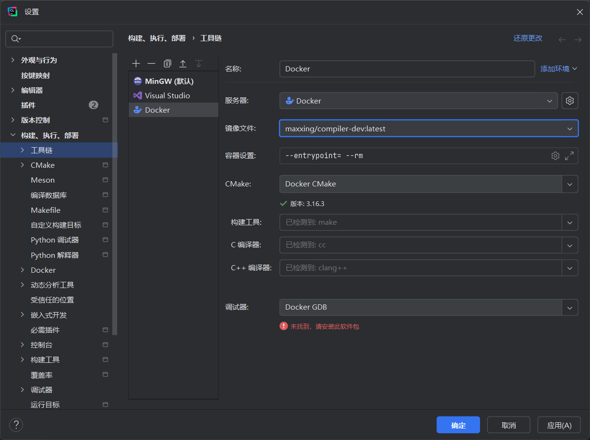
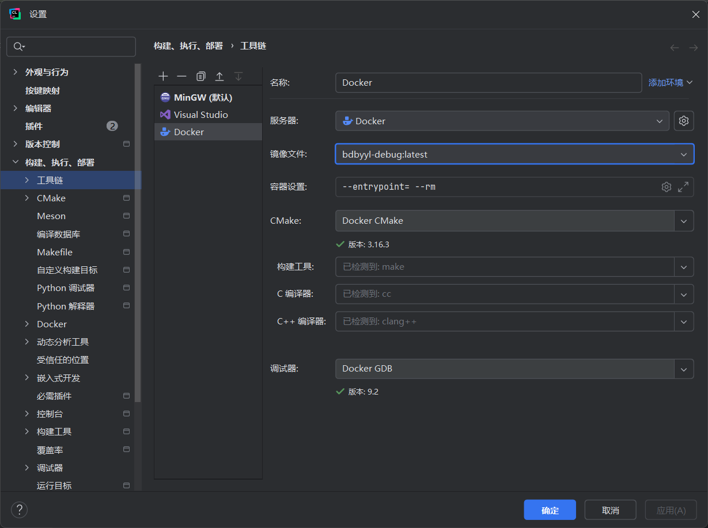
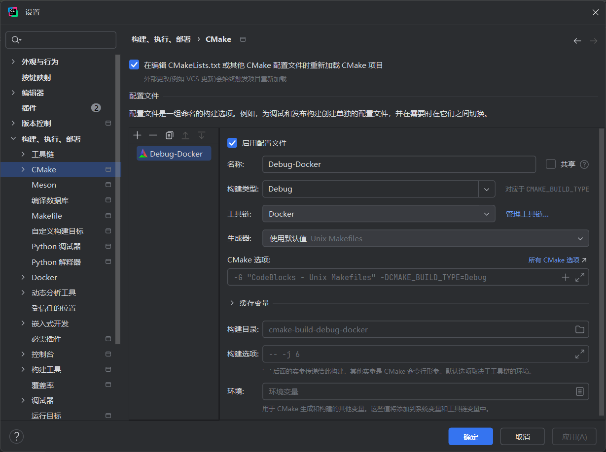
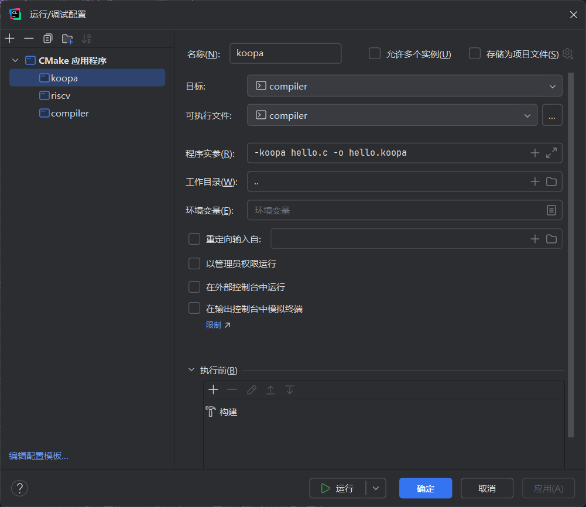
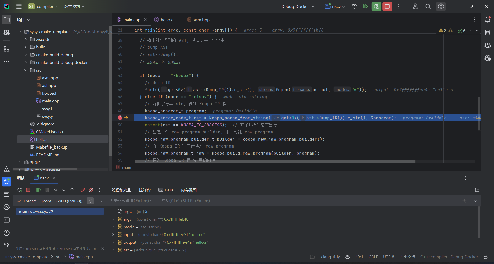

# 使用CLion实现使用Docker环境调试cmake项目

在完成[***北大编译实践课程***](https://pku-minic.github.io/online-doc/)的过程中，由于实验环境是用的docker，我在vscode上不能直接进行断点调试(直接调试使用的是我电脑上的环境)。之前也尝试过使用vscode来连接docker容器，但是要调试似乎需要添加`tasks.json`和`launch.json`，比较复杂，并且也没弄成功。

今天突然想到CLion是用cmake来构建项目，那我或许可以尝试使用CLion来连接docker环境，(因为有较好的集成功能)而较为简单地就能实现调试。

<!-- more -->

[在Google上搜索：`how to open a project in docker with clion`](https://www.google.com/search?q=how+to+open+a+project+in+docker+with+clion)，得到的第一个网页是jetbrains官方的说明文档，

>   [Docker toolchain | CLion Documentation](https://www.jetbrains.com/help/clion/clion-toolchains-in-docker.html)

发现主要需要参考[`Create a Docker toolchain`](https://www.jetbrains.com/help/clion/clion-toolchains-in-docker.html#create-docker-toolchain)和[`Build, run, debug with a Docker toolchain`](https://www.jetbrains.com/help/clion/clion-toolchains-in-docker.html#build-run-debug-docker)这两节

>   `Create a Docker toolchain` 大致是说明如何在工具链中设置使用docker镜像
>
>   `Build, run, debug with a Docker toolchain` 大致是说明如何设置在使用cmake构建项目时，使用docker镜像工具链

然后我按照那上面的说明，先在工具链中添加要使用的docker镜像，但是发现课程官方提供的镜像中没有安装gdb(应该是clion调试需要用到gdb)

{ loading=lazy }

于是我借助deepseek了解了如何创建出一个新的安装了gdb的镜像的方法

??? example "对话记录"

    <h3>🧑 User</h3>
    
    我现在在docker中有一个镜像，这个镜像创建出来的容器中没有gdb调试工具，我想得到一个在此基础上安装了gdb调试工具的镜像，我应该怎么做呢？
    
    ---
    
    <h3>🤖 DeepSeek AI</h3>
    
    ??? quote "已深度思考（用时 45 秒）"
    
        好的，我现在遇到了一个问题，我需要在一个已有的Docker镜像基础上安装gdb调试工具，生成新的镜像。原来的容器里没有gdb，我需要解决这个问题。
    
        首先，我应该回忆一下Docker的基本操作。Docker镜像是通过Dockerfile来构建的。所以，可能的解决方法就是基于现有的镜像，编写一个Dockerfile，在其中执行安装gdb的步骤，然后构建新的镜像。
    
        接下来，我需要确认当前使用的镜像是什么。比如，如果是基于Ubuntu或者Alpine这样的基础镜像，安装gdb的命令可能不同。假设原镜像是基于Ubuntu的，那么安装gdb可能需要使用apt-get。如果是CentOS的话，可能是yum或者dnf。不同的Linux发行版包管理器不同，所以需要知道基础镜像的类型。
    
        假设用户的原镜像是基于Ubuntu的。那么步骤可能是这样的：
    
        1. 创建一个Dockerfile，FROM原来的镜像。
        2. 运行apt-get update更新包列表。
        3. 然后安装gdb，使用apt-get install -y gdb。
        4. 构建这个Dockerfile，得到新镜像。
    
        不过，我需要考虑是否原镜像的源是否可用，或者是否需要更换镜像源，比如在国内可能需要使用国内的镜像源加速。但可能用户的环境不需要，所以先按默认的情况处理。
    
        另外，需要注意权限问题，可能需要使用root用户来执行安装命令，而Dockerfile中默认以root运行，所以应该没问题。
    
        例如，Dockerfile的内容可能是：
    
        FROM original_image:tag
    
        RUN apt-get update && apt-get install -y gdb
    
        然后执行docker build命令，构建新镜像。
    
        如果原镜像是基于Alpine Linux的话，安装命令应该是apk add gdb，但需要确认包名是否正确，因为有时候包名可能不同。例如，在Alpine中，gdb的包名可能确实是gdb，所以命令是apk add gdb。
    
        如果是CentOS系列，则使用yum install -y gdb。
    
        所以，用户需要先确认他们原来的镜像是什么操作系统，然后选择合适的包管理命令。
    
        另外，可能需要清理缓存，减少镜像大小。例如，在apt-get安装后可以加上&& apt-get clean && rm -rf /var/lib/apt/lists/*之类的命令，但这不是必须的，特别是如果用户不介意镜像大小的话。
    
        总结步骤应该是：
    
        1. 确定基础镜像的操作系统类型。
        2. 编写Dockerfile，基于原镜像，添加安装gdb的命令。
        3. 构建镜像。
        4. 测试新镜像是否包含gdb。
    
        可能的例子：
    
        假设原镜像是ubuntu:20.04，那么Dockerfile：
    
        FROM ubuntu:20.04
    
        RUN apt-get update && apt-get install -y gdb
    
        然后运行docker build -t new_image_name .
    
        构建完成后，运行docker run -it new_image_name gdb --version来验证是否安装成功。
    
        但用户可能不知道原镜像的具体情况，所以可能需要用户自行替换基础镜像的名称。
    
        用户可能还需要考虑镜像的标签是否正确，是否有其他依赖需要安装。例如，某些情况下安装gdb可能需要额外的库，但通常gdb的包会处理好依赖。
    
        另外，如果用户无法直接修改Dockerfile，或者原来的镜像是通过其他方式获得的，无法直接获取Dockerfile，用户可能需要基于现有容器进行修改。不过这样不是推荐的做法，推荐使用Dockerfile的方式。
    
        另一种方法是，用户启动一个容器，进入容器内部安装gdb，然后commit容器为新的镜像。但这种方法不利于维护和重复构建，所以推荐使用Dockerfile。
    
        例如，用户运行：
    
        docker run -it original_image /bin/bash
    
        然后在容器内执行：
    
        apt-get update && apt-get install -y gdb
    
        退出后，用docker commit将容器保存为新镜像。不过这种方法生成的镜像层较多，且无法版本控制，所以作为临时方案可以，但长期还是应该用Dockerfile。
    
        所以，用户应该优先选择编写Dockerfile的方法。
    
        总结，用户需要：
    
        1. 编写Dockerfile，基于原镜像。
        2. 在Dockerfile中执行安装gdb的命令，根据基础镜像的包管理器选择合适的安装命令。
        3. 构建新镜像。
        4. 验证新镜像是否包含gdb。
    
        可能的错误点：如果原镜像没有包含apt-get或者其他包管理器，或者用户权限不够，可能需要处理。但一般来说，基础镜像都会包含这些工具。
    
    为了在现有Docker镜像基础上安装gdb调试工具，请按照以下步骤操作：
    
    <h3>方法1：使用Dockerfile（推荐）</h3>
    
    1. **创建Dockerfile**
    
        新建一个文本文件，命名为`Dockerfile`，内容如下（根据基础镜像类型调整命令）：
    
        ```dockerfile
        # 假设原镜像是基于Debian/Ubuntu
        FROM your_original_image:tag
        RUN apt-get update && apt-get install -y gdb
    
        # 如果是Alpine镜像：
        # RUN apk add gdb
    
        # 如果是CentOS/RHEL镜像：
        # RUN yum install -y gdb
        ```
    
    2. **构建新镜像**
    
        在Dockerfile所在目录执行以下命令（将`new_image_name`替换为你想要的镜像名称）：
    
        ```bash
        docker build -t new_image_name .
        ```
    
    3. **验证安装**
    
        运行以下命令检查gdb是否安装成功：
    
        ```bash
        docker run --rm -it new_image_name gdb --version
        ```
    
    <h3>方法2：临时修改容器并提交（适用于快速测试）</h3>
    
    1. **启动容器并安装gdb**
    
        ```bash
        docker run -it --name temp_container your_original_image:tag /bin/bash
        # 在容器内执行安装命令（以Ubuntu为例）
        apt-get update && apt-get install -y gdb
        exit
        ```
    
    2. **提交容器为新镜像**
    
        ```bash
        docker commit temp_container new_image_name
        docker rm temp_container  # 清理临时容器
        ```
    
    <h3>验证</h3>
    
    无论使用哪种方法，运行以下命令验证：
    
    ```bash
    docker run --rm -it new_image_name which gdb
    # 应该输出gdb的路径，如/usr/bin/gdb
    ```
    
    <h3>注意事项</h3>
    
    - **基础镜像适配**：确保根据原镜像的操作系统类型（如Ubuntu/Alpine/CentOS）选择正确的包管理命令。
    - **镜像标签**：替换`your_original_image:tag`为实际使用的镜像名称和标签。
    - **镜像优化**：建议在安装完成后清理包管理器缓存以减小镜像体积，例如在Ubuntu中添加`&& apt-get clean && rm -rf /var/lib/apt/lists/*`。
    
    通过以上步骤，你将在原镜像基础上获得一个包含gdb调试工具的新镜像。

于是我就参照它的回答，编写`Dockerfile`创建一个基于课程官方提供的镜像并装有gdb的新镜像

```dockerfile title="Dockerfile"
FROM maxxing/compiler-dev:latest
RUN apt update && apt install -y gdb
```

并运行命令

```bash
docker build -t bdbyyl-debug .
```

创建好后运行命令测试发现能够显示gdb的版本

```bash
docker run --rm -it bdbyyl-debug gdb --version
```

<div class="result" markdown>

```txt
GNU gdb (Ubuntu 9.2-0ubuntu1~20.04.2) 9.2
Copyright (C) 2020 Free Software Foundation, Inc.
License GPLv3+: GNU GPL version 3 or later <http://gnu.org/licenses/gpl.html>
This is free software: you are free to change and redistribute it.
There is NO WARRANTY, to the extent permitted by law.
```

</div>

然后便将工具链中的镜像文件换成新的`bdbyyl-debug`镜像

{ loading=lazy }

然后按照[`Build, run, debug with a Docker toolchain`](https://www.jetbrains.com/help/clion/clion-toolchains-in-docker.html#build-run-debug-docker)中的说明，在cmake中把工具链改成docker

{ loading=lazy }

最后因为课程中的编译器使用时需要输入命令行参数，所以需要编辑*运行/调试配置*

=== "Koopa IR"

    { loading=lazy }

=== "RISC-V 汇编"

    { loading=lazy }

这里需要注意的是，因为clion默认(似乎)的生成目录是`cmake-build-debug-docker`，所以编译出来的编译器在这个目录下，我的`hello.c`文件放在了项目的根目录下， 所以我将*工作目录*设置成了`..`。

最后就能够对编译器进行断点调试和查看中间变量的值了

{ loading=lazy }
