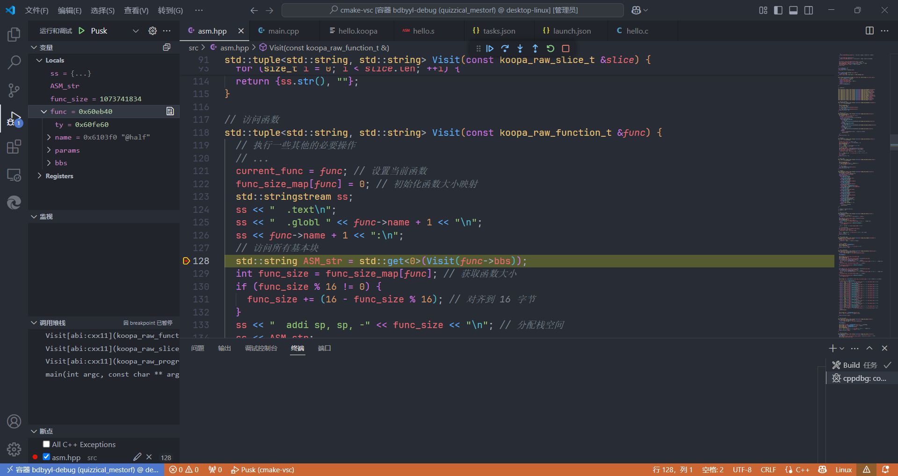

# 在VSCode中连接Docker环境并调试基于Makefile的项目

[上一篇](2025-05-04.md)的延续😅，<del>因为用clion调试好像出了一点奇怪的小问题暂时没有搞清楚😅并且也懒得了，于是就</del>按照之前从谷歌搜出来的stackoverflow的帖子中的回答进行(vscode的)设置，并且还需要docker容器中有gdb，就可以断点调试了。

-   [How to "fix" debugger in VScode if you have Makefile project on C++? - Stack Overflow](https://stackoverflow.com/questions/58581500/how-to-fix-debugger-in-vscode-if-you-have-makefile-project-on-c/)

<!-- more -->

>   其实是先[Google搜索了`how to debug in a make project`](https://www.google.com/search?q=how+to+debug+in+a+make+project)，得到这个帖子
>
>   [Debugging an existing project with Makefile in Visual Studio Code - Stack Overflow](https://stackoverflow.com/questions/67046479/debugging-an-existing-project-with-makefile-in-visual-studio-code)
>
>   唯一的回答中就直接回复了上面的那个帖子

参考[最高赞回答](https://stackoverflow.com/a/58779252)，主要是需要在项目的`.vscode`文件夹中，新建并设置`tasks.json`和`launch.json`

>   之前因为容器中没有gdb所以一直没有成功，但是不知道是因为没装gdb的原因😅

以下是最后我在编译器项目中使用的`tasks.json`和`launch.json`

```json title="launch.json" hl_lines="11 12 25"
{
  // Use IntelliSense to learn about possible attributes.
  // Hover to view descriptions of existing attributes.
  // For more information, visit: https://go.microsoft.com/fwlink/?linkid=830387
  "version": "0.2.0",
  "configurations": [
    {
      "name": "Pusk", //I named it Pusk because i can 
      "type": "cppdbg",
      "request": "launch",
      "program": "${workspaceFolder}/build/compiler", //path to your programs exe and exe name
      "args": ["-riscv", "hello.c", "-o", "hello.s"],
      "stopAtEntry": false,
      "cwd": "${workspaceFolder}",
      "environment": [],
      "externalConsole": false,
      "MIMode": "gdb",
      "setupCommands": [
        {
          "description": "Enable pretty-printing for gdb",
          "text": "-enable-pretty-printing",
          "ignoreFailures": true
        }
      ],
      "preLaunchTask": "Build"
    }
  ]
}
```

```json title="tasks.json"
{
  // See https://go.microsoft.com/fwlink/?LinkId=733558
  // for the documentation about the tasks.json format
  "version": "2.0.0",
  "tasks": [
    {
      "label": "Build",
      "type": "shell",
      "command": "make", //its like writing in console make //btw you can others commands like clean make build etc
      "group": {
        "kind": "build",
        "isDefault": true
      },
      "problemMatcher": {
        "owner": "cpp",
        "fileLocation": ["relative", "${workspaceFolder}"],
        "pattern": {
          "regexp": "^(.*):(\\d+):(\\d+):\\s+(warning|error):\\s+(.*)$",
          "file": 1,
          "line": 2,
          "column": 3,
          "severity": 4,
          "message": 5
        }
      }
    }
  ]
}
```

需要说明一下的是，在`launch.json`中

-   `"program"`需要修改为编译出的可执行程序的位置
-   `"args"`内添加运行程序需要的命令行参数
-   `"preLaunchTask"`原本在帖子中没有提到，添加前在vscode中点击调试后并不能自动进行make，上网搜索发现需要添加设置这个参数，需要注意的是，此处设置的值应与`tasks.json`中的`"label"`一致，然后点击调试之后就可以自动进行make了

{ loading=lazy }
